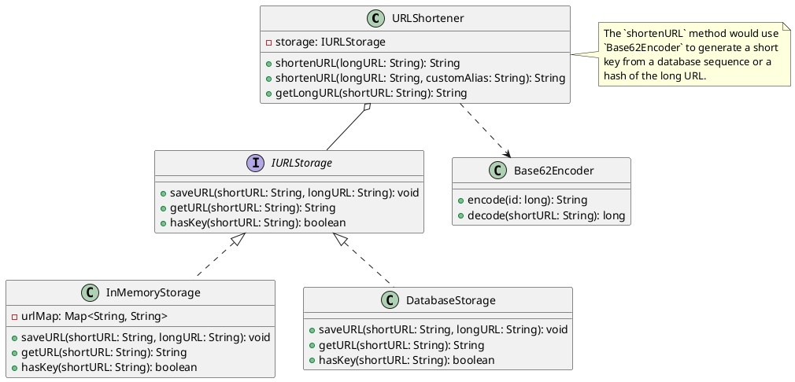

## Problem Statement

Design a URL shortener service that takes a long URL and generates a unique short URL. The service should also be able to redirect users from the short URL to the original long URL.

## Requirements

- Given a long URL, the service should return a much shorter, unique URL.
- When a user accesses a short URL, they should be redirected to the original long URL.
- The short URL should be a combination of characters `[a-z, A-Z, 0-9]`.
- The service should be able to handle a high volume of requests.
- The mapping between the short URL and the long URL should be stored persistently.
- Users should be able to optionally provide a custom short URL.

## Class Diagram



## Code Snippets

### URLShortener Service

The main service class that orchestrates the shortening and redirection logic.

```java
public class URLShortener {
    private final IURLStorage storage;

    public URLShortener(IURLStorage storage) {
        this.storage = storage;
    }

    public String shortenURL(String longURL) {
        // Generate a unique ID (e.g., from a database sequence)
        long id = getUniqueID();
        String shortKey = Base62Encoder.encode(id);
        storage.saveURL(shortKey, longURL);
        return "http://short.ly/" + shortKey;
    }

    public String getLongURL(String shortURL) {
        String shortKey = shortURL.substring(shortURL.lastIndexOf('/') + 1);
        return storage.getURL(shortKey);
    }

    private long getUniqueID() {
        // This could be a call to a distributed sequence generator
        // or the auto-incremented ID from a database.
        return System.currentTimeMillis(); // Placeholder
    }
}
```

### Base62 Encoding

This is a common technique to convert a large integer (like a database ID) into a short alphanumeric string.

```java
public class Base62Encoder {
    private static final String ALPHABET = "abcdefghijklmnopqrstuvwxyzABCDEFGHIJKLMNOPQRSTUVWXYZ0123456789";
    private static final int BASE = ALPHABET.length();

    public static String encode(long num) {
        StringBuilder sb = new StringBuilder();
        while (num > 0) {
            sb.insert(0, ALPHABET.charAt((int) (num % BASE)));
            num /= BASE;
        }
        return sb.toString();
    }
}
```
