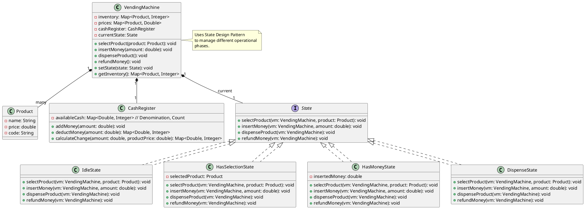

## Problem Statement

Design a vending machine that allows users to select products, insert money, and receive their selected product along with any change.

## Requirements

- The vending machine should have an inventory of products, each with a price and quantity.
- Users can select a product.
- Users can insert various denominations of coins/notes.
- The machine should validate the inserted money.
- If the inserted money is less than the product price, the machine should prompt for more money.
- If the inserted money is sufficient, the machine should dispense the product.
- The machine should return the correct change if any.
- The machine should handle out-of-stock products.
- The machine should allow for cancellation of a transaction and refund the inserted money.

## Class Diagram



## Code Snippets

### State Interface

Defines the behavior for each state of the vending machine.

```java
public interface State {
    void selectProduct(VendingMachine vm, Product product);
    void insertMoney(VendingMachine vm, double amount);
    void dispenseProduct(VendingMachine vm);
    void refundMoney(VendingMachine vm);
}
```

### IdleState

Initial state where no product is selected and no money is inserted.

```java
public class IdleState implements State {
    @Override
    public void selectProduct(VendingMachine vm, Product product) {
        if (vm.getInventory().getOrDefault(product, 0) > 0) {
            System.out.println("Product " + product.getName() + " selected. Please insert money.");
            vm.setState(new HasSelectionState(product));
        } else {
            System.out.println("Product " + product.getName() + " is out of stock.");
        }
    }

    @Override
    public void insertMoney(VendingMachine vm, double amount) {
        System.out.println("Please select a product first.");
    }

    @Override
    public void dispenseProduct(VendingMachine vm) {
        System.out.println("No product selected to dispense.");
    }

    @Override
    public void refundMoney(VendingMachine vm) {
        System.out.println("No money to refund.");
    }
}
```

### VendingMachine Class (partial)

The context class that holds the current state and delegates operations to it.

```java
public class VendingMachine {
    private Map<Product, Integer> inventory;
    private Map<Product, Double> prices;
    private CashRegister cashRegister;
    private State currentState;

    public VendingMachine() {
        this.inventory = new HashMap<>();
        this.prices = new HashMap<>();
        this.cashRegister = new CashRegister();
        this.currentState = new IdleState(); // Initial state
    }

    public void setState(State newState) {
        this.currentState = newState;
    }

    public void selectProduct(Product product) {
        currentState.selectProduct(this, product);
    }

    public void insertMoney(double amount) {
        currentState.insertMoney(this, amount);
    }

    // Other methods...
}
```
