Object-Oriented Analysis and Design (OOAD) is a structured method for analyzing and designing systems by applying object-oriented concepts. This guide covers fundamental OO principles, UML diagrams, and the relationships between classes.

## Coupling in Object-Oriented Design

### Tight Coupling

:::caution[Avoid Tight Coupling]
Two classes A and B are tightly coupled when changes in class B force changes in class A. They change together.
:::

**Problem:** When class A directly uses class B, any method changes in class B (e.g., `classB.method1()` → `classB.method2()`) require updates in class A.

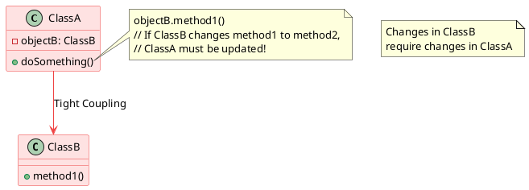

### Loose Coupling

:::tip[Prefer Loose Coupling]
Two classes A and B are loosely coupled when changes in class B do not cause changes in class A. They are mostly independent.
:::

**Solution:** Use interfaces to decouple dependencies. Class A refers to class B through an interface C, so changes in class B's implementation don't impact class A.

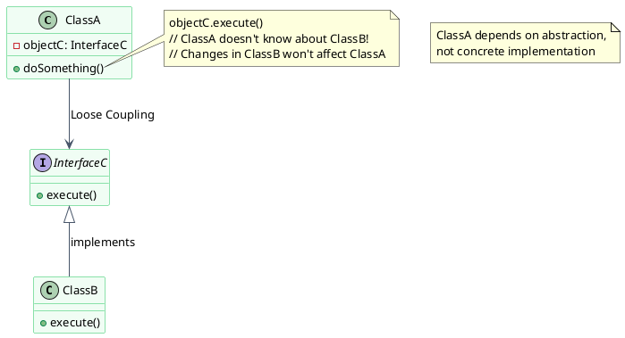

---

## The OOAD Process

The process of Object-Oriented Analysis and Design involves investigating the objects that constitute a system and determining how they interact.

### Key Steps

1. **Identify the objects** in a system
2. **Define relationships** between objects
3. **Establish the interface** of each object
4. **Create a design** that can be converted to executables using OO languages

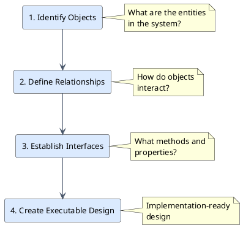

---

## Unified Modeling Language (UML)

:::note[Why UML?]
We need a standard method to document design information. **UML (Unified Modeling Language)** is powerful enough to represent all concepts in object-oriented analysis and design.
:::

UML is a way of visualizing and documenting a software system using a collection of diagrams, helping engineers, businesspeople, and system architects understand the behavior and structure of the system being designed.

### Types of UML Diagrams

There are 14 different kinds of UML diagrams, classified into two main groups:

#### Structural UML Diagrams

| Diagram Type | Purpose |
|--------------|---------|
| **Class Diagram** | Describes structure and behavior in use cases, providing a conceptual model in terms of entities and their relationships |
| **Component Diagram** | Shows how components are organized and their dependencies |
| **Object Diagram** | Shows a snapshot of objects and their relationships at a specific time |
| **Package Diagram** | Shows dependencies between packages |

#### Behavioral/Interaction UML Diagrams

| Diagram Type | Purpose |
|--------------|---------|
| **Use Case Diagram** | Describes user scenarios and illustrates the functionality provided by the system |
| **Sequence Diagram** | Describes interactions among classes in terms of message exchange over time |
| **Activity Diagram** | Models the functional flow-of-control between two or more class objects |
| **State Diagram** | Shows the different states of an object throughout its lifecycle |


---

## Class Diagram

:::tip[Class Diagrams]
Class diagrams show how different entities relate to each other. They describe the attributes and operations of a class and the constraints imposed on the system. Class diagrams are the **only UML diagrams** that can be mapped directly to object-oriented languages.
:::

### Class Structure

A class is depicted as a rectangle with three horizontal sections:

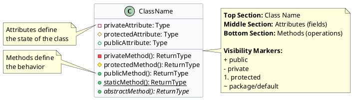

### Example: Flight Booking System

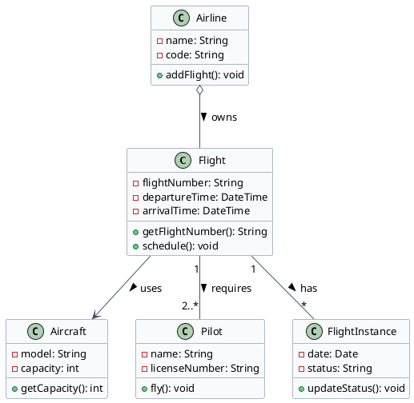

---

## Relationships Between Classes

### 1. Association

**Definition:** A link between classes that need to communicate with each other.

- **Uni-directional** (with arrow): Only one party is aware of the relationship
- **Bi-directional** (no arrow): Both entities are aware of the relationship

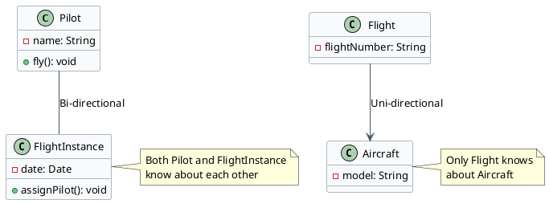

### 2. Multiplicity

**Definition:** Specifies how many instances of a class can participate in a relationship.

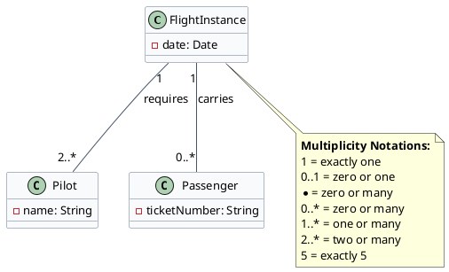

### 3. Aggregation (Hollow Diamond)

:::note[Has-A Relationship - Weak]
The child can exist independently of the parent. Models "whole to its parts" where parts have their own lifecycle.
:::

**Example:** Aircraft can exist without Airline. Books can exist without Library.

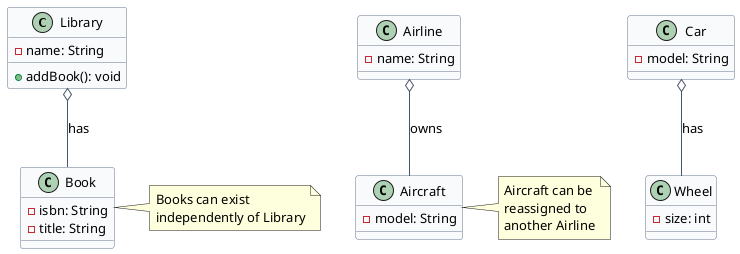

### 4. Composition (Filled Diamond)

:::caution[Has-A Relationship - Strong]
The child **cannot** exist without the parent. When the parent is destroyed, the child is automatically destroyed.
:::

**Example:** WeeklySchedule cannot exist without Flight. TransactionHistory cannot exist without BankAccount.

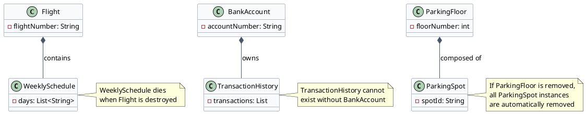

### 5. Generalization (Inheritance)

:::tip[IS-A Relationship]
Combining similar classes into a single, more general class. Represents inheritance hierarchy.
:::

**Example:** Crew, Pilot, and Admin are all Person. Dog IS-A Animal, Cat IS-A Animal.

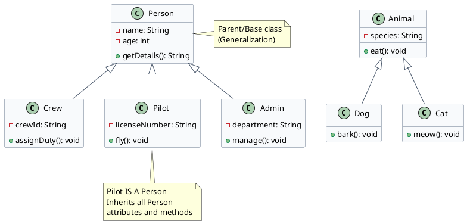

### 6. Dependency

:::note[Uses Relationship]
One class (client) uses or depends on another class (supplier). Usually a temporary relationship.
:::

**Example:** FlightReservation depends on Payment. Driver uses Vehicle.

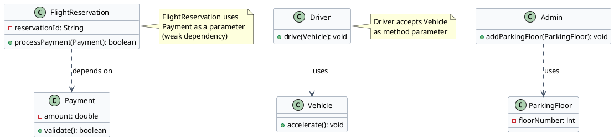

### 7. Abstract Class and Interface

**Abstract Class:** Identified by name in *italics*. Cannot be instantiated.

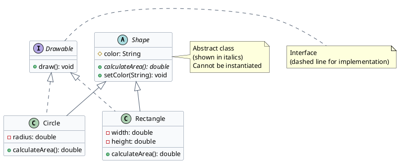

---

## Implementation in Code

**Association:** A class A is associated with class B if class A contains some reference to class B anywhere inside the class (as a field, method parameter, or return type).

:::tip[Three Types of Association]
1. **Dependency** - Weakest relationship (parameter/return type)
2. **Aggregation** - Moderate relationship (field reference, independent lifecycle)
3. **Composition** - Strongest relationship (field ownership, dependent lifecycle)
:::

### Dependency in Code

A weak association where an object accepts another object as a method parameter or return type.

**Example:**

```java title="Driver.java" "Vehicle vehicle" "vehicle.accelerate()"
// Dependency: Vehicle is only used as a method parameter
public class Driver {
    public void drive(Vehicle vehicle) {
        vehicle.accelerate();
    }
}

public class Vehicle {
    public void accelerate() {
        // Implementation
    }
}
```

:::note[Characteristics]
- Temporary relationship
- Object is not stored as a field
- Weakest form of coupling
:::

### Aggregation in Code

A Has-A relationship where the container holds a reference to the contained object. The contained object can exist independently and may be used by other parts of the system.

**Example:**

```java title="Car.java (Aggregation)" {3,6}
public class Car {
    // Car Has-A Engine (reference only)
    private Engine engine;
    
    // Engine created separately and passed in
    public Car(Engine engine) {
        this.engine = engine;
    }
    
    public void start() {
        engine.start();
    }
}

public class Engine {
    private int horsePower;
    
    public Engine(int horsePower) {
        this.horsePower = horsePower;
    }
    
    public void start() {
        System.out.println("Engine started");
    }
}
```

:::note[Key Characteristics]
- **Weak bonding** - Engine can exist without Car
- Container holds only a **reference** to the contained object
- Object created externally and passed in (usually via constructor or setter)
- Useful when the object might be shared or reused elsewhere (e.g., testing Engine independently)
:::

### Composition in Code

Also a Has-A relationship, but with **strong coupling**. The container directly owns the contained object. If the container dies, the contained object ceases to exist.

**Example:**

```java title="Vehicle.java (Composition)" {2,6} "new Engine"
public class Vehicle {
    private Engine myEngine;  // Vehicle owns Engine
    
    // Engine created inside constructor (composition)
    public Vehicle(int horsePower) {
        myEngine = new Engine(horsePower);  // Created here!
    }
    
    public void start() {
        myEngine.start();
    }
}
```

:::caution[Key Characteristics]
- **Strong bonding** - Engine cannot exist without Vehicle
- Container directly **creates and owns** the contained object
- Object created internally (typically in constructor)
- When Vehicle is destroyed, Engine is automatically destroyed
- Lifecycle is tightly coupled
:::

**Another Example:**

```java title="ParkingFloor.java (Strong Ownership)" {3,8,11} "new ParkingSpot"
public class ParkingFloor {
    // HashMap directly owns all ParkingSpot instances
    private Map<String, ParkingSpot> spots;
    
    public ParkingFloor(int capacity) {
        spots = new HashMap<>();
        // Create parking spots (composition)
        for (int i = 0; i < capacity; i++) {
            String spotId = "S" + i;
            spots.put(spotId, new ParkingSpot(spotId));
        }
    }
}
```

If `ParkingFloor` is removed, all `ParkingSpot` instances are automatically removed.

---

## UML Arrow Direction

:::tip[Arrow Direction Rule]
In UML, the arrow head always points **toward the dependency** - toward objects that receive messages.
:::

**Examples:**

```
[Vehicle] ----> [Engine]      (Vehicle depends on Engine)
[College] ----> [Branches]    (College depends on Branches)
[College] ----> [Professor]   (College depends on Professor)
```

The arrow shows the direction of knowledge and communication flow.


---

## Relationship Hierarchy

### Strength Order (Weakest → Strongest)

**Dependency → Association → Aggregation → Composition**

| Relationship | Symbol | Strength | Example |
|--------------|--------|----------|---------|
| **Dependency** | `A ..> B` | Weakest | Driver (A) uses Vehicle (B) |
| **Association** | `A --> B` | Weak | Admin (A) → ParkingFloor (B) |
| **Aggregation** | `A o-- B` | Moderate | Person (A) Has-A Address (B) |
| **Composition** | `A *-- B` | Strongest | ParkingFloor (A) owns Spots (B) |
| **Inheritance** | `A <\|-- B` | - | Dog (B) IS-A Animal (A) |

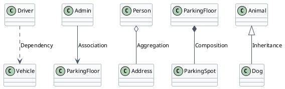

:::tip[Arrow Direction Rule]
The arrow head points toward the dependency - toward objects that receive messages.

**Examples:** `Vehicle --> Engine`, `College --> Professor`
:::

---

## Summary

:::tip[Key Takeaways]
1. **Loose coupling** is preferred for maintainability
2. **UML** provides standard visualization for OO designs
3. **Class diagrams** show structure and relationships
4. **Relationships** range from weak (dependency) to strong (composition)
5. Use **aggregation** when parts can exist independently
6. Use **composition** when parts cannot exist without the whole
:::


