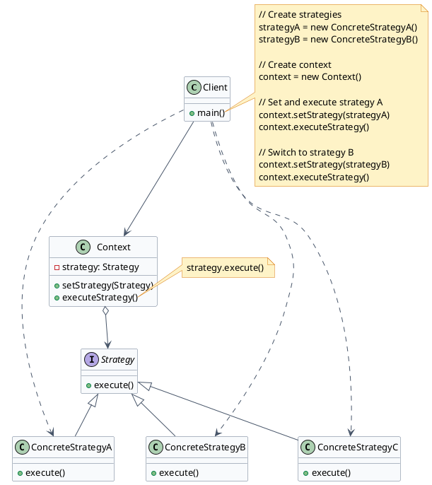
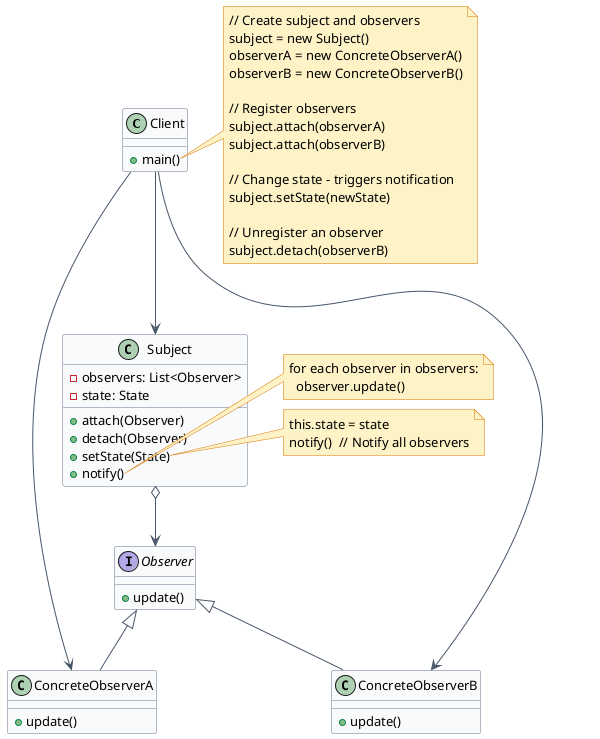
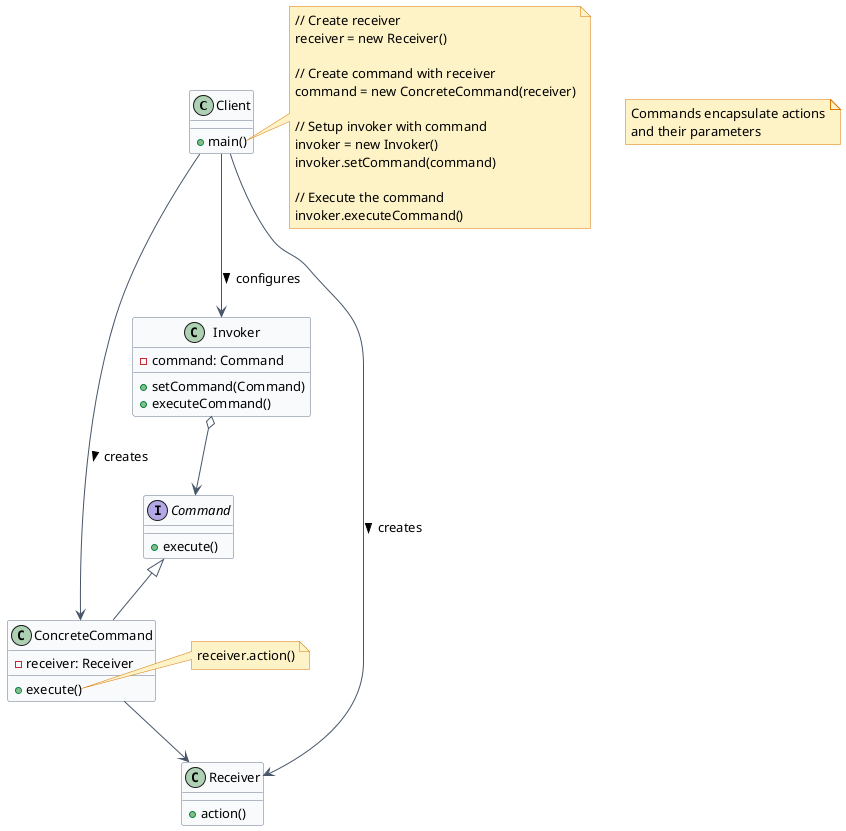
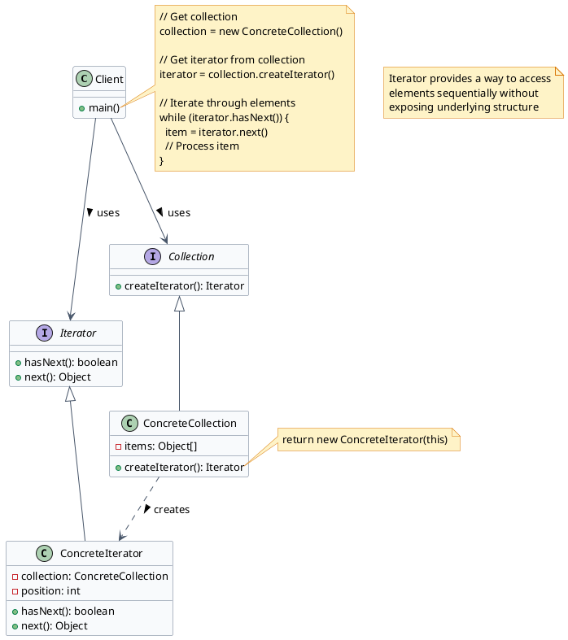
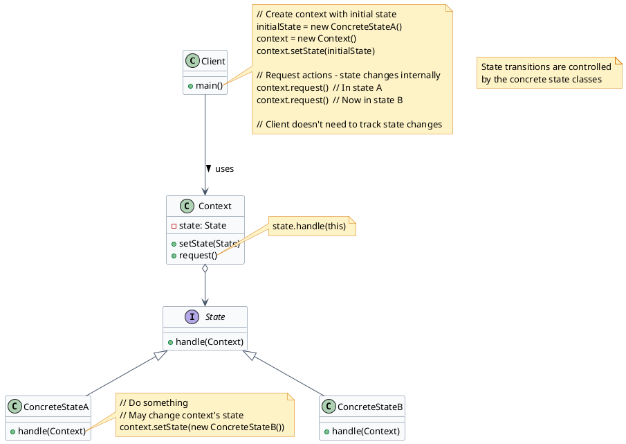
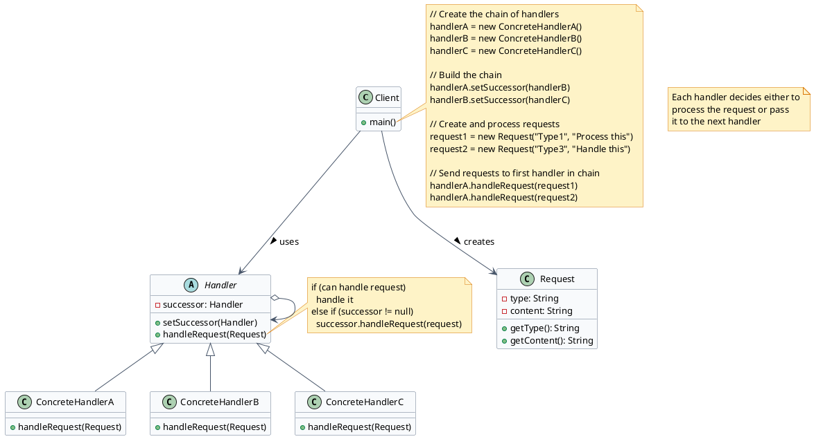
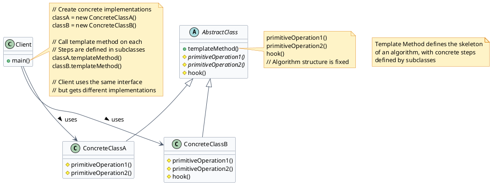
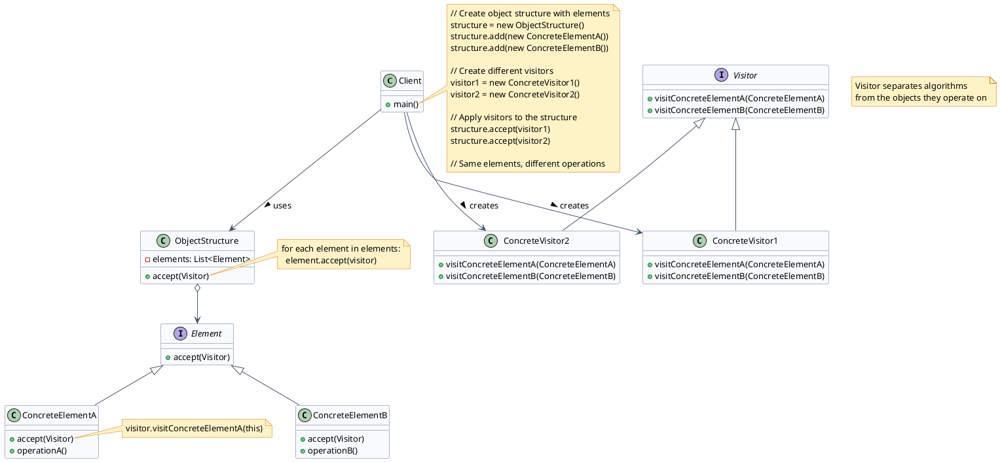
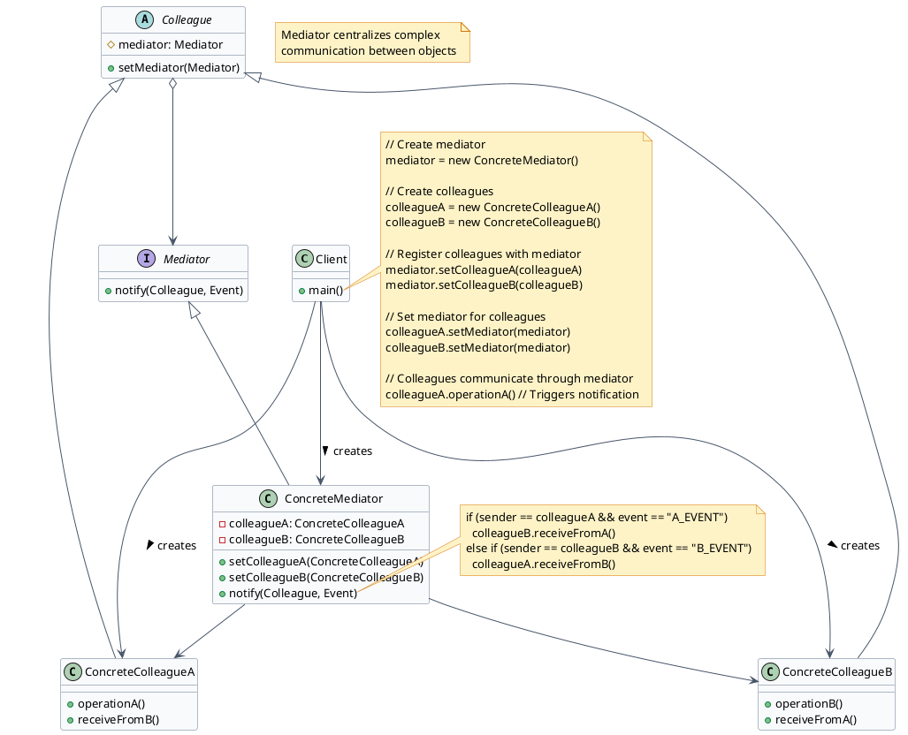
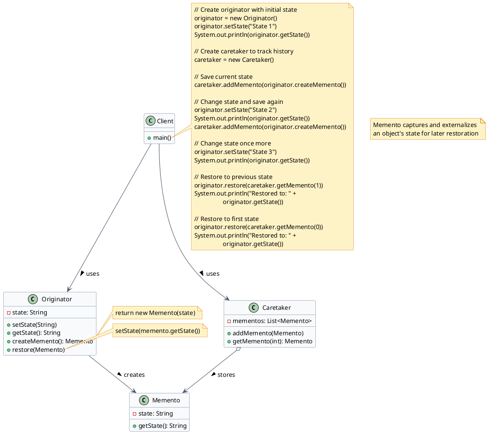

Behavioral patterns take care of effective communication and the assignment of responsibilities between objects.

## Overview of Behavioral Patterns

1. **Strategy** - Lets you define a family of algorithms, put each of them in a separate class and make their objects interchangeable.
2. **Observer** - Lets you define a subscription mechanism to notify multiple objects if any events happens to objects they're observing.
3. **Command** - Turns a request into a stand-alone object that contains all information about the request. This transformation lets us pass the requests as arguments, delay or queue execution, and support undo operations.
4. **Iterator** - Lets us traverse elements of a collection without exposing the underlying representation (List, stack, tree, etc.).
5. **State** - Lets an object alter its behavior when its internal state changes, it appears as if the object changed its class.
6. **Chain of Responsibility** - Lets you pass the requests along the chain of handlers; on receiving the request, each handler decides either to process the request or to pass it to the next handler in the chain.
7. **Template Method** - Defines the skeleton of an algorithm in the superclass but lets the subclasses override specific steps of the algorithm without changing its structure.
8. **Visitor** - Lets you separate the algorithms from the objects on which they operate.
9. **Mediator** - Lets you reduce the chaotic dependencies between objects. The pattern restricts direct communication between objects and forces them to collaborate only through the mediator object.
10. **Memento** - Lets you store and restore the previous state of the object without revealing the details of its implementation.

## Strategy Pattern

The Strategy pattern defines a family of algorithms, encapsulates each one, and makes them interchangeable. Strategy lets the algorithm vary independently from clients that use it.

### Key Components:

- **Context**: Maintains a reference to a Strategy object and delegates it to execute the algorithm
- **Strategy**: Common interface for all concrete strategies
- **ConcreteStrategy**: Implements the algorithm using the Strategy interface

### When to Use:

- When you need different variants of an algorithm
- When you want to isolate algorithm implementation details from the code that uses it
- When you have many related classes that differ only in their behavior
- When you need to switch algorithms at runtime
- When an algorithm uses data that clients shouldn't know about

### Real-World Example:

Navigation apps that can calculate a route using different strategies: fastest route, shortest distance, avoiding highways, public transport, etc.

## Observer Pattern

The Observer pattern lets you define a subscription mechanism to notify multiple objects about any events that happen to the object they're observing.

### Key Components:

- **Subject**: Maintains a list of observers and notifies them of state changes
- **Observer**: Interface that defines the update method for objects that should be notified
- **ConcreteObserver**: Implements the Observer interface to respond to updates

### When to Use:

- When changes to one object require changing others, and you don't know how many objects need to change
- When an object should be able to notify other objects without making assumptions about who these objects are
- When you need a one-to-many dependency between objects that is loosely coupled
- When you need a publish-subscribe communication pattern
- When the set of objects that need to be notified can change dynamically

### Real-World Example:

Event listeners in user interfaces, subscription systems (like YouTube channel subscriptions), or financial market data feeds.

## Command Pattern

The Command pattern turns a request into a stand-alone object containing all information about the request, allowing you to parameterize clients with queues, requests, and operations.

### Key Components:

- **Command**: Interface with an execute method
- **ConcreteCommand**: Implements Command and links to a Receiver
- **Invoker**: Asks the command to carry out the action

### When to Use:

- When you want to parameterize objects with operations
- When you want to queue operations, schedule their execution, or execute them remotely
- When you need to implement reversible operations (undo/redo functionality)
- When you want to structure a system around high-level operations built on primitive operations
- When you need to decouple objects that execute commands from objects that issue commands
- **Receiver**: Knows how to perform the operations

### Real-World Example:

Remote controls, command queues in game engines, transactional systems with undo capability, or task schedulers.

## Iterator Pattern

The Iterator pattern provides a way to access elements of a collection sequentially without exposing its underlying representation.

### Key Components:

- **Iterator**: Interface with methods for traversing a collection
- **ConcreteIterator**: Implements the Iterator interface
- **Collection**: Interface that creates an Iterator
- **ConcreteCollection**: Implements Collection and returns ConcreteIterator

### When to Use:

- When you need to access a collection's contents without exposing its internal structure
- When you need multiple traversal algorithms for a collection
- When you want to provide a uniform interface for traversing different collection types
- When you need to decouple algorithms from the data structures they operate on
- When you want to hide the complexity of navigation from client code

### Real-World Example:

Java's Iterator and Iterable interfaces, database result sets, or custom collection traversal implementations.

## State Pattern

The State pattern allows an object to alter its behavior when its internal state changes, making it appear as if the object changed its class.

### Key Components:

- **Context**: Maintains a reference to a State object and delegates state-specific behavior
- **State**: Interface defining state-specific behavior
- **ConcreteState**: Classes that implement specific states' behavior

### When to Use:

- When an object's behavior depends on its state, and it must change behavior at runtime
- When operations have large, multipart conditional statements that depend on the object's state
- When state transitions are complex and need to be represented explicitly
- When you want to avoid massive conditional logic in one class
- When you want state transitions to be explicit and controlled by the state objects themselves

### Real-World Example:

Order processing systems (ordered, shipped, delivered), document editing (editing, formatting, reviewing), or media players (playing, paused, stopped).

## Chain of Responsibility Pattern

The Chain of Responsibility pattern passes a request along a chain of handlers, with each handler deciding either to process the request or pass it to the next handler in the chain.

### Key Components:

- **Handler**: Abstract class/interface defining the request handling method and successor link
- **ConcreteHandler**: Implements the request handling behavior

### When to Use:

- When more than one object may handle a request, and the handler isn't known in advance
- When you want to issue a request to one of several objects without specifying the receiver explicitly
- When the set of objects that can handle a request should be specified dynamically
- When you want to decouple the sender and receiver of a request
- When you need to process different requests in different ways but don't know the sequence in advance

### Real-World Example:

HTTP request middleware, event propagation in UI frameworks, or approval workflows with multiple levels of authority.

## Template Method Pattern

The Template Method pattern defines the skeleton of an algorithm in a base class, with specific steps implemented by subclasses without changing the algorithm's structure.

### Key Components:

- **AbstractClass**: Defines template methods and abstract operations
- **ConcreteClass**: Implements the primitive operations required by the template method

### When to Use:

- When you want to implement the invariant parts of an algorithm once and leave the variant parts to subclasses
- When you want to control the extension points available to subclasses
- When common behavior among subclasses should be factored into a common class
- When you want to avoid code duplication in related classes
- When you need a way to refactor for better code reuse while maintaining algorithm structure

### Real-World Example:

Framework lifecycle methods, data processing pipelines, or document generation systems.

## Visitor Pattern

The Visitor pattern separates algorithms from the objects on which they operate, allowing you to add new operations to existing object structures without modifying those structures.

### Key Components:

- **Visitor**: Interface declaring visit methods for each element type
- **ConcreteVisitor**: Implements the visitor interface with specific behavior
- **Element**: Interface declaring an accept method
- **ConcreteElement**: Implements the element interface

### When to Use:

- When you need to perform operations on objects of a composite structure
- When you want to add new operations to a class hierarchy without modifying the hierarchy
- When you have many distinct operations to perform on objects, but don't want to pollute their classes
- When the object structure classes rarely change but you often need to define new operations on them
- When you want to collect related operations into a single class rather than spreading them across multiple classes

### Real-World Example:

Document object model (DOM) operations, abstract syntax tree (AST) processing, or report generation from complex data structures.

## Mediator Pattern

The Mediator pattern reduces chaotic dependencies between objects by restricting direct communications and forcing collaborations through a mediator object.

### Key Components:

- **Mediator**: Interface defining communication method between colleagues
- **ConcreteMediator**: Implements Mediator and coordinates between colleague objects
- **Colleague**: Abstract class for objects that communicate through the mediator
- **ConcreteColleague**: Implements Colleague with specific behavior

### When to Use:

- When a set of objects communicate in well-defined but complex ways
- When reusing an object is difficult because it communicates with many other objects
- When you want to customize how objects interact without subclassing
- When you have many classes that are tightly coupled making the system hard to maintain
- When you want to avoid a "many-to-many" relationship between communicating objects

### Real-World Example:

Air traffic control systems, chat room servers, or UI components coordination.

## Memento Pattern

The Memento pattern lets you capture and externalize an object's internal state so it can be restored to this state later without violating encapsulation.

### Key Components:

- **Originator**: Creates a memento containing its state and uses it to restore state
- **Memento**: Stores the internal state of the Originator
- **Caretaker**: Keeps track of multiple mementos

### When to Use:

- When you need to create snapshots of an object's state for later restoration
- When direct access to an object's fields/getters/setters would expose implementation details
- When you need to implement undo/redo functionality
- When you want to provide a rollback mechanism for operations
- When you need to maintain history states while preserving encapsulation

### Real-World Example:

Undo/redo functionality, save game systems, or transaction rollbacks in databases.
