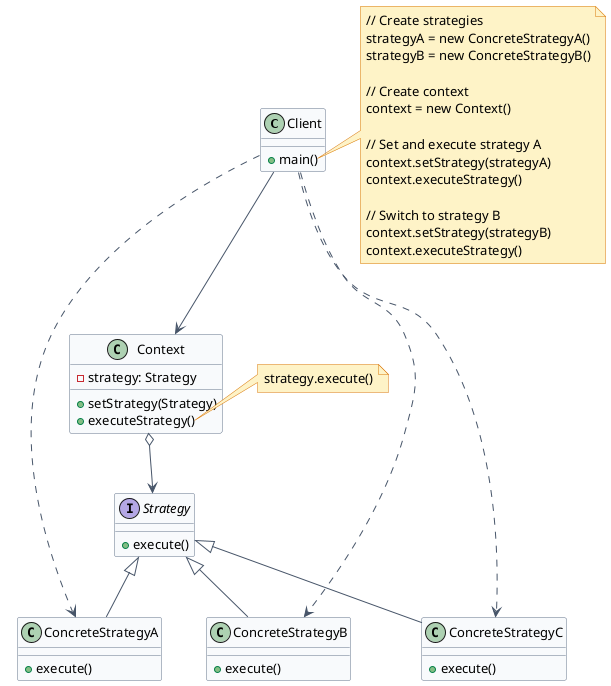
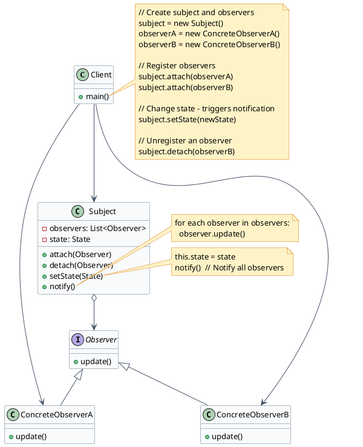
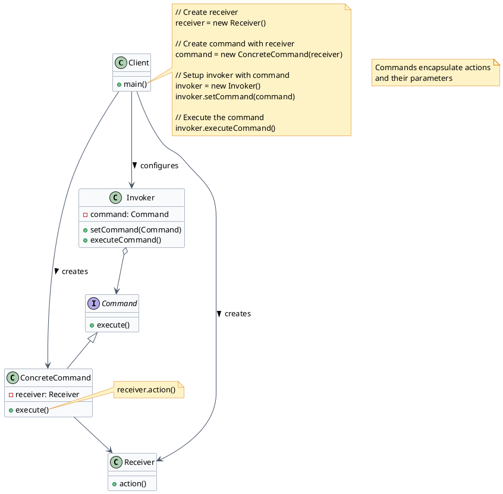
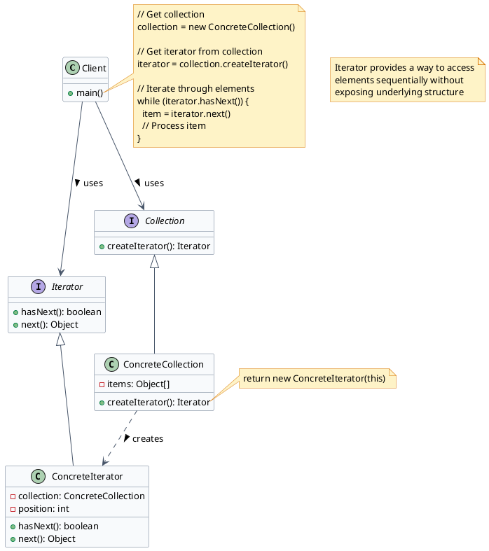
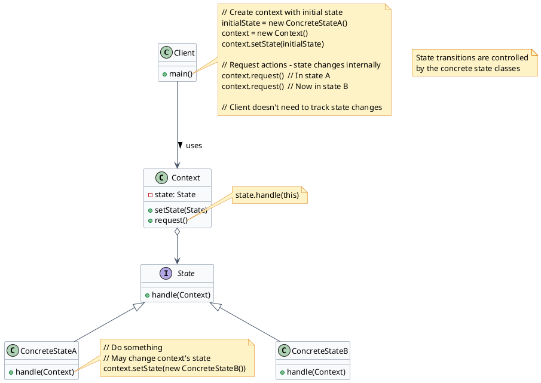
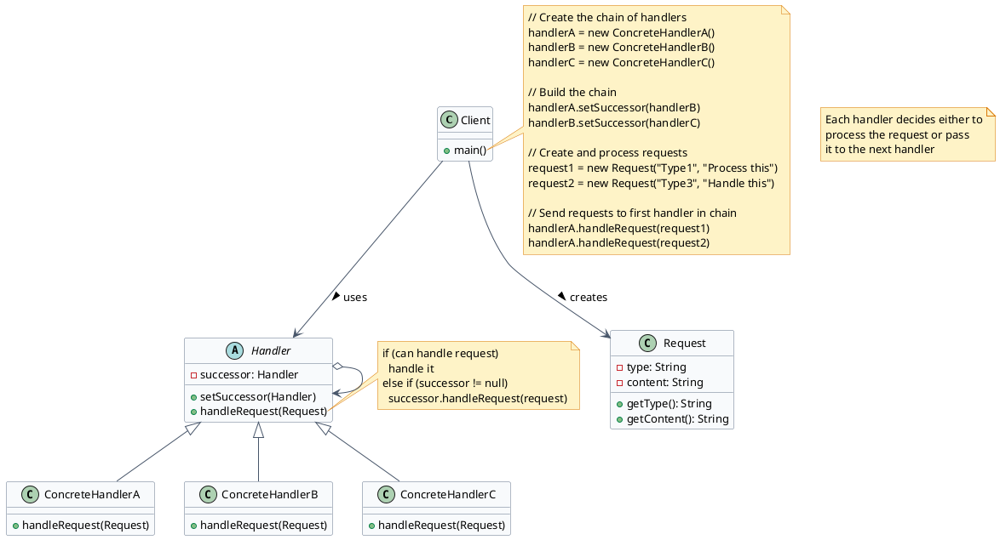
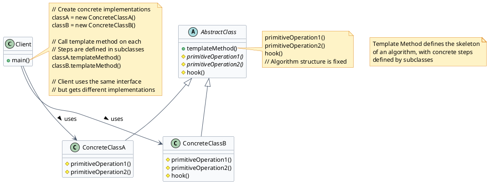
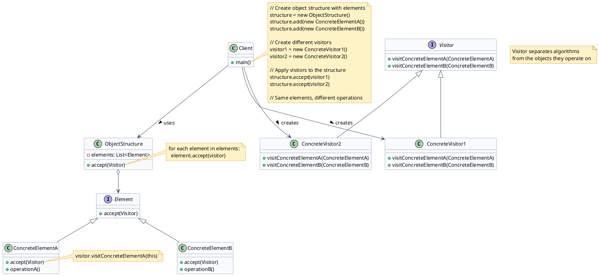
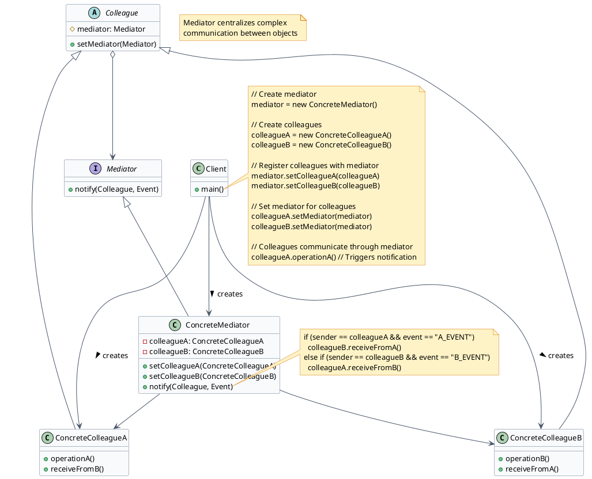
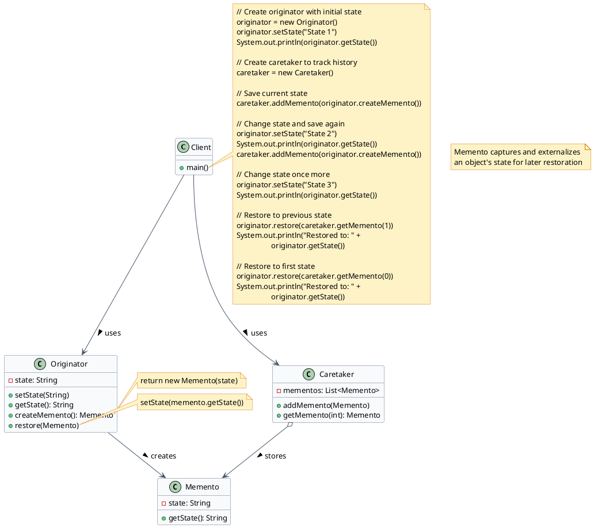

Behavioral patterns take care of effective communication and the assignment of responsibilities between objects.

## Overview of Behavioral Patterns

| Pattern | Purpose |
|---------|---------|
| **Strategy** | Define a family of algorithms, put each in a separate class, and make their objects interchangeable |
| **Observer** | Define a subscription mechanism to notify multiple objects about events happening to observed objects |
| **Command** | Turn requests into stand-alone objects containing all request information |
| **Iterator** | Traverse elements of a collection without exposing the underlying representation |
| **State** | Let an object alter its behavior when its internal state changes |
| **Chain of Responsibility** | Pass requests along a chain of handlers where each decides to process or forward |
| **Template Method** | Define the skeleton of an algorithm in a superclass, letting subclasses override specific steps |
| **Visitor** | Separate algorithms from the objects on which they operate |
| **Mediator** | Reduce chaotic dependencies by forcing objects to collaborate through a mediator |
| **Memento** | Store and restore the previous state of an object without revealing implementation details |

---

## Strategy Pattern

:::tip[Intent]
Define a family of algorithms, encapsulate each one, and make them interchangeable. Strategy lets the algorithm vary independently from clients that use it.
:::

### Key Components

- **Context**: Maintains a reference to a Strategy object and delegates it to execute the algorithm
- **Strategy**: Common interface for all concrete strategies
- **ConcreteStrategy**: Implements the algorithm using the Strategy interface

### When to Use

:::note[Use Strategy Pattern When]
- You need different variants of an algorithm
- You want to isolate algorithm implementation details from the code that uses it
- You have many related classes that differ only in their behavior
- You need to switch algorithms at runtime
- An algorithm uses data that clients shouldn't know about
:::

### Real-World Examples

- **Navigation Apps** - Calculate routes using different strategies (fastest, shortest, avoid highways, public transport)
- **Payment Processing** - Different payment methods (credit card, PayPal, cryptocurrency)
- **Compression Algorithms** - Various compression strategies (ZIP, RAR, 7z)
- **Sorting Algorithms** - Different sorting implementations based on data characteristics

---

## Observer Pattern

:::tip[Intent]
Define a one-to-many dependency between objects so that when one object changes state, all its dependents are notified and updated automatically.
:::

### Key Components

- **Subject**: Maintains a list of observers and notifies them of state changes
- **Observer**: Interface that defines the update method for objects that should be notified
- **ConcreteObserver**: Implements the Observer interface to respond to updates

### When to Use

:::note[Use Observer Pattern When]
- Changes to one object require changing others, and you don't know how many objects need to change
- An object should notify others without making assumptions about who they are
- You need a one-to-many dependency between objects that is loosely coupled
- You need a publish-subscribe communication pattern
- The set of objects that need to be notified can change dynamically
:::

### Real-World Examples

- **UI Event Listeners** - Button clicks, form submissions, keyboard events
- **Subscription Systems** - YouTube channels, newsletters, RSS feeds
- **Stock Market Feeds** - Real-time price updates to multiple traders
- **Social Media** - Notification systems for likes, comments, and shares

---

## Command Pattern

:::tip[Intent]
Encapsulate a request as an object, thereby letting you parameterize clients with different requests, queue or log requests, and support undoable operations.
:::

### Key Components

- **Command** - Interface with an execute method
- **ConcreteCommand** - Implements Command and links to a Receiver
- **Invoker** - Asks the command to carry out the action
- **Receiver** - Knows how to perform the operations

### When to Use

:::note[Use Command Pattern When]
- You want to parameterize objects with operations
- You want to queue operations, schedule their execution, or execute them remotely
- You need to implement reversible operations (undo/redo functionality)
- You want to structure a system around high-level operations built on primitive operations
- You need to decouple objects that execute commands from objects that issue commands
:::

### Real-World Examples

- **Remote Controls** - TV remotes, smart home devices
- **Text Editors** - Undo/redo functionality
- **Game Commands** - Action queues, replay systems
- **Task Schedulers** - Job queues, batch processing
- **Transactional Systems** - Database transactions with rollback

---

## Iterator Pattern

:::tip[Intent]
Provide a way to access the elements of an aggregate object sequentially without exposing its underlying representation.
:::

### Key Components

- **Iterator**: Interface with methods for traversing a collection
- **ConcreteIterator**: Implements the Iterator interface
- **Collection**: Interface that creates an Iterator
- **ConcreteCollection**: Implements Collection and returns ConcreteIterator

### When to Use

:::note[Use Iterator Pattern When]
- You need to access a collection's contents without exposing its internal structure
- You need multiple traversal algorithms for a collection
- You want to provide a uniform interface for traversing different collection types
- You need to decouple algorithms from the data structures they operate on
- You want to hide the complexity of navigation from client code
:::

### Real-World Examples

- **Java Collections** - Iterator and Iterable interfaces
- **Database Result Sets** - Cursor-based record traversal
- **File Systems** - Directory tree traversal
- **Social Media Feeds** - Infinite scroll pagination

---

## State Pattern

:::tip[Intent]
Allow an object to alter its behavior when its internal state changes. The object will appear to change its class.
:::

### Key Components

- **Context**: Maintains a reference to a State object and delegates state-specific behavior
- **State**: Interface defining state-specific behavior
- **ConcreteState**: Classes that implement specific states' behavior

### When to Use

:::note[Use State Pattern When]
- An object's behavior depends on its state, and it must change behavior at runtime
- Operations have large, multipart conditional statements that depend on the object's state
- State transitions are complex and need to be represented explicitly
- You want to avoid massive conditional logic in one class
- You want state transitions to be explicit and controlled by the state objects themselves
:::

### Real-World Examples

- **Order Processing** - States: ordered → paid → shipped → delivered
- **Document Workflow** - States: draft → review → approved → published
- **Media Players** - States: playing, paused, stopped, buffering
- **TCP Connections** - States: closed, listen, established, closing
- **Vending Machines** - States: idle, selecting, dispensing, out of stock

---

## Chain of Responsibility Pattern

:::tip[Intent]
Avoid coupling the sender of a request to its receiver by giving more than one object a chance to handle the request. Chain the receiving objects and pass the request along the chain until an object handles it.
:::

### Key Components

- **Handler**: Abstract class/interface defining the request handling method and successor link
- **ConcreteHandler**: Implements the request handling behavior

### When to Use

:::note[Use Chain of Responsibility When]
- More than one object may handle a request, and the handler isn't known in advance
- You want to issue a request to one of several objects without specifying the receiver explicitly
- The set of objects that can handle a request should be specified dynamically
- You want to decouple the sender and receiver of a request
- You need to process different requests in different ways but don't know the sequence in advance
:::

### Real-World Examples

- **HTTP Middleware** - Authentication → logging → compression → response
- **Event Propagation** - UI event bubbling in DOM hierarchy
- **Approval Workflows** - Employee → manager → director → VP
- **Exception Handling** - Try-catch chains in error processing
- **Logging Frameworks** - Different log levels (debug, info, warn, error)

---

## Template Method Pattern

:::tip[Intent]
Define the skeleton of an algorithm in an operation, deferring some steps to subclasses. Template Method lets subclasses redefine certain steps of an algorithm without changing the algorithm's structure.
:::

### Key Components

- **AbstractClass**: Defines template methods and abstract operations
- **ConcreteClass**: Implements the primitive operations required by the template method

### When to Use

:::note[Use Template Method When]
- You want to implement the invariant parts of an algorithm once and leave the variant parts to subclasses
- You want to control the extension points available to subclasses
- Common behavior among subclasses should be factored into a common class
- You want to avoid code duplication in related classes
- You need a way to refactor for better code reuse while maintaining algorithm structure
:::

### Real-World Examples

- **Framework Lifecycle** - React component lifecycle, Spring bean lifecycle
- **Data Processing** - ETL pipelines (extract → transform → load)
- **Document Generation** - Report templates with customizable sections
- **Testing Frameworks** - setUp → test → tearDown
- **Game Development** - Game loop: initialize → update → render

---

## Visitor Pattern

:::tip[Intent]
Represent an operation to be performed on elements of an object structure. Visitor lets you define a new operation without changing the classes of the elements on which it operates.
:::

### Key Components

- **Visitor**: Interface declaring visit methods for each element type
- **ConcreteVisitor**: Implements the visitor interface with specific behavior
- **Element**: Interface declaring an accept method
- **ConcreteElement**: Implements the element interface

### When to Use

:::note[Use Visitor Pattern When]
- You need to perform operations on objects of a composite structure
- You want to add new operations to a class hierarchy without modifying the hierarchy
- You have many distinct operations to perform on objects, but don't want to pollute their classes
- The object structure classes rarely change but you often need to define new operations on them
- You want to collect related operations into a single class rather than spreading them across multiple classes
:::

### Real-World Examples

- **Compiler Design** - Abstract syntax tree (AST) traversal and analysis
- **Document Processing** - XML/HTML DOM operations (rendering, validation, transformation)
- **Report Generation** - Different export formats (PDF, HTML, JSON) from same data structure
- **Tax Calculation** - Computing taxes for different product types
- **Graphics Rendering** - Rendering different shape types

---

## Mediator Pattern

:::tip[Intent]
Define an object that encapsulates how a set of objects interact. Mediator promotes loose coupling by keeping objects from referring to each other explicitly, and it lets you vary their interaction independently.
:::

### Key Components

- **Mediator**: Interface defining communication method between colleagues
- **ConcreteMediator**: Implements Mediator and coordinates between colleague objects
- **Colleague**: Abstract class for objects that communicate through the mediator
- **ConcreteColleague**: Implements Colleague with specific behavior

### When to Use

:::note[Use Mediator Pattern When]
- A set of objects communicate in well-defined but complex ways
- Reusing an object is difficult because it communicates with many other objects
- You want to customize how objects interact without subclassing
- You have many classes that are tightly coupled making the system hard to maintain
- You want to avoid a "many-to-many" relationship between communicating objects
:::

### Real-World Examples

- **Air Traffic Control** - Centralized coordination of aircraft communication
- **Chat Rooms** - Server mediates messages between users
- **UI Dialog Boxes** - Coordinating interactions between form elements
- **Stock Exchange** - Mediating trades between buyers and sellers
- **Smart Home Systems** - Central hub coordinating device interactions

---

## Memento Pattern

:::tip[Intent]
Without violating encapsulation, capture and externalize an object's internal state so that the object can be restored to this state later.
:::

### Key Components

- **Originator**: Creates a memento containing its state and uses it to restore state
- **Memento**: Stores the internal state of the Originator
- **Caretaker**: Keeps track of multiple mementos

### When to Use

:::note[Use Memento Pattern When]
- You need to create snapshots of an object's state for later restoration
- Direct access to an object's fields/getters/setters would expose implementation details
- You need to implement undo/redo functionality
- You want to provide a rollback mechanism for operations
- You need to maintain history states while preserving encapsulation
:::

### Real-World Examples

- **Text Editors** - Undo/redo functionality for document changes
- **Video Games** - Save game states, checkpoints
- **Database Systems** - Transaction rollback mechanisms
- **Version Control** - Saving and restoring file states
- **Drawing Applications** - History of drawing operations
- **Form Wizards** - Saving progress across multiple steps
