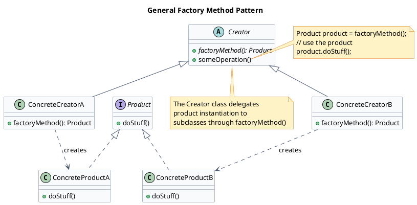
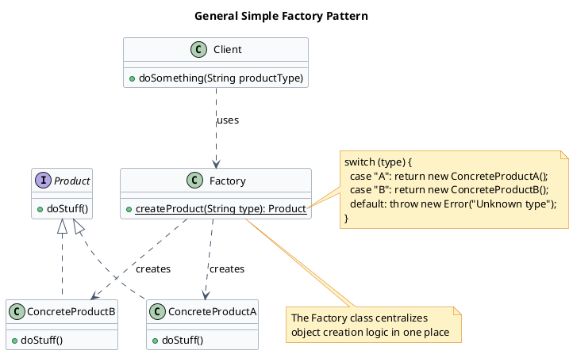
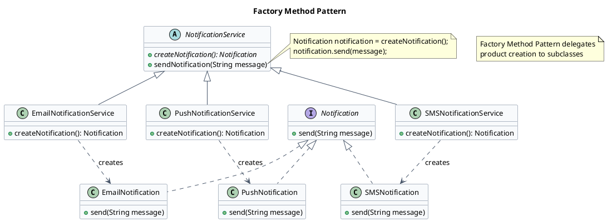
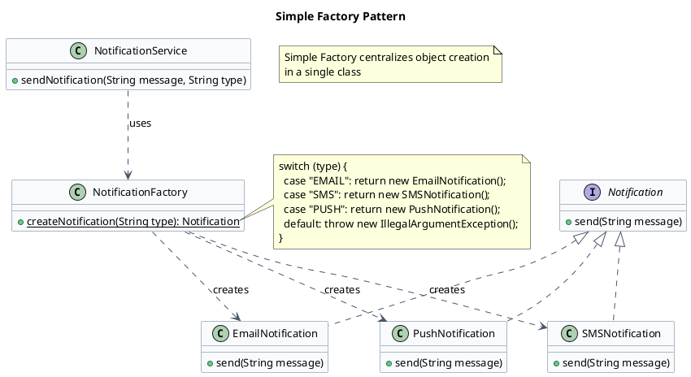

Creational design patterns provide various object creation mechanisms, which increase flexibility and reuse of existing code.

Popular ones-
 - **[Singleton](/low-level-design/patterns/singleton/)** - lets you ensure that a class has only one instance, while providing a global access point to this instance.
 - **Factory Method** - provides an interface for creating objects in a superclass, but allows subclasses to alter the type of objects that will be created.
 - **Abstract Factory** - lets you produce families of related objects without specifying their concrete classes.
 - **Builder** - Lets you construct complex objects step by step. The pattern allows you to produce different types and representations of an object using the same construction code.
 - **Prototype** - Lets you copy existing objects without making your code dependent on their classes.

## Factory Method

> The Factory Method Design Pattern is a creational pattern that provides an interface for creating objects in a **superclass**, but allows **subclasses** to alter the type of objects that will be created.

:::note
meaning there will be a **superclass** with a *abstract method* for creating some **Product(interface)** object which it will use for setting a **Product** instance in it's local variable, and then it will be responsibility of **subclasses** to implement this method and return an instance of the appropriate **Product** subclass.
:::




### Example
Let's take an example of simple notification sending application, which was designed without using factory method pattern. The application was designed initially only for sending email notification, so application works well, however it's difficult to extend now coz the notification service is having email notifications hardcoded.

There's two ways to solve this problem:
```java {4}
// NotificationService.java 
class NotificationService {
    public void sendNotification(String message) {
        EmailNotification email = new EmailNotification();
        email.send(message);
    }
}
```
following is sample implementation of email notification
```java collapse={1-6}
// EmailNotification.java 
class EmailNotification implements Notification {
    public void send(String message) {
        System.out.println("Sending an Email notification...");
    }
}
```

:::note
**Why two different solutions?**

**Factory Method Pattern** is an official GoF pattern — it emphasizes inheritance and polymorphism, where subclasses determine the object type.

**Simple Factory** is a common practical idiom — it emphasizes encapsulating object creation in one utility class, often using static methods.

In short -
If you want extensibility and polymorphism, use **Factory Method**.

If you want simplicity and centralized object creation, use **Simple Factory**.
:::

### Solution #1(Method style)
now if we want to add SMS notification and push notifications due to per new requirements. it would be difficult, here the difficulty is not much apparent but if it were a huge code base then we would need to rewrite the entire app or update the hardcoded instances.

Solution is to use Factory Method pattern, which will allow us to create new notification types without modifying the existing code.

Idea being instead of hardcoding the EmailNotification object creation we will let subclasses decide which notification type to create.



First we create the creator abstract class with createNotification abstract method, which will be implemented by subclasses to create specific notification objects.

```java {3,6}
// NotificationService.java 
abstract class NotificationService {
    public abstract Notification createNotification();

    public void sendNotification(String message) {
        Notification notification = createNotification();
        notification.send(message);
    }
}
```

The Notification interface will be implemented by all concrete notification classes.
```java collapse={1-4}
// Notification.java 
interface Notification {
    public void send(String message);
}
```

Next we create the individual products
```java
// EmailNotification.java
class EmailNotification implements Notification {
    public void send(String message) {
        System.out.println("Sending an Email notification...");
    }
}
```
similarly we have following files-
```java collapse={1-6}
// SMSNotification.java 
class SMSNotification implements Notification {
    public void send(String message) {
        System.out.println("Sending an SMS notification...");
    }
}
```
```java collapse={1-6}
// PushNotification.java
class PushNotification implements Notification {
    public void send(String message) {
        System.out.println("Sending a Push notification...");
    }
}
```

### Solution #2(Class style) or simple factory
Here, you use a separate class with a static method that creates objects.
This centralizes object creation logic in one place, but it's not as flexible as the Factory Method, since you may need to modify the factory whenever new types are added.



```java
// NotificationFactory.java
class NotificationFactory {
    public static Notification createNotification(String type) {
        switch (type) {
            case "EMAIL":
                return new EmailNotification();
            case "SMS":
                return new SMSNotification();
            case "PUSH":
                return new PushNotification();
            default:
                throw new IllegalArgumentException("Unknown notification type");
        }
    }
}
```

Then the NotificationService class will use this factory to create notification objects.
```java
// NotificationService.java
class NotificationService {
    public void sendNotification(String message, String type) {
        Notification notification = NotificationFactory.createNotification(type);
        notification.send(message);
    }
}
```
:::success
1. **Encapsulation** - Centralizes and hides object creation logic.

2. **Loose Coupling** - Clients depend on interfaces/abstractions instead of concrete classes.

3. **Scalability** - Easy to introduce new product types without changing client code.
:::

:::caution
1. **Complexity Overhead** - Introduces extra classes/interfaces that may be unnecessary for simple cases.

2. **Open/Closed Violation (in Simple Factory)** - Adding new types often requires modifying the factory.
:::