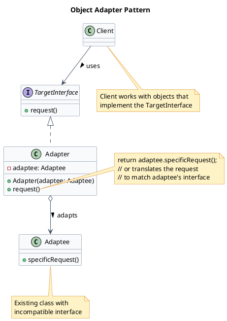
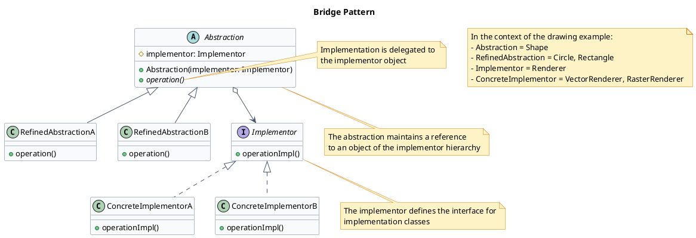
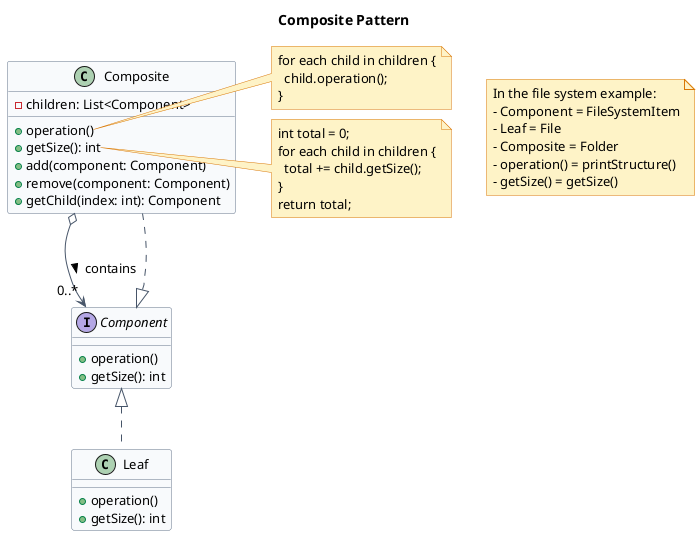
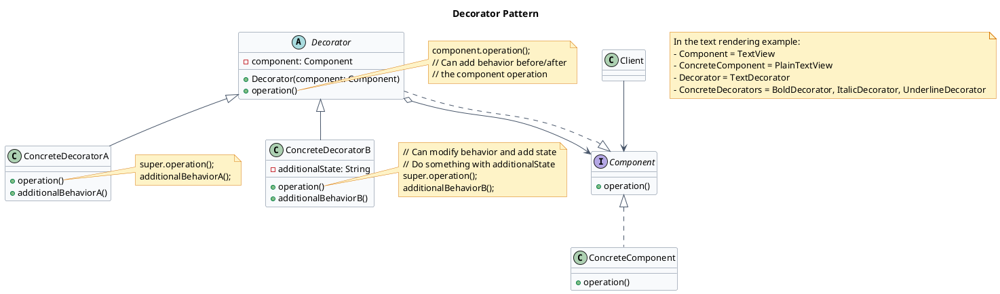
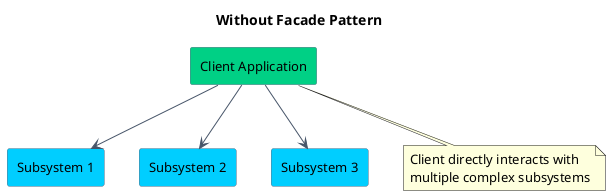
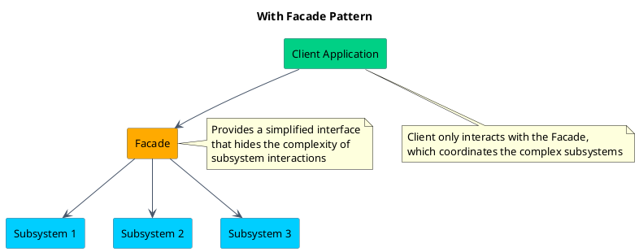
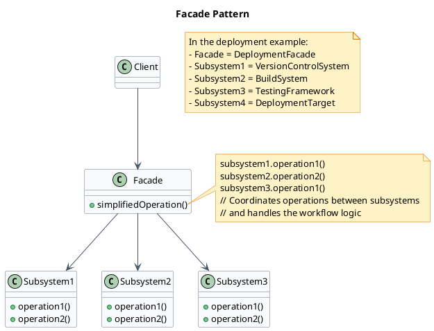
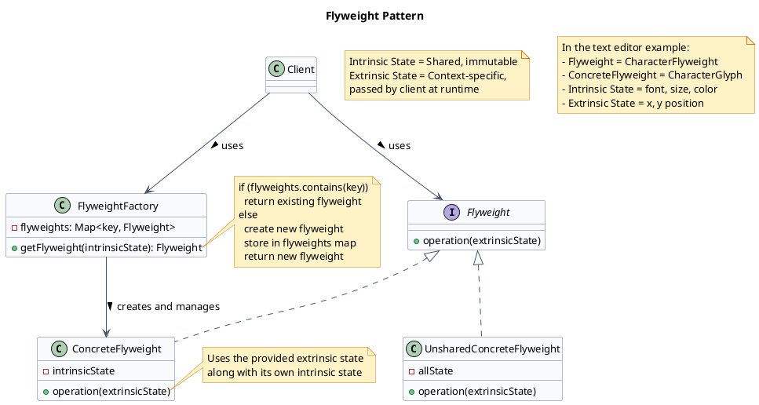
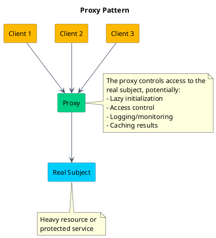
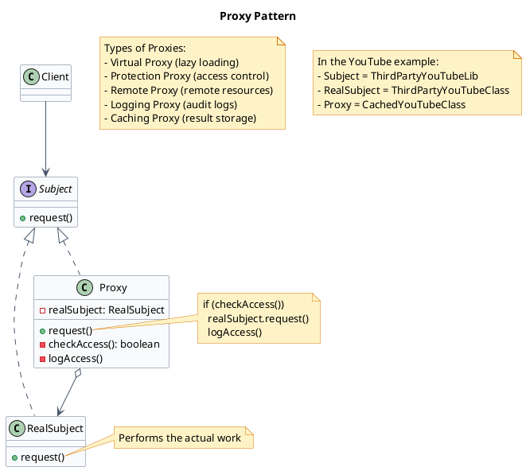

Structural design patterns explain how to assemble objects and classes into larger structures, while keeping these structures flexible and efficient.

:::note
Common structural patterns include:
1. **Adapter** - allows objects with incompatible interfaces to work together.
2. **Bridge** - Let's you separate a large class or set of closely related classes into two separate hierarchies: abstraction and implementation -- which can be developed independently.
3. **Composite** - Lets us compose objects into tree structures to represent part-whole hierarchies.
4. **Decorator** - Lets us attach new behaviours to objects by placing these objects under a special wrapper objects that contains the behaviours.
5. **Facade** - provides a simplified interface to a complex subsystem.
6. **Flyweight** - reduces the cost of creating and manipulating a large number of similar objects. It lets us fit more objects in available memory by sharing common parts of state between multiple objects instead of keeping all data in each object.
7. **Proxy** - Lets you provide a substitute or placeholder for another object. A proxy controls access to the original object, allowing you to perform something either before or after the request gets through to the original object.
:::

## Adapter
> The Adapter Design Pattern is a structural design pattern that allows incompatible interfaces to work together by converting the interface of one class into another that the client expects.

### Problem
When faced with incompatible interfaces, developers often resort to rewriting large parts of code or embedding conditionals like `if (legacyType)` to handle special cases. For example, a `PaymentProcessor` might use `if-else` logic to handle both a modern `StripeService` and a legacy `BankTransferAPI`.

But as more incompatible services or modules are introduced, this approach quickly becomes messy, tightly coupled, and violates the Open/Closed Principle making the system hard to scale or refactor.

For example let's say following is the expected `PaymentProcessor` interface used in the app:

```java
// PaymentProcessor.java
interface PaymentProcessor {
    void processPayment(double amount, String currency);
    boolean isPaymentSuccessful();
    String getTransactionId();
}
```
it's been used like this in the app:
- the `InHousePaymentProcessor` class implements the `PaymentProcessor` interface.
- the checkout service uses the `PaymentProcessor` interface to process payments.
- the checkout service relies on the `PaymentProcessor` interface for payment processing.
```java
// ECommerceAppV1.java
public class ECommerceAppV1 {
    public static void main(String[] args) {
        PaymentProcessor processor = new InHousePaymentProcessor();
        CheckoutService checkout = new CheckoutService(processor);
        checkout.checkout(199.99, "USD");
    }
}
```

now the management wants to integrate a new payment method, `LegacyGateway`, without modifying the existing codebase. Which has a different interface:
```java
// LegacyGateway.java
class LegacyGateway {
    private long transactionReference;
    private boolean isPaymentSuccessful;

    public void executeTransaction(double totalAmount, String currency) {
        System.out.println("LegacyGateway: Executing transaction for " 
                           + currency + " " + totalAmount);
    }

    public boolean checkStatus(long transactionReference) {
        System.out.println("LegacyGateway: Checking status for ref: " + transactionReference);
        return isPaymentSuccessful;
    }

    public long getReferenceNumber() {
        return transactionReference;
    }
}
```

### Solution
The `Adapter Pattern` solves this by introducing a wrapper class that sits between your system and the incompatible component. It translates calls from your interface into calls the legacy or third-party system understands  without changing either side.

This approach allows you to:

1. Integrate with legacy systems more easily.
2. Reuse existing code without modification.
3. Maintain a clean separation of concerns, making your system easier to understand and modify.

:::note
We use `method translation` in the adapter class:
1. Each method in `PaymentProcessor` is translated into equivalent calls to the legacy API. This often includes:

2. Renaming or remapping method names
3. Reorganizing parameters
4. Converting return types — e.g., converting a long transaction reference into a formatted String ID
:::

```java
// LegacyGatewayAdapter.java highlight=2
class LegacyGatewayAdapter implements PaymentProcessor {
    private final LegacyGateway legacyGateway; // instance of adaptee is needed
    private long currentRef;

    public LegacyGatewayAdapter(LegacyGateway legacyGateway) {
        this.legacyGateway = legacyGateway;
    }

    @Override
    public void processPayment(double amount, String currency) {
        System.out.println("Adapter: Translating processPayment() for " + amount + " " + currency);
        legacyGateway.executeTransaction(amount, currency);
        currentRef = legacyGateway.getReferenceNumber(); // Store for later use
    }

    @Override
    public boolean isPaymentSuccessful() {
        return legacyGateway.checkStatus(currentRef);
    }

    @Override
    public String getTransactionId() {
        return "LEGACY_TXN_" + currentRef;
    }
}
```

One way to implement the Adapter Pattern is use Object Adapter (other way is Class Adapter - not possible in Java as it does not support multiple inheritance).
### Object Adapter
An Object Adapter uses composition to adapt one interface to another. **It holds an instance of the class it wraps** and delegates calls to it.

#### Class Diagram



In this pattern:
- `Client` expects to work with the `TargetInterface`
- `Adaptee` is an existing class with an incompatible interface
- `Adapter` implements the `TargetInterface` that the client expects
- `Adapter` contains an instance of `Adaptee` and translates calls from the target interface to the adaptee's interface

### Class Adapter
A Class Adapter uses inheritance to adapt one interface to another. It inherits from both the interface it needs to adapt and the class it wraps.

## Bridge
> The Bridge Design Pattern is a structural pattern that lets you decouple an `abstraction` from its `implementation`, allowing the two to vary independently.

This design pattern belongs to the structural category.

In the Bridge Pattern, "**abstraction has-a implementation**" — the abstraction delegates work to an implementor object.

:::note
The Bridge Pattern splits a class into two separate hierarchies:

1. One for the `abstraction` (e.g., shape, UI control) = the part that the client interacts with (the high-level concept).
2. One for the `implementation` (e.g., rendering engine, platform) = the part that is likely to vary in multiple ways at the detail/platform level.

**Analogy** - 
- `Remote Control` (**Abstraction**) — defines buttons (`on()`, `off()`).

- `Device` (**Implementation**) — actual TV, Radio, AC, etc.

- The remote just calls methods on the device. You can make new remotes or new devices without touching each other's code.
:::

### Class Diagram



This diagram illustrates the core structure of the Bridge pattern:

- `Abstraction`: The abstract class (Shape) that defines the high-level interface and maintains a reference to the Implementor
- `RefinedAbstraction`: Concrete classes (Circle, Rectangle) that extend the Abstraction
- `Implementor`: The interface (Renderer) that defines operations for concrete implementors
- `ConcreteImplementor`: The concrete implementation classes (VectorRenderer, RasterRenderer)

The bridge is the reference from Abstraction to Implementor, which allows both hierarchies to evolve independently.

### Problem - Drawing Shapes
The main problem the Bridge Pattern addresses is the need for flexibility in extending both the `abstraction` and the `implementation` independently. Without this pattern, changes in one hierarchy could necessitate changes in the other, leading to a tightly coupled system.

Imagine you're building a cross-platform graphics library. It supports rendering shapes like circles and rectangles using different rendering approaches:

1. 🟢 Vector rendering - for scalable, resolution-independent output
2. 🔵 Raster rendering - for pixel-based output

Now, you need to support:

1. Drawing different shapes (e.g., Circle, Rectangle)
2. Using different renderers (e.g., VectorRenderer, RasterRenderer)

```java
// Shape.java
abstract class Shape {
    public abstract void draw();
}
```

Circle variants:
```java
// VectorCircle.java
class VectorCircle extends Shape {
    public void draw() {
        System.out.println("Drawing Circle as VECTORS");
    }
}
```
```java
// RasterCircle.java
class RasterCircle extends Shape {
    public void draw() {
        System.out.println("Drawing Circle as PIXELS");
    }
}
```
Rectangle Variants:
```java
// VectorRectangle.java
class VectorRectangle extends Shape {
    public void draw() {
        System.out.println("Drawing Rectangle as VECTORS");
    }
}
```
```java
// RasterRectangle.java
class RasterRectangle extends Shape {
    public void draw() {
        System.out.println("Drawing Rectangle as PIXELS");
    }
}
```
:::caution
1. **Class Explosion** - Every new combination of shape and rendering method requires a new subclass:
  - 2 shapes x 2 renderers = 4 classes
  - Add a third renderer (e.g., OpenGL)? Now you need 6 classes
  - Add more shapes (e.g., triangle, ellipse)? The combinations multiply
  - This makes the class hierarchy bloated and rigid.

2. **Tight Coupling** - Each class ties together shape logic and rendering logic. You can't reuse rendering behavior independently of the shape — they're intertwined.

3. **Violates Open/Closed Principle** - If you want to support a new rendering engine, you must modify or recreate every shape for that renderer.
:::

### Solution 
:::note
We need a solution that:

1. Separates the abstraction (`Shape`) from its implementation (`Renderer`)
2. Allows new renderers to be added **without touching shape classes**
3. Enables new shapes to be added **without modifying or duplicating renderer logic**
4. Keeps the system **scalable, extensible, and composable**
:::

#### Implementation
1. **Abstraction** (e.g., **Shape**) -
The high-level interface that defines the abstraction's core behavior. It maintains a reference to an **Implementor** and delegates work to it.

2. **RefinedAbstraction** (e.g., **Circle**, **Rectangle**) -
A concrete subclass of Abstraction that adds additional behaviors or logic. It still relies on the implementor for actual execution.

3. **Implementor** (e.g., **Renderer**) -
An interface that declares the operations to be implemented by concrete implementors. These are the low-level operations.

4. **ConcreteImplementors** (e.g., **VectorRenderer**, **RasterRenderer**) -
Platform- or strategy-specific classes that implement the **Implementor** interface. They contain the actual logic for performing the delegated operations.


1. Defining the Implementor interface
```java
// Renderer.java
interface Renderer {
    void renderCircle(float radius);
    void renderRectangle(float width, float height);
}
```
2. Create Concrete Implementations of the Renderer
```java
// VectorRenderer.java
class VectorRenderer implements Renderer {
    @Override
    public void renderCircle(float radius) {
        System.out.println("Drawing a circle of radius " + radius + " using VECTOR rendering.");
    }

    @Override
    public void renderRectangle(float width, float height) {
        System.out.println("Drawing a rectangle " + width + "x" + height + " using VECTOR rendering.");
    }
}
```
```java
// RasterRenderer.java
class RasterRenderer implements Renderer {
    @Override
    public void renderCircle(float radius) {
        System.out.println("Drawing pixels for a circle of radius " + radius + " (RASTER).");
    }

    @Override
    public void renderRectangle(float width, float height) {
        System.out.println("Drawing pixels for a rectangle " + width + "x" + height + " (RASTER).");
    }
}
```
3. Define the Abstraction (`Shape`)
```java
// Shape.java 
abstract class Shape {
    protected Renderer renderer;

    public Shape(Renderer renderer) {
        this.renderer = renderer;
    }

    public abstract void draw();
}
```
4. Create Concrete Shapes
```java
// Circle.java
class Circle extends Shape {
    private final float radius;

    public Circle(Renderer renderer, float radius) {
        super(renderer);
        this.radius = radius;
    }

    @Override
    public void draw() {
        renderer.renderCircle(radius);
    }
}
```

```java
// Rectangle.java
class Rectangle extends Shape {
    private final float width;
    private final float height;

    public Rectangle(Renderer renderer, float width, float height) {
        super(renderer);
        this.width = width;
        this.height = height;
    }

    @Override
    public void draw() {
        renderer.renderRectangle(width, height);
    }
}
```

## Composite
> The Composite Design Pattern is a structural pattern that lets you treat individual objects and compositions of objects uniformly.

It allows you to build **tree-like** structures (e.g., file systems, UI hierarchies, organizational charts) where clients can work with both single elements and groups of elements using the same interface.

It's particularly useful in situations where:
- You need to **represent** part-whole hierarchies.
- You want to **perform operations** on both leaf nodes and composite nodes in a consistent way.
- You want to **avoid writing special-case logic** to distinguish between "single" and "grouped" objects.

### Problem

Imagine you're building a file explorer application (like Finder on macOS or File Explorer on Windows). 

The system needs to represent:

1. `Files` - simple items that have a name and a size.
2. `Folders` - containers that can hold files and other folders (even nested folders).

Your goal is to support operations such as:

- `getSize()` - return the total size of a file or folder (which is the sum of all contents).
- `printStructure()` - print the name of the item, including indentation to show hierarchy.
- `delete()` - delete a file or a folder and everything inside it.

**Naive approach** - 

```java
// File.java

class File {
    private String name;
    private int size;

    public int getSize() {
        return size;
    }

    public void printStructure(String indent) {
        System.out.println(indent + name);
    }

    public void delete() {
        System.out.println("Deleting file: " + name);
    }
}
```

```java
// Folder.java
class Folder {
    private String name;
    private List<Object> contents = new ArrayList<>();

    public int getSize() {
        int total = 0;
        for (Object item : contents) {
            if (item instanceof File) {
                total += ((File) item).getSize();
            } else if (item instanceof Folder) {
                total += ((Folder) item).getSize();
            }
        }
        return total;
    }

    public void printStructure(String indent) {
        System.out.println(indent + name + "/");
        for (Object item : contents) {
            if (item instanceof File) {
                ((File) item).printStructure(indent + " ");
            } else if (item instanceof Folder) {
                ((Folder) item).printStructure(indent + " ");
            }
        }
    }

    public void delete() {
        for (Object item : contents) {
            if (item instanceof File) {
                ((File) item).delete();
            } else if (item instanceof Folder) {
                ((Folder) item).delete();
            }
        }
        System.out.println("Deleting folder: " + name);
    }
}
```

:::caution
As the structure grows more complex, this solution introduces several critical problems:

1. **Repetitive Type Checks**
Operations like `getSize()`, `printStructure()`, and `delete()` require repeated `instanceof` checks and downcasting — leading to duplicated and fragile logic.

2. **No Shared Abstraction**
There's no common interface for `File` and `Folder`, which means you can't treat them uniformly. You can't write code like:

```java
// Code.java
List<FileSystemItem> items = List.of(file, folder);
for (FileSystemItem item : items) {
    item.delete();
}
```
3. **Violation of Open/Closed Principle**
To add new item types (e.g., `Shortcut`, `CompressedFolder`), you must modify existing logic in every place where type checks happen — increasing the risk of bugs and regression.

4. **Lack of Recursive Elegance**
Deleting deeply nested folders or computing sizes across multiple levels becomes a tangled mess of nested conditionals and recursive checks.
:::

### Solution
In a composite structure, each node in the hierarchy shares the same interface, whether it's a leaf (e.g., a `File`) or a composite (e.g., a `Folder`). This allows clients to perform operations like `getSize()`, `delete()`, or `render()` recursively and consistently across both.

#### Class diagram



This diagram illustrates the core structure of the Composite pattern:

- `Component`: The common interface that defines operations for both simple and complex elements (FileSystemItem)
- `Leaf`: A simple element that has no children (File)
- `Composite`: A complex element that can contain other elements, both Leaves and other Composites (Folder)
- The recursive composition relationship: Composite contains Components, which could be either Leaves or other Composites

The pattern allows clients to treat individual objects and compositions uniformly through the Component interface, enabling recursive operations on complex hierarchical structures.

#### Implementation
1. Define the Component Interface
```java
// FileSystemItem.java
interface FileSystemItem {
    int getSize();
    void printStructure(String indent);
    void delete();
}
```
2. Create the Leaf Class - `File`
```java
// File.java
class File implements FileSystemItem {
    private final String name;
    private final int size;

    public File(String name, int size) {
        this.name = name;
        this.size = size;
    }

    @Override
    public int getSize() {
        return size;
    }

    @Override
    public void printStructure(String indent) {
        System.out.println(indent + "- " + name + " (" + size + " KB)");
    }

    @Override
    public void delete() {
        System.out.println("Deleting file: " + name);
    }
}
```
3. Create the Composite Class - `Folder`
```java
// Folder.java
class Folder implements FileSystemItem {
    private final String name;
    private final List<FileSystemItem> children = new ArrayList<>();

    public Folder(String name) {
        this.name = name;
    }

    public void addItem(FileSystemItem item) {
        children.add(item);
    }

    @Override
    public int getSize() {
        int total = 0;
        for (FileSystemItem item : children) {
            total += item.getSize();
        }
        return total;
    }

    @Override
    public void printStructure(String indent) {
        System.out.println(indent + "+ " + name + "/");
        for (FileSystemItem item : children) {
            item.printStructure(indent + "  ");
        }
    }

    @Override
    public void delete() {
        for (FileSystemItem item : children) {
            item.delete();
        }
        System.out.println("Deleting folder: " + name);
    }
}
```
4. Client Code
```java
// FileExplorerApp.java
public class FileExplorerApp {
    public static void main(String[] args) {
        FileSystemItem file1 = new File("readme.txt", 5);
        FileSystemItem file2 = new File("photo.jpg", 1500);
        FileSystemItem file3 = new File("data.csv", 300);

        Folder documents = new Folder("Documents");
        documents.addItem(file1);
        documents.addItem(file3);

        Folder pictures = new Folder("Pictures");
        pictures.addItem(file2);

        Folder home = new Folder("Home");
        home.addItem(documents);
        home.addItem(pictures);

        System.out.println("---- File Structure ----");
        home.printStructure("");

        System.out.println("\nTotal Size: " + home.getSize() + " KB");

        System.out.println("\n---- Deleting All ----");
        home.delete();
    }
}
```

## Decorator
> The Decorator Design Pattern is a **structural pattern** that lets you dynamically add new behavior or responsibilities to objects without modifying their underlying code.

It's particularly useful in situations where:
- You want to add **pre-processing** or **post-processing** behavior to existing objects.
- You want to extend the functionality of a class **without subclassing** it.
- You need to compose behaviors at runtime, in **various combinations**.
- You want to avoid bloated classes filled with if-else logic for optional features.

### Problem

Imagine you're building a rich text rendering system (like a simple word processor or a markdown preview tool). At the core of your system is a `TextView` component that renders plain text on screen.

Soon, product requirements evolve:

- You need to support **bold text**
- Then **italic text**
- Then **underlined text**
- Then **scrollable** and **bordered text containers**
- And possibly combinations of those (e.g., bold + italic + underlined)

#### Naive Approach

You might start by creating a base class like this:
```java
interface TextView {
    void render();
}
```
And then extend it to support new features:

Bold Text View
```java
// BoldTextView.java
class BoldTextView extends TextView {
    @Override
    public void render() {
        System.out.print("Rendering bold text");
    }
}
```

Italic Text View

```java
// ItalicTextView.java
class ItalicTextView extends TextView {
    @Override
    public void render() {
        System.out.print("Rendering italic text");
    }
}
```

:::caution
1. Class Explosion
For every new combination of features, you need to create a new subclass:

`BoldTextView`, `ItalicTextView`, `UnderlineTextView`
`BoldItalicTextView`, `BoldUnderlineTextView`, `ItalicUnderlineTextView`
etc.

This doesn't scale. With just 4 features, you'd already have to manage up to 15 classes for all possible combinations.

2. Rigid Design
You can't dynamically change features at runtime. Want to turn bold on or off based on user preference? You'll need conditional logic or object swapping.

3. Violates the Open/Closed Principle
Every time a new feature (like highlight or shadow) is introduced, you need to modify or extend existing classes — which increases the chance of regressions.

:::

#### Solution
We need a solution that lets us:

- Add features like bold, italic, underline dynamically and independently
- Compose features in flexible combinations (e.g., bold + scrollable + bordered)
- Avoid creating dozens of subclasses for every possible variation
- Follow the Open/Closed Principle — open for extension, closed for modification

#### class diagram



This diagram illustrates the core structure of the Decorator pattern:

- `Component`: The common interface (TextView) that defines operations for both the original object and its decorators
- `ConcreteComponent`: The core object being decorated (PlainTextView)
- `Decorator`: The abstract base class for all decorators that implements the Component interface and contains a reference to a Component
- `ConcreteDecorator`: Specific decorator implementations that add behavior before/after delegating to the wrapped component (BoldDecorator, ItalicDecorator, etc.)

The key aspects of this pattern are:
1. Both decorators and the core component implement the same interface
2. Decorators contain (wrap) a component through composition
3. Decorators can be stacked by wrapping other decorators
4. Each decorator adds its own behavior while maintaining the original component's interface


#### Implementation
1. Define the `Component` Interface

This interface will be used by both the base component and all decorators. It defines the `render()` method that displays the text.
```java
// TextView.java
interface TextView {
    void render();
}
```
2. Implement the Concrete Component

This is the base class that renders plain text. It implements the TextView interface and contains the core content to be displayed.

```java
// PlainTextView.java 
class PlainTextView implements TextView {
    private final String text;

    public PlainTextView(String text) {
        this.text = text;
    }

    @Override
    public void render() {
        System.out.print(text);
    }
}
```

3. Create the Abstract Decorator

This class also implements `TextView` and holds a reference to another `TextView` component. It forwards calls to the wrapped component.
```java
// TextDecorator.java
abstract class TextDecorator implements TextView {
    protected final TextView inner;

    public TextDecorator(TextView inner) {
        this.inner = inner;
    }
}
```

4. Implement Concrete Decorators

Each decorator adds a specific formatting layer before or after calling the wrapped component's `render()` method.

**Bold, Italic & Underline Decorators**
```java
// BoldDecorator.java
class BoldDecorator extends TextDecorator {
    public BoldDecorator(TextView inner) {
        super(inner);
    }

    @Override
    public void render() {
        System.out.print("<b>");
        inner.render();
        System.out.print("</b>");
    }
}
```

```java
// ItalicDecorator.java
class ItalicDecorator extends TextDecorator {
    public ItalicDecorator(TextView inner) {
        super(inner);
    }

    @Override
    public void render() {
        System.out.print("<i>");
        inner.render();
        System.out.print("</i>");
    }
}
```

```java
// UnderlineDecorator.java
class UnderlineDecorator extends TextDecorator {
    public UnderlineDecorator(TextView inner) {
        super(inner);
    }

    @Override
    public void render() {
        System.out.print("<u>");
        inner.render();
        System.out.print("</u>");
    }
}
```

5. Compose Decorators in Client Code
```java
// TextRendererApp.java
public class TextRendererApp {
    public static void main(String[] args) {
        TextView text = new PlainTextView("Hello, World!");

        System.out.print("Plain: ");
        text.render();
        System.out.println();

        System.out.print("Bold: ");
        TextView boldText = new BoldDecorator(text);
        boldText.render();
        System.out.println();

        System.out.print("Italic + Underline: ");
        TextView italicUnderline = new UnderlineDecorator(new ItalicDecorator(text));
        italicUnderline.render();
        System.out.println();

        System.out.print("Bold + Italic + Underline: ");
        TextView allStyles = new UnderlineDecorator(new ItalicDecorator(new BoldDecorator(text)));
        allStyles.render();
        System.out.println();
    }
}
```


## Facade
> it is a structural pattern which provides a uniform and simple interface to a set of complex interfaces, making it easier to use and understand without showing the underlying complexity.

> It's implemented by just creating a simpler class (**Facade class**) which client can interact with, all the complexitites are hidden behind this **Facade class**.

It's particularly useful in situations where:

- Your system contains many interdependent classes or low-level APIs.
- The client doesn't need to know how those parts work internally.
- You want to reduce the learning curve or coupling between clients and complex systems.

When building applications, you often need to interact with multiple components to achieve a single task.



For example, deploying a new version of your app might require calls to a build system, a container service, a monitoring tool, and a notification system — all in a specific sequence.

:::note
The Facade Pattern solves this by introducing a single entry point — a facade — that wraps the complex interactions behind a clean and easy-to-use interface.

The Facade pattern is simply a way to provide a simplified interface to a complex subsystem.
:::


### Problem
Let's say you're building a deployment automation tool for your development team.

On the surface, deploying an application may seem like a straightforward task, but in reality, it involves a sequence of coordinated, error-prone steps.

Here's a simplified version of a typical deployment flow:

1. **Pull the latest** code from a Git repository
2. **Build the project** using a tool like Maven or Gradle
3. **Run automated tests** (unit, integration, maybe end-to-end)
4. **Deploy the build** to a production environment

Each of these steps might be handled by a separate module or class, each with its own specific API and configuration.

**Deployment Subsystems**
1. Version Control System

Handles interaction with Git or another VCS. Responsible for fetching the latest code.

```java
// VersionControlSystem.java
class VersionControlSystem {
    public void pullLatestChanges(String branch) {
        System.out.println("VCS: Pulling latest changes from '" + branch + "'...");
        simulateDelay();
        System.out.println("VCS: Pull complete.");
    }

    private void simulateDelay() {
        try {
            Thread.sleep(1000);
        } catch (InterruptedException e) {
            e.printStackTrace();
        }
    }
}
```
2. Build System

Compiles the codebase, creates an artifact (like a .jar), and returns its location.
```java
// BuildSystem.java
class BuildSystem {
    public boolean compileProject() {
        System.out.println("BuildSystem: Compiling project...");
        simulateDelay(2000);
        System.out.println("BuildSystem: Build successful.");
        return true;
    }

    public String getArtifactPath() {
        String path = "target/myapplication-1.0.jar";
        System.out.println("BuildSystem: Artifact located at " + path);
        return path;
    }

    private void simulateDelay(int ms) {
        try {
            Thread.sleep(ms);
        } catch (InterruptedException e) {
            e.printStackTrace();
        }
    }
}
```

3. Testing Framework
Executes unit and integration tests. Could also include E2E, mutation testing, or security scans in real-world setups.

```java
// TestingFramework.java
class TestingFramework {
    public boolean runUnitTests() {
        System.out.println("Testing: Running unit tests...");
        simulateDelay(1500);
        System.out.println("Testing: Unit tests passed.");
        return true;
    }

    public boolean runIntegrationTests() {
        System.out.println("Testing: Running integration tests...");
        simulateDelay(3000);
        System.out.println("Testing: Integration tests passed.");
        return true;
    }

    private void simulateDelay(int ms) {
        try {
            Thread.sleep(ms);
        } catch (InterruptedException e) {
            e.printStackTrace();
        }
    }
}
```

4. Deployment Target
```java
// DeploymentTarget.java
class DeploymentTarget {
    public void transferArtifact(String artifactPath, String server) {
        System.out.println("Deployment: Transferring " + artifactPath + " to " + server + "...");
        simulateDelay(1000);
        System.out.println("Deployment: Transfer complete.");
    }

    public void activateNewVersion(String server) {
        System.out.println("Deployment: Activating new version on " + server + "...");
        simulateDelay(500);
        System.out.println("Deployment: Now live on " + server + "!");
    }

    private void simulateDelay(int ms) {
        try {
            Thread.sleep(ms);
        } catch (InterruptedException e) {
            e.printStackTrace();
        }
    }
}
```

**The Orchestrator**
The `DeploymentOrchestrator` is the component trying to coordinate everything. It pulls in all subsystems and defines the exact sequence of operations to perform a deployment.

```java
// DeploymentOrchestrator.java
class DeploymentOrchestrator {
    private VersionControlSystem vcs = new VersionControlSystem();
    private BuildSystem buildSystem = new BuildSystem();
    private TestingFramework testFramework = new TestingFramework();
    private DeploymentTarget deployTarget = new DeploymentTarget();

    public boolean deployApplication(String branch, String prodServer) {
        System.out.println("\n[Orchestrator] Starting deployment for branch: " + branch);

        vcs.pullLatestChanges(branch);

        if (!buildSystem.compileProject()) {
            System.err.println("Build failed. Deployment aborted.");
            return false;
        }

        String artifact = buildSystem.getArtifactPath();

        if (!testFramework.runUnitTests() || !testFramework.runIntegrationTests()) {
            System.err.println("Tests failed. Deployment aborted.");
            return false;
        }

        deployTarget.transferArtifact(artifact, prodServer);
        deployTarget.activateNewVersion(prodServer);

        System.out.println("[Orchestrator] Deployment successful!");
        return true;
    }
}
```

:::caution
1. **High Client Complexity**

The `DeploymentOrchestrator` — which essentially acts as your "`client`" — must be aware of every subsystem:

- What methods to call
- In what sequence
- What to do on success or failure
This bloats the client's responsibility and tightly couples it to the internal workings of the system.

2. **Tight Coupling Between Subsystems**

Each subsystem (VCS, Build, Test, Deploy) is directly invoked from the orchestrator. A change in any one of them (e.g., compileProject() now takes environment flags) will ripple through the orchestrator — and potentially every other place it's used.

3. **Poor Maintainability**
Want to:

- Add a code quality scan?
- Send Slack notifications after deployment?
- Integrate a rollback mechanism?
You'll need to update the orchestrator every time — bloating it with more logic and responsibilities, violating the Single Responsibility Principle.

4. **Scattered Workflow Logic**
If other parts of the system (say, a webhook handler or a CI trigger) need to perform a deployment:

You either duplicate the logic elsewhere (increasing the chance of inconsistency), or
You reuse the orchestrator, which is already becoming monolithic and rigid.

:::

### Solution
We need a way to:

- Hide the complexity of the underlying subsystems
- Expose a simple and unified interface to perform deployments
- Decouple the client code from the internal workflow
- Make the system easier to maintain, test, and evolve

#### Class diagram



This diagram illustrates the core structure of the Facade pattern:

- `Facade`: The simplified interface (DeploymentFacade) that coordinates interactions between complex subsystems
- `Subsystems`: The individual specialized components that perform specific tasks (VersionControlSystem, BuildSystem, etc.)
- `Client`: The code that uses the Facade instead of working directly with multiple subsystems

The key aspects of this pattern are:
1. The Facade provides a unified interface to a set of interfaces in a subsystem
2. The Facade delegates client requests to appropriate subsystem objects
3. The client is shielded from subsystem complexity
4. Subsystems remain unaware of the facade and can be used directly if needed

#### Implementation
The `Facade` class — in our case, `DeploymentFacade` — serves as a single, unified interface to a complex set of operations involved in application deployment.

Internally, it holds references to the core building blocks of the deployment pipeline:

- `VersionControlSystem` - Fetches the latest code from a Git branch
- `BuildSystem` - Compiles the code and generates the deployable artifact
- `TestingFramework` - Runs automated tests (unit, integration)
- `DeploymentTarget` - Transfers the artifact and activates it on the target server

Rather than forcing the **client** to call each of these subsystems in the correct order, the facade abstracts this coordination logic and offers a clean, high-level method like `deployApplication()` that executes the full workflow.

```java
// DeploymentFacade.java
class DeploymentFacade {
    private VersionControlSystem vcs = new VersionControlSystem();
    private BuildSystem buildSystem = new BuildSystem();
    private TestingFramework testingFramework = new TestingFramework();
    private DeploymentTarget deploymentTarget = new DeploymentTarget();

    public boolean deployApplication(String branch, String serverAddress) {
        System.out.println("\nFACADE: --- Initiating FULL DEPLOYMENT for branch: " + branch + " to " + serverAddress + " ---");
        boolean success = true;

        try {
            vcs.pullLatestChanges(branch);

            if (!buildSystem.compileProject()) {
                System.err.println("FACADE: DEPLOYMENT FAILED - Build compilation failed.");
                return false;
            }

            String artifactPath = buildSystem.getArtifactPath();

            if (!testingFramework.runUnitTests()) {
                System.err.println("FACADE: DEPLOYMENT FAILED - Unit tests failed.");
                return false;
            }

            if (!testingFramework.runIntegrationTests()) {
                System.err.println("FACADE: DEPLOYMENT FAILED - Integration tests failed.");
                return false;
            }

            deploymentTarget.transferArtifact(artifactPath, serverAddress);
            deploymentTarget.activateNewVersion(serverAddress);

            System.out.println("FACADE: APPLICATION DEPLOYED SUCCESSFULLY to " + serverAddress + "!");
        } catch (Exception e) {
            System.err.println("FACADE: DEPLOYMENT FAILED - An unexpected error occurred: " + e.getMessage());
            e.printStackTrace();
            success = false;
        }

        return success;
    }
}
```

Now imagine rendering a 10-page document with 500,000 characters. Even if most characters share the same font, size, and color — you're still allocating half a million objects, most of which contain duplicate formatting data.


## Flyweight
> The Flyweight Design Pattern is a structural pattern that focuses on efficiently sharing common parts of object state across many objects to reduce memory usage and boost performance.

:::note
The Flyweight Pattern minimizes memory usage by sharing as much data as possible between similar objects.
:::

It's particularly useful in situations where:

- You need to create a large number of similar objects, but most of their data is shared or repeated.
- Storing all object data individually would result in high memory consumption.
- You want to separate intrinsic state (shared, reusable data) from extrinsic state (context-specific, passed in at runtime).

:::note
When building high-volume systems like text editors (with thousands of character glyphs), map applications (with repeated icons or tiles), or game engines (with many similar objects like trees or particles), developers often instantiate huge numbers of objects many of which are functionally identical.

But this can lead to significant performance issues, excessive memory allocation, and poor scalability especially when most of these objects differ only by a few small, context-specific values.

The Flyweight Pattern solves this by sharing common state (the intrinsic part) across all similar objects and externalizing unique data (the extrinsic part). It allows you to create lightweight objects by caching and reusing instances instead of duplicating data.

There are two states :
1. Intrinsic State: This is the shared, immutable state of the object. It contains all the data that is common across all instances of the object. In the context of a text editor, for example, the intrinsic state of a character might include its font, size, and color.
2. Extrinsic State: This is the context-specific state that is passed to the object at runtime. It can vary between different instances of the object. In the text editor example, the extrinsic state might include the character's position on the screen (x, y coordinates). 

:::

### Class diagram



This diagram illustrates the core structure of the Flyweight pattern:

- `Flyweight`: The interface that defines operations where extrinsic (context-specific) state can be passed
- `ConcreteFlyweight`: Implements the Flyweight interface and stores intrinsic (shared) state
- `UnsharedConcreteFlyweight`: An optional class that doesn't share its state (not always needed)
- `FlyweightFactory`: Creates and manages flyweight objects, ensuring they're reused when possible
- `Client`: Uses the factory to obtain flyweight references and provides the extrinsic state

The key aspects of this pattern are:
1. Separation between intrinsic state (shared among objects) and extrinsic state (varies per context)
2. A factory that ensures flyweights with the same intrinsic state are reused
3. Clients that maintain or pass the extrinsic state when using the flyweights

### Problem - Rich Text rendering

Imagine you're building a rich text editor that needs to render characters on screen — much like Google Docs or MS Word.

Every character (a, b, c, ..., z, punctuation, etc.) must be displayed with formatting information such as:

- Font family
- Font size
- Color
- Style (bold, italic, etc.)
- Position (x, y on the screen)

A naive implementation might look like this:

```java
// CharacterGlyph.java
class CharacterGlyph {
    private char symbol;          // e.g., 'a', 'b', etc.
    private String fontFamily;    // e.g., "Arial"
    private int fontSize;         // e.g., 12
    private String color;         // e.g., "#000000"
    private int x;                // position X
    private int y;                // position Y

    public CharacterGlyph(char symbol, String fontFamily, int fontSize, String color, int x, int y) {
        this.symbol = symbol;
        this.fontFamily = fontFamily;
        this.fontSize = fontSize;
        this.color = color;
        this.x = x;
        this.y = y;
    }

    public void draw() {
        System.out.println("Drawing '" + symbol + "' in " + fontFamily +
            ", size " + fontSize + ", color " + color + " at (" + x + "," + y + ")");
    }
}
```

:::caution
1. High Memory Usage
Each character glyph holds repeated data (font, size, color) — even though these are shared across thousands of characters. You're wasting memory by storing the same values over and over.

2. Performance Bottleneck
Creating and managing a massive number of objects increases GC pressure, reduces cache performance, and may cause your app to lag on lower-end machines.

3. Poor Scalability
Want to render an entire book or open multiple large documents? Memory usage will balloon out of control, and you'll hit limits quickly.
:::

#### Solution
We need a way to:

- Share the formatting data (font, size, color, etc.) among all similar characters
- Only store what's truly unique (like position or context) for each character
- Avoid duplicating redundant data while still rendering characters accurately

1. Define the Flyweight Interface

The flyweight interface declares a method like draw(x, y) that renders a character on screen.

Importantly, the flyweight does not store extrinsic state (like position). Instead, this data is supplied by the client at runtime.
```java
// CharacterFlyweight.java
interface CharacterFlyweight {
    void draw(int x, int y);
}
```

2. Implement the Concrete Flyweight
This class holds the **intrinsic state** — the shared, repeatable properties like:
```java
// CharacterGlyph.java
class CharacterGlyph implements CharacterFlyweight {
    private final char symbol;
    private final String fontFamily;
    private final int fontSize;
    private final String color;

    public CharacterGlyph(char symbol, String fontFamily, int fontSize, String color) {
        this.symbol = symbol;
        this.fontFamily = fontFamily;
        this.fontSize = fontSize;
        this.color = color;
    }

    @Override
    public void draw(int x, int y) {
        System.out.println("Drawing '" + symbol + "' [Font: " + fontFamily +
            ", Size: " + fontSize + ", Color: " + color + "] at (" + x + "," + y + ")");
    }
}
```
3. Create the Flyweight Factory

The factory ensures flyweights are shared and reused.
It checks whether a flyweight with a given set of intrinsic values already exists and returns it, or creates a new one if it doesn't.

```java
// CharacterFlyweightFactory.java
class CharacterFlyweightFactory {
    private final Map<String, CharacterFlyweight> flyweightMap = new HashMap<>();

    public CharacterFlyweight getFlyweight(char symbol, String fontFamily, int fontSize, String color) {
        String key = symbol + fontFamily + fontSize + color;
        flyweightMap.putIfAbsent(key, new CharacterGlyph(symbol, fontFamily, fontSize, color));
        return flyweightMap.get(key);
    }

    public int getFlyweightCount() {
        return flyweightMap.size();
    }
}
```
4. Create the Client
The client is responsible for rendering the document. It:

- Retrieves flyweight objects from the factory
- Combines each flyweight with position-specific data (extrinsic state)
- Stores RenderedCharacter objects that contain a flyweight and coordinates

```java
// TextEditorClient.java 
class TextEditorClient {
    private final CharacterFlyweightFactory factory = new CharacterFlyweightFactory();
    private final List<RenderedCharacter> document = new ArrayList<>();

    public void addCharacter(char c, int x, int y, String font, int size, String color) {
        CharacterFlyweight glyph = factory.getFlyweight(c, font, size, color);
        document.add(new RenderedCharacter(glyph, x, y));
    }

    public void renderDocument() {
        for (RenderedCharacter rc : document) {
            rc.render();
        }
        System.out.println("Total flyweight objects used: " + factory.getFlyweightCount());
    }

    private static class RenderedCharacter {
        private final CharacterFlyweight glyph;
        private final int x, y;

        public RenderedCharacter(CharacterFlyweight glyph, int x, int y) {
            this.glyph = glyph;
            this.x = x;
            this.y = y;
        }

        public void render() {
            glyph.draw(x, y);
        }
    }
}
```

5. Test it in the Main Method
```java
// FlyweightDemo.java
public class FlyweightDemo {
    public static void main(String[] args) {
        TextEditorClient editor = new TextEditorClient();

        // Render "Hello" with same style
        String word = "Hello";
        for (int i = 0; i < word.length(); i++) {
            editor.addCharacter(word.charAt(i), 10 + i * 15, 50, "Arial", 14, "#000000");
        }

        // Render "World" with different font and color
        String word2 = "World";
        for (int i = 0; i < word2.length(); i++) {
            editor.addCharacter(word2.charAt(i), 10 + i * 15, 100, "Times New Roman", 14, "#3333FF");
        }

        editor.renderDocument();
    }
}
```

### Problem - Forest rendering

the Flyweight pattern helps to reduce memory usage when rendering millions of tree objects on a canvas.

The pattern extracts the repeating intrinsic(repeatable) state from a main `Tree` class and moves it into the flyweight class `TreeType`.

#### Solution

1. Create the Flyweight Class, it contains the intrinsic state of the tree.

```java
// TreeType.java
class TreeType {
    private final String name; 
    private final String color;
    private final String texture;

    public TreeType(String name, String color, String texture) {
        this.name = name;
        this.color = color;
        this.texture = texture;
    }

    public void draw(int x, int y) {
        System.out.println("Drawing " + name + " [Color: " + color +
            ", Texture: " + texture + "] at (" + x + "," + y + ")");
    }
}
```

2. Create the Context Class, it contains the extrinsic state of the tree.

```java
// Tree.java
class Tree {
    private final TreeType type; // intrinsic state
    private final int x;
    private final int y;

    public Tree(TreeType type, int x, int y) {
        this.type = type; // it's being re-used
        this.x = x;
        this.y = y;
    }

    public void draw() {
        type.draw(x, y);
    }
}
```

3. Create the Flyweight Factory

```java
// TreeFactory.java
class TreeFactory {
    private final Map<String, TreeType> treeTypes = new HashMap<>();

    public TreeType getTreeType(String name, String color, String texture) {
        String key = name + color + texture;
        treeTypes.putIfAbsent(key, new TreeType(name, color, texture));
        return treeTypes.get(key);
    }

    public int getTreeTypeCount() {
        return treeTypes.size();
    }
}
```

4. Create the Client Class

```java
// Forest.java
class Forest {
    private final TreeFactory treeFactory = new TreeFactory();
    private final List<Tree> trees = new ArrayList<>();

    public void plantTree(String name, String color, String texture, int x, int y) {
        TreeType type = treeFactory.getTreeType(name, color, texture);
        trees.add(new Tree(type, x, y));
    }

    public void drawForest() {
        for (Tree tree : trees) {
            tree.draw();
        }
        System.out.println("Total tree types used: " + treeFactory.getTreeTypeCount());
    }
}
```

5. the main method

```java
// Main.java
public class Main {
    public static void main(String[] args) {
        Forest forest = new Forest();
        forest.plantTree("Oak", "Green", "Rough", 10, 20);
        forest.plantTree("Pine", "Dark Green", "Smooth", 15, 25);
        forest.plantTree("Birch", "White", "Bark", 20, 30);
        forest.drawForest();
    }
}
```
## Proxy

> The Proxy Design Pattern is a structural pattern that provides a placeholder or surrogate for another object, allowing you to control access to it.

A proxy controls access to the original object, allowing you to perform something either before or after the request gets through to the original object.

Why would you want to control access to an object (*database connections, third-party APIs, file systems, or large in-memory datasets*)? Here is an example: you have a massive object that consumes a vast amount of system resources. You need it from time to time, but not always.

Sometimes you also want to:

- **Defer or control access to the actual implementation** - You could alternatively implement lazy initialization: create this object only when it's actually needed. All of the object's clients would need to execute some deferred initialization code. Unfortunately, this would probably cause a lot of code duplication.


- **Add extra functionality** (e.g., logging, authentication) without modifying existing code. - In an ideal world, we'd want to put this code directly into our object's class, but that isn't always possible. For instance, the class may be part of a closed 3rd-party library.


A proxy sits between the client and the real object, intercepting calls and optionally altering the behavior.



### Class diagram



This diagram illustrates the core structure of the Proxy pattern:

- `Subject`: The common interface that both the RealSubject and Proxy implement
- `RealSubject`: The class that does the actual work and is being proxied
- `Proxy`: Controls access to the RealSubject and may provide additional functionality
- `Client`: Uses the Subject interface to interact with either the RealSubject or Proxy

The key aspects of this pattern are:
1. The Proxy implements the same interface as the RealSubject
2. The Proxy contains a reference to a RealSubject
3. The Proxy controls access to the RealSubject and may add behavior before/after delegating calls
4. Clients work with both RealSubject and Proxy through the Subject interface

### Problem
This example illustrates how the Proxy pattern can help to introduce lazy initialization and caching to a 3rd-party YouTube integration library.

The library provides us with the video downloading class. However, it’s very inefficient. If the client application requests the same video multiple times, the library just downloads it over and over, instead of caching and reusing the first downloaded file.


The proxy class implements the same interface as the original downloader and delegates it all the work. However, it keeps track of the downloaded files and returns the cached result when the app requests the same video multiple times.

#### Solution

1. Create a proxy class that implements the same interface as the original downloader.
```python
// ThirdPartyYouTubeLib.py
// The interface of a remote service.
interface ThirdPartyYouTubeLib:
    method listVideos()
    method getVideoInfo(id)
    method downloadVideo(id)
```

2. The concrete implementation of a service connector. Methods of this class can request information from YouTube.

```python 
class ThirdPartyYouTubeClass implements ThirdPartyYouTubeLib is
    method listVideos() is
        // Send an API request to YouTube.

    method getVideoInfo(id) is
        // Get metadata about some video.

    method downloadVideo(id) is
        // Download a video file from YouTube.
```

3. Create the proxy class that caches the results.
```python
class CachedYouTubeClass implements ThirdPartyYouTubeLib is
    private field service: ThirdPartyYouTubeLib
    private field listCache, videoCache
    field needReset

    constructor CachedYouTubeClass(service: ThirdPartyYouTubeLib) is
        this.service = service

    method listVideos() is
        if (listCache == null || needReset)
            listCache = service.listVideos()
        return listCache

    method getVideoInfo(id) is
        if (videoCache == null || needReset)
            videoCache = service.getVideoInfo(id)
        return videoCache

    method downloadVideo(id) is
        if (!downloadExists(id) || needReset)
            service.downloadVideo(id)

```

4. Use the proxy in the client code.
```python

class YouTubeManager is
    protected field service: ThirdPartyYouTubeLib

    constructor YouTubeManager(service: ThirdPartyYouTubeLib) is
        this.service = service

    method renderVideoPage(id) is
        info = service.getVideoInfo(id)
        // Render the video page.

    method renderListPanel() is
        list = service.listVideos()
        // Render the list of video thumbnails.

    method reactOnUserInput() is
        renderVideoPage()
        renderListPanel()

```

5. The main method
```python 
class Application is
    method init() is
        aYouTubeService = new ThirdPartyYouTubeClass()
        aYouTubeProxy = new CachedYouTubeClass(aYouTubeService)
        manager = new YouTubeManager(aYouTubeProxy)
        manager.reactOnUserInput()
```

### Proxy vs Decorator
#### Proxy pattern
:::note
**Intent**: Control access to the object.

**Why use it**: When you want to add a level of indirection before the actual object is used.

**Focus**: Managing access and lifecycle of the object.
:::
**Examples**:

- **Virtual Proxy**: Delay expensive object creation until it’s really needed (e.g., load an image only when it’s displayed).

- **Remote Proxy**: Represent an object in another address space (e.g., RMI, gRPC).

- **Protection Proxy**: Control access (e.g., only admins can call certain methods).


#### Decorator Pattern
:::note
**Intent**: Add new behavior or responsibilities to an object dynamically.

**Why use it**: When you want to enhance or extend functionality without modifying the original class.

**Focus**: Extending behavior flexibly, often in a composable way.
:::
**Examples**:

- Wrapping an InputStream in Java with a BufferedInputStream to add buffering.

- Adding scrollbars to a window UI component.