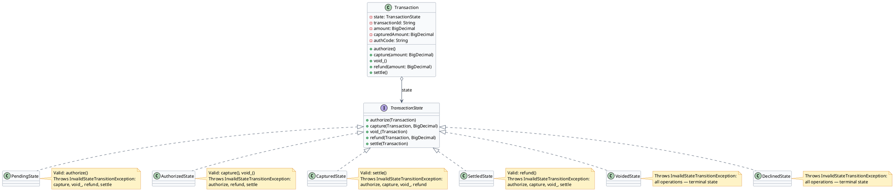
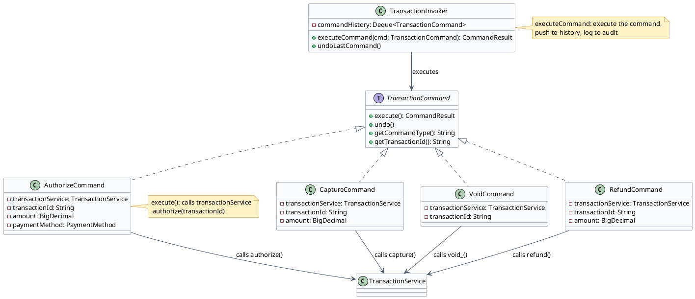
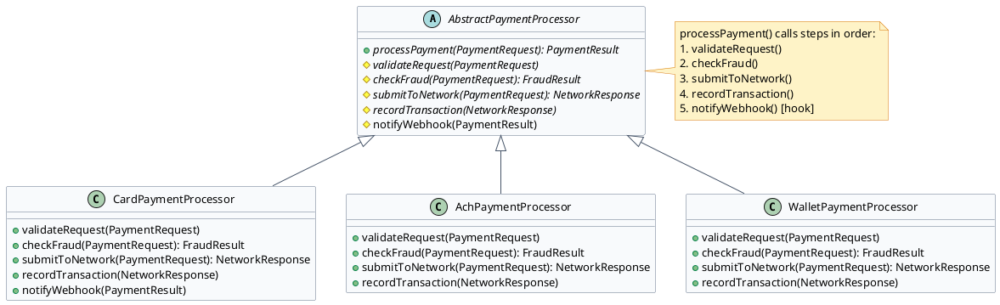

# Transaction Engine — Low Level Design

The transaction engine is the heart of a payment gateway. This document shows how three design patterns work together to implement a type-safe, extensible transaction processing system in Java.

---

## State Pattern — Transaction Lifecycle

:::tip[Intent]
Allow a transaction object to alter its behavior when its internal state changes. Each transaction state (PENDING, AUTHORIZED, CAPTURED, SETTLED, VOIDED, DECLINED) encapsulates the valid operations for that state and the transitions to other states.
:::



:::note[Use State Pattern for Transaction Lifecycle When]
- The same transaction object must behave differently in each state (void an AUTHORIZED transaction vs void an already-SETTLED one has completely different behavior)
- You want to prevent illegal operations (can't capture a VOIDED transaction) at compile-time via exceptions rather than if-else chains
- State transitions need to be explicit and self-documenting
- You want to add new states (e.g., HELD_FOR_REVIEW) without modifying existing states
:::

```java
// TransactionState.java
public interface TransactionState {
    void authorize(Transaction context);
    void capture(Transaction context, BigDecimal amount);
    void void_(Transaction context);
    void refund(Transaction context, BigDecimal amount);
    void settle(Transaction context);
}
```

```java
// Transaction.java
public class Transaction {
    private TransactionState state;
    private String transactionId;
    private BigDecimal amount;
    private BigDecimal capturedAmount;
    private String authCode;

    public Transaction(String transactionId, BigDecimal amount) {
        this.transactionId = transactionId;
        this.amount = amount;
        this.state = new PendingState();   // initial state
    }

    public void setState(TransactionState state) {
        this.state = state;
    }

    public void authorize() { state.authorize(this); }
    public void capture(BigDecimal amount) { state.capture(this, amount); }
    public void void_() { state.void_(this); }
    public void refund(BigDecimal amount) { state.refund(this, amount); }
    public void settle() { state.settle(this); }
}
```

```java {8,14}
// AuthorizedState.java
public class AuthorizedState implements TransactionState {

    @Override
    public void capture(Transaction context, BigDecimal amount) {
        if (amount.compareTo(context.getAmount()) > 0) {
            throw new IllegalArgumentException("Capture amount exceeds authorized amount");
        }
        context.setCapturedAmount(amount);
        context.setState(new CapturedState());  // valid transition
        System.out.println("Transaction captured: " + amount);
    }

    @Override
    public void void_(Transaction context) {
        context.setState(new VoidedState());  // valid transition
        System.out.println("Transaction voided");
    }

    @Override
    public void authorize(Transaction context) {
        throw new InvalidStateTransitionException("Cannot authorize an already-authorized transaction");
    }

    @Override
    public void refund(Transaction context, BigDecimal amount) {
        throw new InvalidStateTransitionException("Cannot refund before settlement");
    }

    @Override
    public void settle(Transaction context) {
        throw new InvalidStateTransitionException("Must capture before settling");
    }
}
```

```java collapse={1-8}
// SettledState.java
public class SettledState implements TransactionState {

    @Override
    public void refund(Transaction context, BigDecimal amount) {
        if (amount.compareTo(context.getCapturedAmount()) > 0) {
            throw new IllegalArgumentException("Refund exceeds settled amount");
        }
        context.setState(new RefundedState());
        System.out.println("Refund initiated: " + amount);
    }

    @Override
    public void authorize(Transaction context) {
        throw new InvalidStateTransitionException("Cannot re-authorize a settled transaction");
    }

    @Override
    public void capture(Transaction context, BigDecimal amount) {
        throw new InvalidStateTransitionException("Already settled");
    }

    @Override
    public void void_(Transaction context) {
        throw new InvalidStateTransitionException("Cannot void after settlement — use refund");
    }

    @Override
    public void settle(Transaction context) {
        throw new InvalidStateTransitionException("Already settled");
    }
}
```

### State Transition Table

| State       | authorize()        | capture()          | void_()            | refund()           | settle()           |
|-------------|--------------------|--------------------|--------------------|--------------------|---------------------|
| PENDING     | → AUTHORIZED       | InvalidTransition  | InvalidTransition  | InvalidTransition  | InvalidTransition  |
| AUTHORIZED  | InvalidTransition  | → CAPTURED         | → VOIDED           | InvalidTransition  | InvalidTransition  |
| CAPTURED    | InvalidTransition  | InvalidTransition  | InvalidTransition  | InvalidTransition  | → SETTLED          |
| SETTLED     | InvalidTransition  | InvalidTransition  | InvalidTransition  | → REFUNDED         | InvalidTransition  |
| VOIDED      | InvalidTransition  | InvalidTransition  | InvalidTransition  | InvalidTransition  | InvalidTransition  |
| DECLINED    | InvalidTransition  | InvalidTransition  | InvalidTransition  | InvalidTransition  | InvalidTransition  |

:::success[Advantages]
- **Type safety**: Illegal operations throw immediately rather than silently failing
- **Extensibility**: Add HELD_FOR_REVIEW state without touching existing states
- **Self-documenting**: State class names make the lifecycle obvious to new developers
- **No massive switch statements**: Each state handles its own logic
:::

:::caution[Disadvantages]
- More classes: one class per state (6+ states = 6+ files)
- State transitions scattered across state classes — must read multiple files to understand the full lifecycle
:::

---

## Command Pattern — Transaction Operations

:::tip[Intent]
Encapsulate each transaction operation (Authorize, Capture, Void, Refund) as a standalone Command object. This enables operation queuing, undo/redo, audit logging, and retry logic — all without modifying the core transaction processing logic.
:::



:::note[Use Command Pattern for Transaction Operations When]
- You need an audit trail of every operation performed on every transaction
- You want to support undo/compensation (void an authorization that was mistakenly captured)
- Operations need to be queued, retried, or scheduled asynchronously
- You want to decouple the operation trigger (merchant API call) from the operation execution (processor call)
:::

```java
// TransactionCommand.java
public interface TransactionCommand {
    CommandResult execute();
    void undo();
    String getCommandType();
    String getTransactionId();
}
```

```java
// CommandResult.java
public class CommandResult {
    private final boolean success;
    private final String responseCode;
    private final String message;
    private final String authCode;

    // constructor, getters
}
```

```java {6,10}
// AuthorizeCommand.java
public class AuthorizeCommand implements TransactionCommand {
    private final TransactionService transactionService;
    private final String transactionId;
    private final BigDecimal amount;
    private final PaymentMethod paymentMethod;

    public AuthorizeCommand(TransactionService service, String transactionId,
                            BigDecimal amount, PaymentMethod paymentMethod) {
        this.transactionService = service;
        this.transactionId = transactionId;
        this.amount = amount;
        this.paymentMethod = paymentMethod;
    }

    @Override
    public CommandResult execute() {
        return transactionService.authorize(transactionId, amount, paymentMethod);
    }

    @Override
    public void undo() {
        // Compensation: void the authorization
        transactionService.void_(transactionId);
    }

    @Override
    public String getCommandType() { return "AUTHORIZE"; }

    @Override
    public String getTransactionId() { return transactionId; }
}
```

```java
// TransactionInvoker.java
public class TransactionInvoker {
    private final Deque<TransactionCommand> commandHistory = new ArrayDeque<>();
    private final AuditLogger auditLogger;

    public TransactionInvoker(AuditLogger auditLogger) {
        this.auditLogger = auditLogger;
    }

    public CommandResult executeCommand(TransactionCommand command) {
        CommandResult result = command.execute();
        commandHistory.push(command);
        auditLogger.log(command.getTransactionId(), command.getCommandType(),
                        result.isSuccess(), result.getResponseCode());
        return result;
    }

    public void undoLastCommand() {
        if (!commandHistory.isEmpty()) {
            TransactionCommand last = commandHistory.pop();
            last.undo();
            auditLogger.log(last.getTransactionId(), "UNDO_" + last.getCommandType(), true, "COMPENSATED");
        }
    }
}
```

:::success[Advantages]
- **Audit trail**: every command logged with who, what, when, result
- **Undo support**: compensation via undo() method (critical for payment error recovery)
- **Queue/retry**: commands can be serialized and retried independently
- **Decoupling**: merchant API handler just builds a command and passes to invoker
:::

:::caution[Disadvantages]
- **Command explosion**: one class per operation type (AuthorizeCommand, CaptureCommand, etc.)
- **State management**: undo() must be carefully implemented or it creates inconsistency
:::

---

## Template Method Pattern — Payment Processing Pipeline

:::tip[Intent]
Define the skeleton of the transaction processing algorithm in an abstract base class. Card payments, ACH payments, and digital wallet payments all follow the same high-level steps (validate → fraud check → process → record → notify) but differ in how each step is implemented.
:::



:::note[Use Template Method for Payment Processing When]
- Multiple payment methods (card, ACH, wallet) share the same high-level processing steps but differ in implementation details
- You want to ensure all payment types go through fraud check and recording — subclasses can't skip these steps
- New payment methods (e.g., BNPL) can be added by implementing only the variant steps
:::

```java {5,7,9,11,13}
// AbstractPaymentProcessor.java
public abstract class AbstractPaymentProcessor {

    // Template method — final so subclasses cannot reorder steps
    public final PaymentResult processPayment(PaymentRequest request) {
        validateRequest(request);
        FraudResult fraud = checkFraud(request);
        if (fraud.isDeclined()) {
            return PaymentResult.declined(fraud.getReason());
        }
        NetworkResponse response = submitToNetwork(request);
        recordTransaction(request, response);
        PaymentResult result = buildResult(response);
        notifyWebhook(result);   // hook — default does nothing
        return result;
    }

    protected abstract void validateRequest(PaymentRequest request);
    protected abstract FraudResult checkFraud(PaymentRequest request);
    protected abstract NetworkResponse submitToNetwork(PaymentRequest request);
    protected abstract void recordTransaction(PaymentRequest request, NetworkResponse response);

    // Hook with default implementation — subclasses may override
    protected void notifyWebhook(PaymentResult result) {
        // default: no-op
    }

    private PaymentResult buildResult(NetworkResponse response) {
        return new PaymentResult(response.isSuccess(), response.getAuthCode(),
                                  response.getDeclineCode());
    }
}
```

```java collapse={1-6}
// CardPaymentProcessor.java
public class CardPaymentProcessor extends AbstractPaymentProcessor {

    private final CardValidator cardValidator;
    private final FraudEngine fraudEngine;
    private final CardNetworkClient networkClient;
    private final TransactionRepository repository;

    public CardPaymentProcessor(CardValidator cardValidator, FraudEngine fraudEngine,
                                 CardNetworkClient networkClient, TransactionRepository repository) {
        this.cardValidator = cardValidator;
        this.fraudEngine = fraudEngine;
        this.networkClient = networkClient;
        this.repository = repository;
    }

    @Override
    protected void validateRequest(PaymentRequest request) {
        cardValidator.validateCardNumber(request.getCardNumber());
        cardValidator.validateExpiry(request.getExpiryMonth(), request.getExpiryYear());
        cardValidator.validateAmount(request.getAmount());
    }

    @Override
    protected FraudResult checkFraud(PaymentRequest request) {
        return fraudEngine.evaluate(request);   // full AFDS + ML pipeline
    }

    @Override
    protected NetworkResponse submitToNetwork(PaymentRequest request) {
        return networkClient.authorize(request);   // Visa/MC/Amex authorization
    }

    @Override
    protected void recordTransaction(PaymentRequest request, NetworkResponse response) {
        repository.updateTransactionResponse(request.getTransactionId(), response);
    }

    @Override
    protected void notifyWebhook(PaymentResult result) {
        // Cards: fire webhook immediately on hold
        if (result.isHeldForReview()) {
            webhookService.fireAsync("net.authorize.payment.fraud.held", result);
        }
    }
}
```

```java collapse={1-6}
// AchPaymentProcessor.java
public class AchPaymentProcessor extends AbstractPaymentProcessor {

    private final AchValidator achValidator;
    private final EvsClearingService evs;
    private final NachaClient nachaClient;
    private final AchRepository repository;

    @Override
    protected void validateRequest(PaymentRequest request) {
        achValidator.validateRoutingNumber(request.getRoutingNumber());
        achValidator.validateAccountNumber(request.getAccountNumber());
        evs.verifyAccount(request.getRoutingNumber(), request.getAccountNumber());
    }

    @Override
    protected FraudResult checkFraud(PaymentRequest request) {
        // ACH fraud is different: check return rate history, not velocity/CVV
        return FraudResult.allow();   // minimal fraud check; ACH relies on EVS
    }

    @Override
    protected NetworkResponse submitToNetwork(PaymentRequest request) {
        return nachaClient.queueForNextBatch(request);   // async — no immediate response
    }

    @Override
    protected void recordTransaction(PaymentRequest request, NetworkResponse response) {
        repository.insertAchRecord(request, response.getBatchId());
    }
}
```

:::success[Advantages]
- **Enforced pipeline**: `validateRequest` and `recordTransaction` are always called — subclasses can't bypass them
- **Open for extension**: Add BNPL, crypto, or buy-now-pay-later by implementing one class
- **Code reuse**: shared steps (webhook notification, result building) written once
:::

:::caution[Disadvantages]
- **Inheritance coupling**: subclasses depend on the abstract class — changes to the template method affect all subclasses
- **Hidden control flow**: the template method controls execution; reading a subclass alone doesn't show the full picture
:::

---

[← Payment Gateway LLD](/learnings/payment-gateway/lld/)
