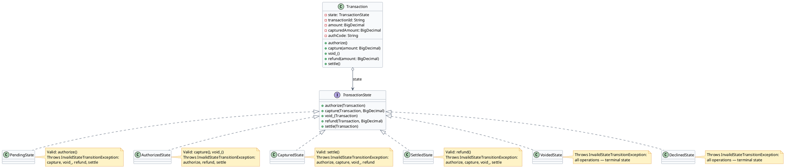
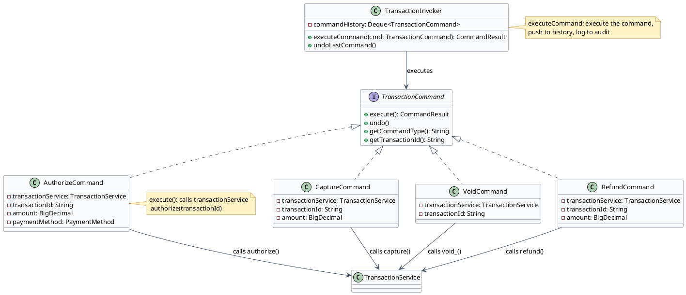
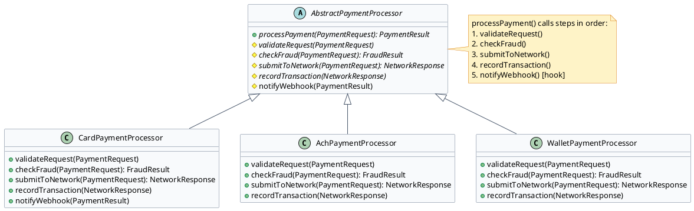

# Transaction Engine — Low Level Design

The transaction engine is the heart of a payment gateway. This document shows how three design patterns work together to implement a type-safe, extensible transaction processing system in Java.

---

## Problem Statement

Design the core transaction processing engine for a payment gateway. The engine must:

- Accept payment requests (auth, capture, void, refund) and route them to card processors
- Prevent illegal operations — a refund on an unauthorized transaction must be impossible
- Never lose an authorized charge even if the server crashes mid-processing
- Detect and reject duplicate requests without double-charging the customer
- Support multiple payment types (card, ACH, digital wallet) through the same pipeline

The key design challenges:
1. **State enforcement**: a `SETTLED` transaction cannot be voided — only refunded. An `AUTHORIZED` transaction cannot be refunded — only captured or voided. These rules must be enforced at every call site.
2. **Crash safety**: the processor charges the card at the network level before the gateway can record the result. A crash in that window must be recoverable.
3. **Payment type variance**: card, ACH, and wallet payments share the same pipeline stages (validate → fraud-check → submit → record) but have completely different implementations for each stage.

---

## Clarifying Questions — Interview

These are the questions you should ask (and be ready to answer) when designing any transaction processing LLD.

### 1. Functional Scope
**Q:** What transaction types must be supported? Can a transaction be partially captured?

**A:** AUTH_ONLY, AUTH_CAPTURE, CAPTURE, VOID, REFUND. Partial capture is required — capture amount can be less than or equal to the original auth amount (e.g., an $80 item on a $100 hotel auth).

### 2. Scale & Performance Budget
**Q:** How many concurrent transactions are processed at peak? What is the target latency?

**A:** ~5,000 TPS at peak. The full authorization round-trip (gateway + processor + issuer) must complete within 3 seconds (p99). The engine itself must contribute <200ms of that budget.

### 3. Consistency & Correctness Invariants
**Q:** What must NEVER happen, regardless of failures?

**A:** (1) A customer must never be charged twice for the same purchase. (2) An authorized charge must never be permanently lost — even if the gateway crashes, recovery must be possible. (3) A `SETTLED` transaction must never be voided — only refunded.

### 4. Extensibility & Rate of Change
**Q:** How often are new transaction types or new payment methods added?

**A:** New payment methods (BNPL, crypto) are added every 1-2 years. Each must go through the same pipeline stages. The system should allow adding a new payment type without modifying the existing pipeline code.

### 5. Concurrency & Thread Safety
**Q:** Is a single `Transaction` object shared across multiple threads?

**A:** No — each transaction request gets its own `Transaction` object, so the State machine is safe. However, concurrent retries for the same order race to insert into the DB simultaneously. The UNIQUE index on `(merchant_id, idempotency_key)` ensures only one wins — the loser gets a constraint violation, reads the winner's PENDING record, and returns that result. No lock required; the DB constraint is the synchronization primitive.

### 6. Failure & Recovery
**Q:** What happens if the server crashes after the processor approves the charge but before the database is updated?

**A:** The PENDING record write happens BEFORE the processor call. The PENDING record acts as a recovery marker. Ops can query all PENDING records older than 5 minutes and reconcile them against the processor's records. This is why write-before-call is non-negotiable.

### 7. Observability & Debuggability
**Q:** How do we trace a specific transaction through the system? How do we detect a stuck transaction?

**A:** `transaction_id` is the trace anchor — injected at PENDING write and included in every log line. Alert on `PENDING` transactions older than 5 minutes: this indicates a processor call that never returned a response.

### 8. Persistence & Durability
**Q:** Is transaction state in-memory or persisted? What is the durability requirement?

**A:** Fully persisted in PostgreSQL. No transaction state lives in-memory only. A JVM restart must lose zero transaction data. The `settlement_state` field on each transaction record is the authoritative source of truth.

### 9. Authorization Expiry
**Q:** What happens when an authorization is not captured before it expires?

**A:** Authorization holds expire — typically 7 days for e-commerce credit cards, 3 days for debit, up to 30 days for hotel/car rental (merchant-category-specific). The system tracks `auth_expires_at` on each `AUTHORIZED` transaction. A background job runs daily and transitions expired `AUTHORIZED` records to `EXPIRED` (a terminal state). `AuthorizedState.capture()` checks expiry before allowing capture — expired auths throw `AuthorizationExpiredException`. The merchant must re-authorize. This is one of the most common production bugs in payment systems when not handled.

### 10. Partial and Multiple Refunds
**Q:** Can a settled transaction be partially refunded? Can it be refunded multiple times?

**A:** Yes to both. A $100 settled transaction can be refunded $30 and then $50 (total $80 in refunds). `SettledState.refund()` tracks `totalRefunded` and validates `newRefundAmount + totalRefunded ≤ settledAmount`. Each refund creates a new transaction record (a new credit) linked to the original via `parent_tx_id`. The state does not move to REFUNDED until fully refunded — partial refunds keep the transaction in SETTLED state with a running `refunded_amount` counter.

### 11. Reversal vs. Refund
**Q:** What is the difference between a void, a reversal, and a refund? When is each used?

**A:** These are three distinct operations with different network-level effects: **(1) Void** — cancels an AUTHORIZED transaction before capture. The authorization hold is released on the cardholder's account (within hours). No money ever moved. **(2) Reversal** — a processor-level cancellation of a captured-but-not-yet-settled transaction sent directly to the card network. Like a void but later in the lifecycle. Must happen before the settlement batch closes. **(3) Refund** — creates a new credit transaction after settlement. Money has already moved from issuer to acquirer; a refund initiates a new movement back. Takes 3–5 business days to appear on the cardholder's statement. The state machine models Void and Refund; Reversal is handled at the processor-adapter layer.

### 12. PCI DSS Compliance
**Q:** What PCI DSS requirements directly affect the design of the transaction engine?

**A:** Three requirements are directly relevant: **(1) Req 3.2** — CVV must never be stored after authorization. `Transaction` must not have a `cvv` field; the value is passed through in the request but purged from the object before any persistence. **(2) Req 10** — all access to cardholder data environments must be logged. The `TransactionInvoker` audit log (from the Command Pattern) satisfies this — every operation on every transaction is recorded. **(3) Req 6** — applications must not introduce vulnerabilities. The State Pattern satisfies this: illegal operations throw `InvalidStateTransitionException` rather than silently processing, preventing unauthorized state manipulation.

---

## State Pattern — Transaction Lifecycle

:::tip[Intent]
Allow a transaction object to alter its behavior when its internal state changes. Each transaction state (PENDING, AUTHORIZED, CAPTURED, SETTLED, VOIDED, DECLINED) encapsulates the valid operations for that state and the transitions to other states.
:::



:::note[Use State Pattern for Transaction Lifecycle When]
- The same transaction object must behave differently in each state (void an AUTHORIZED transaction vs void an already-SETTLED one has completely different behavior)
- You want to prevent illegal operations (can't capture a VOIDED transaction) at compile-time via exceptions rather than if-else chains
- State transitions need to be explicit and self-documenting
- You want to add new states (e.g., HELD_FOR_REVIEW) without modifying existing states
:::

```java title="TransactionState.java"
public interface TransactionState {
    void authorize(Transaction context);
    void capture(Transaction context, BigDecimal amount);
    void void_(Transaction context);
    void refund(Transaction context, BigDecimal amount);
    void settle(Transaction context);
}
```

```java title="Transaction.java"
public class Transaction {
    private TransactionState state;
    private String transactionId;
    private BigDecimal amount;
    private BigDecimal capturedAmount;
    private String authCode;

    public Transaction(String transactionId, BigDecimal amount) {
        this.transactionId = transactionId;
        this.amount = amount;
        this.state = new PendingState();   // initial state
    }

    public void setState(TransactionState state) {
        this.state = state;
    }

    public void authorize() { state.authorize(this); }
    public void capture(BigDecimal amount) { state.capture(this, amount); }
    public void void_() { state.void_(this); }
    public void refund(BigDecimal amount) { state.refund(this, amount); }
    public void settle() { state.settle(this); }
}
```

```java title="AuthorizedState.java" {8,14}
public class AuthorizedState implements TransactionState {

    @Override
    public void capture(Transaction context, BigDecimal amount) {
        if (amount.compareTo(context.getAmount()) > 0) {
            throw new IllegalArgumentException("Capture amount exceeds authorized amount");
        }
        context.setCapturedAmount(amount);
        context.setState(new CapturedState());  // valid transition
        System.out.println("Transaction captured: " + amount);
    }

    @Override
    public void void_(Transaction context) {
        context.setState(new VoidedState());  // valid transition
        System.out.println("Transaction voided");
    }

    @Override
    public void authorize(Transaction context) {
        throw new InvalidStateTransitionException("Cannot authorize an already-authorized transaction");
    }

    @Override
    public void refund(Transaction context, BigDecimal amount) {
        throw new InvalidStateTransitionException("Cannot refund before settlement");
    }

    @Override
    public void settle(Transaction context) {
        throw new InvalidStateTransitionException("Must capture before settling");
    }
}
```

```java title="SettledState.java" collapse={1-8}
public class SettledState implements TransactionState {

    @Override
    public void refund(Transaction context, BigDecimal amount) {
        if (amount.compareTo(context.getCapturedAmount()) > 0) {
            throw new IllegalArgumentException("Refund exceeds settled amount");
        }
        context.setState(new RefundedState());
        System.out.println("Refund initiated: " + amount);
    }

    @Override
    public void authorize(Transaction context) {
        throw new InvalidStateTransitionException("Cannot re-authorize a settled transaction");
    }

    @Override
    public void capture(Transaction context, BigDecimal amount) {
        throw new InvalidStateTransitionException("Already settled");
    }

    @Override
    public void void_(Transaction context) {
        throw new InvalidStateTransitionException("Cannot void after settlement — use refund");
    }

    @Override
    public void settle(Transaction context) {
        throw new InvalidStateTransitionException("Already settled");
    }
}
```

### State Transition Table

| State       | authorize()        | capture()          | void_()            | refund()           | settle()           |
|-------------|--------------------|--------------------|--------------------|--------------------|---------------------|
| PENDING     | → AUTHORIZED       | InvalidTransition  | InvalidTransition  | InvalidTransition  | InvalidTransition  |
| AUTHORIZED  | InvalidTransition  | → CAPTURED         | → VOIDED           | InvalidTransition  | InvalidTransition  |
| CAPTURED    | InvalidTransition  | InvalidTransition  | InvalidTransition  | InvalidTransition  | → SETTLED          |
| SETTLED     | InvalidTransition  | InvalidTransition  | InvalidTransition  | → REFUNDED         | InvalidTransition  |
| VOIDED      | InvalidTransition  | InvalidTransition  | InvalidTransition  | InvalidTransition  | InvalidTransition  |
| DECLINED    | InvalidTransition  | InvalidTransition  | InvalidTransition  | InvalidTransition  | InvalidTransition  |

:::success[Advantages]
- **Type safety**: Illegal operations throw immediately rather than silently failing
- **Extensibility**: Add HELD_FOR_REVIEW state without touching existing states
- **Self-documenting**: State class names make the lifecycle obvious to new developers
- **No massive switch statements**: Each state handles its own logic
:::

:::warn[Disadvantages]
- More classes: one class per state (6+ states = 6+ files)
- State transitions scattered across state classes — must read multiple files to understand the full lifecycle
:::

### Why State Pattern and Not Alternatives

| Alternative | Why it fails for transaction lifecycle |
|---|---|
| `if-else` / `switch` chains | Every new state or operation requires modifying the `Transaction` class. Adding HELD_FOR_REVIEW means touching every operation method. Illegal transitions silently pass through instead of throwing. |
| `enum` with abstract methods | Works for simple cases, but all state logic is in one file. A 6-state × 5-operation matrix becomes a 1000-line enum. Hard to test individual states in isolation. |
| Boolean flags (`isVoided`, `isCaptured`, `isSettled`) | Multiple flags can contradict each other (`isVoided=true` AND `isCaptured=true`). No single source of truth for "what can I do now?" |
| **State Pattern** ✓ | Each state is a self-contained class. `VoidedState.capture()` throws `InvalidStateTransitionException` at exactly the right place. New states are new files — existing states unchanged. |

:::tip[Always use State Pattern when...]
- An object has 3+ distinct states where behavior changes significantly per state
- Some operations are illegal in certain states and must throw (not silently no-op)
- You expect new states to be added over the lifetime of the system
- You want state transition logic owned by the state itself, not by the caller
:::

---

## Command Pattern — Transaction Operations

:::tip[Intent]
Encapsulate each transaction operation (Authorize, Capture, Void, Refund) as a standalone Command object. This enables operation queuing, undo/redo, audit logging, and retry logic — all without modifying the core transaction processing logic.
:::



:::note[Use Command Pattern for Transaction Operations When]
- You need an audit trail of every operation performed on every transaction
- You want to support undo/compensation (void an authorization that was mistakenly captured)
- Operations need to be queued, retried, or scheduled asynchronously
- You want to decouple the operation trigger (merchant API call) from the operation execution (processor call)
:::

```java title="TransactionCommand.java"
public interface TransactionCommand {
    CommandResult execute();
    void undo();
    String getCommandType();
    String getTransactionId();
}
```

```java title="CommandResult.java"
public class CommandResult {
    private final boolean success;
    private final String responseCode;
    private final String message;
    private final String authCode;

    // constructor, getters
}
```

```java title="AuthorizeCommand.java" {6,10}
public class AuthorizeCommand implements TransactionCommand {
    private final TransactionService transactionService;
    private final String transactionId;
    private final BigDecimal amount;
    private final PaymentMethod paymentMethod;

    public AuthorizeCommand(TransactionService service, String transactionId,
                            BigDecimal amount, PaymentMethod paymentMethod) {
        this.transactionService = service;
        this.transactionId = transactionId;
        this.amount = amount;
        this.paymentMethod = paymentMethod;
    }

    @Override
    public CommandResult execute() {
        return transactionService.authorize(transactionId, amount, paymentMethod);
    }

    @Override
    public void undo() {
        // Compensation: void the authorization
        transactionService.void_(transactionId);
    }

    @Override
    public String getCommandType() { return "AUTHORIZE"; }

    @Override
    public String getTransactionId() { return transactionId; }
}
```

```java title="TransactionInvoker.java"
public class TransactionInvoker {
    private final Deque<TransactionCommand> commandHistory = new ArrayDeque<>();
    private final AuditLogger auditLogger;

    public TransactionInvoker(AuditLogger auditLogger) {
        this.auditLogger = auditLogger;
    }

    public CommandResult executeCommand(TransactionCommand command) {
        CommandResult result = command.execute();
        commandHistory.push(command);
        auditLogger.log(command.getTransactionId(), command.getCommandType(),
                        result.isSuccess(), result.getResponseCode());
        return result;
    }

    public void undoLastCommand() {
        if (!commandHistory.isEmpty()) {
            TransactionCommand last = commandHistory.pop();
            last.undo();
            auditLogger.log(last.getTransactionId(), "UNDO_" + last.getCommandType(), true, "COMPENSATED");
        }
    }
}
```

:::success[Advantages]
- **Audit trail**: every command logged with who, what, when, result
- **Undo support**: compensation via undo() method (critical for payment error recovery)
- **Queue/retry**: commands can be serialized and retried independently
- **Decoupling**: merchant API handler just builds a command and passes to invoker
:::

:::warn[Disadvantages]
- **Command explosion**: one class per operation type (AuthorizeCommand, CaptureCommand, etc.)
- **State management**: undo() must be carefully implemented or it creates inconsistency
:::

### Why Command Pattern and Not Alternatives

| Alternative | Why it fails for transaction operations |
|---|---|
| Direct method calls (`transactionService.authorize(...)`) | No audit trail. Undo requires ad-hoc compensation logic scattered through callers. Operations cannot be queued or retried as units. |
| Event sourcing only | Useful for replay but adds overhead. Command Pattern gives you undo + audit without the full event sourcing infrastructure. |
| Simple logging wrapper | Logging after the fact doesn't give you structured retry or undo capability. |
| **Command Pattern** ✓ | Each operation is a first-class object: loggable, retryable, undoable, queueable. The `TransactionInvoker` owns all cross-cutting behavior — callers stay clean. |

:::tip[Always use Command Pattern when...]
- Operations need an audit trail (who, what, when, outcome) — required for PCI compliance
- You need undo/compensation (void an authorization that was erroneously captured)
- Operations may need to be queued, delayed, or retried independently
- You want to decouple "who triggers the operation" from "how the operation executes"
:::

---

## Template Method Pattern — Payment Processing Pipeline

:::tip[Intent]
Define the skeleton of the transaction processing algorithm in an abstract base class. Card payments, ACH payments, and digital wallet payments all follow the same high-level steps (validate → fraud check → process → record → notify) but differ in how each step is implemented.
:::



:::note[Use Template Method for Payment Processing When]
- Multiple payment methods (card, ACH, wallet) share the same high-level processing steps but differ in implementation details
- You want to ensure all payment types go through fraud check and recording — subclasses can't skip these steps
- New payment methods (e.g., BNPL) can be added by implementing only the variant steps
:::

```java title="AbstractPaymentProcessor.java" {5,7,9,11,13}
public abstract class AbstractPaymentProcessor {

    // Template method — final so subclasses cannot reorder steps
    public final PaymentResult processPayment(PaymentRequest request) {
        validateRequest(request);
        FraudResult fraud = checkFraud(request);
        if (fraud.isDeclined()) {
            return PaymentResult.declined(fraud.getReason());
        }
        NetworkResponse response = submitToNetwork(request);
        recordTransaction(request, response);
        PaymentResult result = buildResult(response);
        notifyWebhook(result);   // hook — default does nothing
        return result;
    }

    protected abstract void validateRequest(PaymentRequest request);
    protected abstract FraudResult checkFraud(PaymentRequest request);
    protected abstract NetworkResponse submitToNetwork(PaymentRequest request);
    protected abstract void recordTransaction(PaymentRequest request, NetworkResponse response);

    // Hook with default implementation — subclasses may override
    protected void notifyWebhook(PaymentResult result) {
        // default: no-op
    }

    private PaymentResult buildResult(NetworkResponse response) {
        return new PaymentResult(response.isSuccess(), response.getAuthCode(),
                                  response.getDeclineCode());
    }
}
```

```java title="CardPaymentProcessor.java" collapse={1-6}
public class CardPaymentProcessor extends AbstractPaymentProcessor {

    private final CardValidator cardValidator;
    private final FraudEngine fraudEngine;
    private final CardNetworkClient networkClient;
    private final TransactionRepository repository;

    public CardPaymentProcessor(CardValidator cardValidator, FraudEngine fraudEngine,
                                 CardNetworkClient networkClient, TransactionRepository repository) {
        this.cardValidator = cardValidator;
        this.fraudEngine = fraudEngine;
        this.networkClient = networkClient;
        this.repository = repository;
    }

    @Override
    protected void validateRequest(PaymentRequest request) {
        cardValidator.validateCardNumber(request.getCardNumber());
        cardValidator.validateExpiry(request.getExpiryMonth(), request.getExpiryYear());
        cardValidator.validateAmount(request.getAmount());
    }

    @Override
    protected FraudResult checkFraud(PaymentRequest request) {
        return fraudEngine.evaluate(request);   // full AFDS + ML pipeline
    }

    @Override
    protected NetworkResponse submitToNetwork(PaymentRequest request) {
        return networkClient.authorize(request);   // Visa/MC/Amex authorization
    }

    @Override
    protected void recordTransaction(PaymentRequest request, NetworkResponse response) {
        repository.updateTransactionResponse(request.getTransactionId(), response);
    }

    @Override
    protected void notifyWebhook(PaymentResult result) {
        // Cards: fire webhook immediately on hold
        if (result.isHeldForReview()) {
            webhookService.fireAsync("net.authorize.payment.fraud.held", result);
        }
    }
}
```

```java title="AchPaymentProcessor.java" collapse={1-6}
public class AchPaymentProcessor extends AbstractPaymentProcessor {

    private final AchValidator achValidator;
    private final EvsClearingService evs;
    private final NachaClient nachaClient;
    private final AchRepository repository;

    @Override
    protected void validateRequest(PaymentRequest request) {
        achValidator.validateRoutingNumber(request.getRoutingNumber());
        achValidator.validateAccountNumber(request.getAccountNumber());
        evs.verifyAccount(request.getRoutingNumber(), request.getAccountNumber());
    }

    @Override
    protected FraudResult checkFraud(PaymentRequest request) {
        // ACH fraud is different: check return rate history, not velocity/CVV
        return FraudResult.allow();   // minimal fraud check; ACH relies on EVS
    }

    @Override
    protected NetworkResponse submitToNetwork(PaymentRequest request) {
        return nachaClient.queueForNextBatch(request);   // async — no immediate response
    }

    @Override
    protected void recordTransaction(PaymentRequest request, NetworkResponse response) {
        repository.insertAchRecord(request, response.getBatchId());
    }
}
```

:::success[Advantages]
- **Enforced pipeline**: `validateRequest` and `recordTransaction` are always called — subclasses can't bypass them
- **Open for extension**: Add BNPL, crypto, or buy-now-pay-later by implementing one class
- **Code reuse**: shared steps (webhook notification, result building) written once
:::

:::warn[Disadvantages]
- **Inheritance coupling**: subclasses depend on the abstract class — changes to the template method affect all subclasses
- **Hidden control flow**: the template method controls execution; reading a subclass alone doesn't show the full picture
:::

### Why Template Method and Not Alternatives

| Alternative | Why it fails for multi-payment-type processing |
|---|---|
| Copy-paste the pipeline in each processor class | Fraud check and recording get skipped or implemented differently per payment type. A bug fix in the pipeline must be applied to every copy. |
| Strategy Pattern for the whole pipeline | Strategy swaps the entire algorithm. Template Method keeps the skeleton fixed and only varies the steps — correct here because the sequence (validate → fraud → submit → record) must always run in order. |
| Composition with a `Pipeline` object | Works but gives subclasses no way to add payment-type-specific hooks (like the wallet-specific webhook on hold). Template Method's `hook()` mechanism is cleaner for optional extensions. |
| **Template Method** ✓ | The pipeline skeleton is `final` — subclasses cannot reorder or skip steps. Each step is overridable. Optional behavior (webhook) is a hook with a default no-op. |

:::tip[Always use Template Method when...]
- Multiple variants share the same algorithm skeleton but differ in specific steps
- Some steps are mandatory and must not be skipped (fraud check, transaction recording)
- You want to allow extension at defined points (hooks) without allowing reordering
- The invariant part of the algorithm and the variant part are cleanly separable
:::

---

[← Payment Gateway LLD](/low-level-design/payment-gateway/lld-payment-gateway/)
