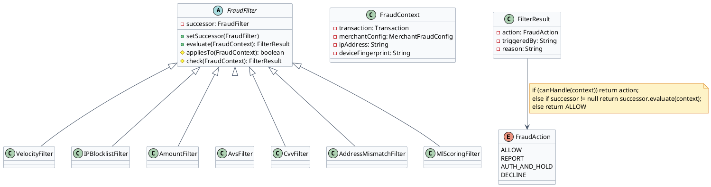
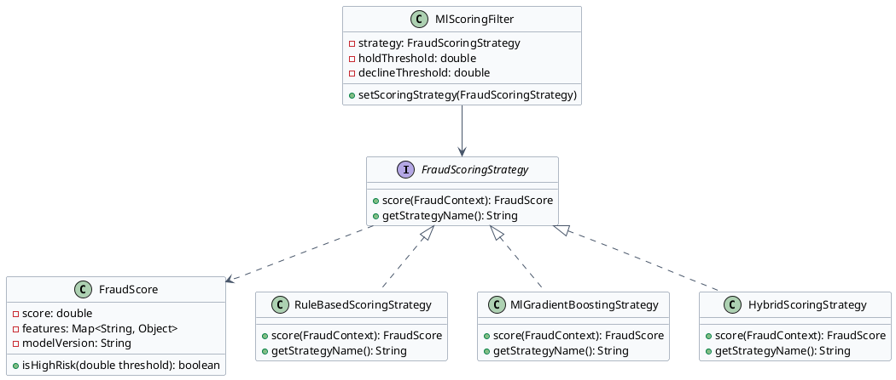
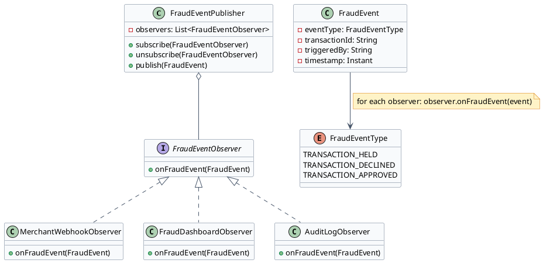

# Fraud Detection Engine — Low Level Design

The fraud detection engine evaluates every transaction through a configurable pipeline. Three patterns combine: Chain of Responsibility routes the request through ordered filters, Strategy allows swapping the scoring algorithm, and Observer decouples fraud event notification from the detection logic.

---

## Section 1: Chain of Responsibility — Fraud Filter Pipeline

:::tip[Intent]
Pass each incoming transaction through a chain of fraud filters. Each filter independently decides whether to handle the request (take an action) or pass it to the next filter. The first filter that triggers returns an action; remaining filters are skipped.
:::



:::note[Use Chain of Responsibility for Fraud Filters When]
- Each filter is independently configurable per merchant (velocity limits, amount thresholds differ per merchant)
- Filters should short-circuit — once a filter triggers a DECLINE, remaining filters are unnecessary
- New filter types (e.g., geolocation, device fingerprint) can be added without changing existing filters
- Filter order matters and must be configurable without code changes
:::

```java
// FraudAction.java
public enum FraudAction {
    ALLOW,
    REPORT_ONLY,
    AUTH_AND_HOLD,
    DO_NOT_AUTH_HOLD,
    DECLINE
}
```

```java
// FraudContext.java
public class FraudContext {
    private final Transaction transaction;
    private final MerchantFraudConfig merchantConfig;
    private final String ipAddress;
    private final String deviceFingerprint;
    private final String customerEmail;
    // constructor + getters
}
```

```java
// FilterResult.java
public class FilterResult {
    private final FraudAction action;
    private final String triggeredBy;
    private final String reason;

    public static FilterResult allow() {
        return new FilterResult(FraudAction.ALLOW, "none", "no filter triggered");
    }
    // constructor + getters
}
```

```java {8,12}
// FraudFilter.java
public abstract class FraudFilter {
    private FraudFilter successor;

    public void setSuccessor(FraudFilter successor) {
        this.successor = successor;
    }

    public FilterResult evaluate(FraudContext context) {
        if (appliesTo(context)) {
            FilterResult result = check(context);
            if (result.getAction() != FraudAction.ALLOW) {
                return result;  // short-circuit — this filter triggered
            }
        }
        // Pass to next filter in chain
        return successor != null ? successor.evaluate(context) : FilterResult.allow();
    }

    protected abstract boolean appliesTo(FraudContext context);
    protected abstract FilterResult check(FraudContext context);
}
```

```java collapse={1-6}
// VelocityFilter.java
public class VelocityFilter extends FraudFilter {
    private final VelocityCounterService velocityService;

    public VelocityFilter(VelocityCounterService velocityService) {
        this.velocityService = velocityService;
    }

    @Override
    protected boolean appliesTo(FraudContext context) {
        return context.getMerchantConfig().isVelocityFilterEnabled();
    }

    @Override
    protected FilterResult check(FraudContext context) {
        String merchantId = context.getTransaction().getMerchantId();
        String ip = context.getIpAddress();
        MerchantFraudConfig config = context.getMerchantConfig();

        // Check hourly transaction count from this IP
        int ipCountLastHour = velocityService.getCount(merchantId, ip, Duration.ofHours(1));
        if (ipCountLastHour > config.getMaxTransactionsPerIpPerHour()) {
            return new FilterResult(
                    config.getVelocityAction(),
                    "VelocityFilter",
                    "IP " + ip + " exceeded " + config.getMaxTransactionsPerIpPerHour() + " tx/hour"
            );
        }

        // Check daily total amount
        BigDecimal dailyTotal = velocityService.getTotalAmount(merchantId, Duration.ofDays(1));
        if (dailyTotal.compareTo(config.getMaxDailyAmount()) > 0) {
            return new FilterResult(
                    config.getDailyAmountAction(),
                    "VelocityFilter",
                    "Daily amount " + dailyTotal + " exceeds limit"
            );
        }

        return FilterResult.allow();
    }
}
```

```java collapse={1-4}
// FraudPipeline.java
public class FraudPipeline {
    private final FraudFilter head;

    public FraudPipeline(List<FraudFilter> filters) {
        if (filters.isEmpty()) throw new IllegalArgumentException("Pipeline needs at least one filter");
        // Chain the filters in order
        for (int i = 0; i < filters.size() - 1; i++) {
            filters.get(i).setSuccessor(filters.get(i + 1));
        }
        this.head = filters.get(0);
    }

    public FilterResult evaluate(FraudContext context) {
        return head.evaluate(context);
    }

    // Factory method to build default pipeline
    public static FraudPipeline defaultPipeline(VelocityCounterService velocity,
                                                  IpIntelligenceService ipIntel,
                                                  MlScoringService ml) {
        return new FraudPipeline(Arrays.asList(
            new VelocityFilter(velocity),
            new IPBlocklistFilter(ipIntel),
            new AmountFilter(),
            new AvsFilter(),
            new CvvFilter(),
            new AddressMismatchFilter(),
            new MlScoringFilter(ml)   // ML scoring last — most expensive
        ));
    }
}
```

:::success[Advantages]
- **Per-merchant config**: each filter reads from `MerchantFraudConfig` — same code, different thresholds per merchant
- **Short-circuit efficiency**: DECLINE from VelocityFilter (fastest) skips ML scoring (slowest)
- **Open for extension**: add `DeviceFingerprintFilter` without touching existing filters
- **Testable in isolation**: each filter can be unit tested independently with a mock context
:::

:::caution[Disadvantages]
- **Ordering complexity**: filters must be ordered by speed (fast rules first, ML last); wrong order hurts performance
- **Silent pass-through**: if no filter triggers, the transaction is allowed — easy to misconfigure a missing filter
:::

---

## Section 2: Strategy Pattern — Fraud Scoring Algorithm

:::tip[Intent]
Define a family of fraud scoring algorithms (rule-based, ML-based, hybrid) and make them interchangeable. The fraud engine delegates scoring to the configured strategy without knowing its implementation details.
:::



:::note[Use Strategy for Fraud Scoring When]
- You need to A/B test a new ML model against the current rule-based model on live traffic
- Different merchant categories need different scoring models (digital goods vs physical goods)
- You want to swap from a rules-only model to ML without changing the filter pipeline
:::

```java
// FraudScoringStrategy.java
public interface FraudScoringStrategy {
    FraudScore score(FraudContext context);
    String getStrategyName();
}
```

```java
// FraudScore.java
public class FraudScore {
    private final double score;           // 0.0 = safe, 1.0 = certain fraud
    private final Map<String, Object> topFeatures;
    private final String modelVersion;

    public boolean isHighRisk(double threshold) {
        return score >= threshold;
    }
}
```

```java collapse={1-4}
// RuleBasedScoringStrategy.java
public class RuleBasedScoringStrategy implements FraudScoringStrategy {

    @Override
    public FraudScore score(FraudContext context) {
        double score = 0.0;
        Map<String, Object> features = new HashMap<>();

        // Weight: new card + high amount = suspicious
        if (context.getTransaction().getAmount().compareTo(new BigDecimal("500")) > 0) {
            score += 0.3;
            features.put("high_amount", context.getTransaction().getAmount());
        }

        // Weight: IP country ≠ card BIN country
        if (!context.getIpCountry().equals(context.getCardBinCountry())) {
            score += 0.4;
            features.put("geo_mismatch", true);
        }

        // Weight: first transaction from this device
        if (context.isFirstDeviceSeen()) {
            score += 0.2;
            features.put("new_device", true);
        }

        return new FraudScore(Math.min(score, 1.0), features, "rules-v1.0");
    }

    @Override
    public String getStrategyName() { return "RULE_BASED"; }
}
```

```java {10}
// MlScoringFilter.java
public class MlScoringFilter extends FraudFilter {
    private FraudScoringStrategy scoringStrategy;
    private final double declineThreshold;
    private final double holdThreshold;

    public MlScoringFilter(FraudScoringStrategy strategy, double holdThreshold, double declineThreshold) {
        this.scoringStrategy = strategy;
        this.holdThreshold = holdThreshold;
        this.declineThreshold = declineThreshold;
    }

    // Allows switching strategy at runtime (A/B testing)
    public void setScoringStrategy(FraudScoringStrategy strategy) {
        this.scoringStrategy = strategy;
    }

    @Override
    protected boolean appliesTo(FraudContext context) {
        return context.getMerchantConfig().isMlScoringEnabled();
    }

    @Override
    protected FilterResult check(FraudContext context) {
        FraudScore score = scoringStrategy.score(context);

        if (score.isHighRisk(declineThreshold)) {
            return new FilterResult(FraudAction.DECLINE, "MlScoringFilter",
                    "ML score " + score.getScore() + " exceeds decline threshold " + declineThreshold);
        }
        if (score.isHighRisk(holdThreshold)) {
            return new FilterResult(FraudAction.AUTH_AND_HOLD, "MlScoringFilter",
                    "ML score " + score.getScore() + " exceeds hold threshold " + holdThreshold);
        }
        return FilterResult.allow();
    }
}
```

:::success[Advantages]
- **A/B testing**: route 10% of traffic to new ML model, 90% to rules — compare performance without full rollout
- **Merchant-specific models**: high-risk merchant categories get a more aggressive ML model
- **Runtime swap**: `setScoringStrategy()` lets ops switch models without restart
:::

:::caution[Disadvantages]
- ML model is a black box — hard to explain to a merchant why their transaction was declined
- Strategy pattern doesn't prevent misconfiguration — wrong threshold + right strategy = bad outcomes
:::

---

## Section 3: Observer Pattern — Fraud Event Notification

:::tip[Intent]
When a transaction is held for fraud review or declined, multiple systems need to be notified: the merchant webhook system, the fraud review dashboard, the audit log, and possibly a real-time alert. Observer decouples the fraud engine from the downstream notification systems.
:::



:::note[Use Observer for Fraud Notifications When]
- Multiple downstream systems need to react to fraud events but are developed by different teams
- New notification channels (e.g., Slack alert, SMS) can be added without modifying the fraud engine
- Observers should fail independently — a broken webhook delivery should not crash the fraud engine
:::

```java
// FraudEventType.java
public enum FraudEventType {
    TRANSACTION_HELD,
    TRANSACTION_DECLINED,
    TRANSACTION_APPROVED,
    FRAUD_REVIEW_APPROVED,
    FRAUD_REVIEW_DECLINED
}
```

```java
// FraudEvent.java
public class FraudEvent {
    private final FraudEventType eventType;
    private final String transactionId;
    private final String merchantId;
    private final String triggeredBy;
    private final FraudAction action;
    private final Instant timestamp;
    // constructor + getters
}
```

```java {9}
// FraudEventPublisher.java
public class FraudEventPublisher {
    private final List<FraudEventObserver> observers = new CopyOnWriteArrayList<>();

    public void subscribe(FraudEventObserver observer) {
        observers.add(observer);
    }

    public void publish(FraudEvent event) {
        for (FraudEventObserver observer : observers) {
            try {
                observer.onFraudEvent(event);
            } catch (Exception e) {
                // Log but don't propagate — one failing observer must not block others
                log.error("Observer {} failed for event {}: {}", 
                          observer.getClass().getSimpleName(), event.getTransactionId(), e.getMessage());
            }
        }
    }
}
```

```java collapse={1-4}
// MerchantWebhookObserver.java
public class MerchantWebhookObserver implements FraudEventObserver {
    private final WebhookService webhookService;

    @Override
    public void onFraudEvent(FraudEvent event) {
        if (event.getEventType() == FraudEventType.TRANSACTION_HELD) {
            webhookService.sendAsync(
                event.getMerchantId(),
                "net.authorize.payment.fraud.held",
                Map.of("transactionId", event.getTransactionId(),
                       "triggeredBy", event.getTriggeredBy())
            );
        }
    }
}
```

```java collapse={1-4}
// AuditLogObserver.java
public class AuditLogObserver implements FraudEventObserver {
    private final AuditLogRepository auditLog;

    @Override
    public void onFraudEvent(FraudEvent event) {
        auditLog.insert(AuditEntry.builder()
                .entityType("TRANSACTION")
                .entityId(event.getTransactionId())
                .eventType(event.getEventType().name())
                .metadata(Map.of("action", event.getAction(), "triggeredBy", event.getTriggeredBy()))
                .timestamp(event.getTimestamp())
                .build());
    }
}
```

Wiring it together in a usage example:

```java
// FraudEngineConfig.java (Spring @Configuration)
@Bean
public FraudEventPublisher fraudEventPublisher(WebhookService webhookService,
                                                FraudDashboardService dashboardService,
                                                AuditLogRepository auditLog) {
    FraudEventPublisher publisher = new FraudEventPublisher();
    publisher.subscribe(new MerchantWebhookObserver(webhookService));
    publisher.subscribe(new FraudDashboardObserver(dashboardService));
    publisher.subscribe(new AuditLogObserver(auditLog));
    return publisher;
}
```

:::success[Advantages]
- **Independent failures**: `try-catch` around each observer means a broken webhook service doesn't break fraud evaluation
- **Open for extension**: add `SlackAlertObserver` without touching the fraud engine
- **Decoupled teams**: webhook team and fraud team can evolve independently
:::

:::caution[Disadvantages]
- **Async risk**: if observers are called synchronously and one is slow, it delays the transaction response
- **Ordering not guaranteed**: observers are notified in registration order — if order matters, document it explicitly
:::

---

[← Payment Gateway LLD](/learnings/payment-gateway/lld/)
