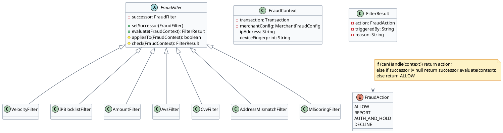
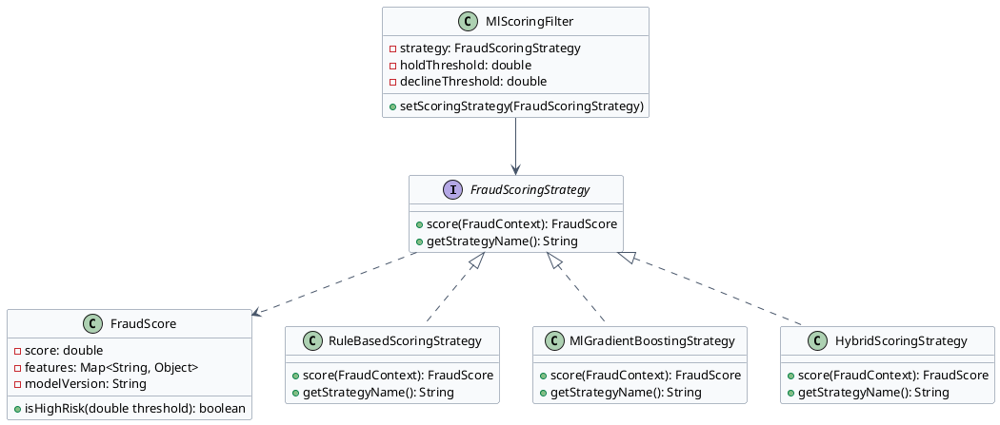
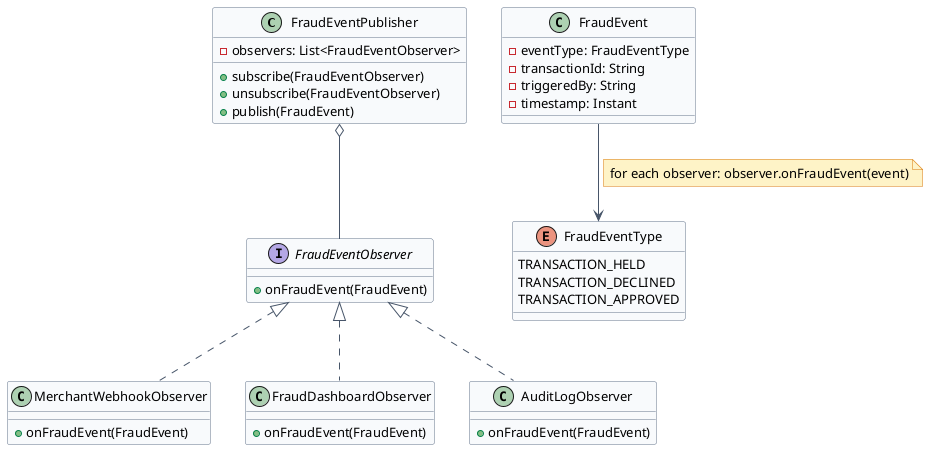

# Fraud Detection Engine — Low Level Design

The fraud detection engine evaluates every transaction through a configurable pipeline. Three patterns combine: Chain of Responsibility routes the request through ordered filters, Strategy allows swapping the scoring algorithm, and Observer decouples fraud event notification from the detection logic.

---

## Problem Statement

Design the fraud detection engine for a payment gateway. The engine must:

- Evaluate every incoming transaction through an ordered pipeline of configurable fraud filters
- Allow merchants to configure different thresholds (velocity limits, amount limits, IP rules) without code changes
- Support multiple fraud scoring algorithms that can be swapped at runtime (A/B testing, merchant-specific models)
- Notify multiple downstream systems (merchant webhook, fraud review dashboard, audit log) when a transaction is held or declined — without coupling the detection logic to the notification systems

The key design challenges:
1. **Pipeline ordering**: fast, cheap filters (velocity, amount) must run before slow, expensive ones (ML scoring). Short-circuit on the first trigger.
2. **Per-merchant configurability**: the same filter with different thresholds for a digital goods merchant vs a physical goods merchant.
3. **Notification fan-out**: when a transaction is held, 4+ systems need to know. If one notification fails, the others must still fire.

---

## Clarifying Questions — Interview

### 1. Functional Scope
**Q:** What actions can the fraud engine take? Can it only decline or does it have more options?

**A:** Five progressive actions: ALLOW (silent pass), REPORT_ONLY (log but proceed), AUTH_AND_HOLD (authorize but queue for merchant review), DO_NOT_AUTH_HOLD (queue without authorizing), DECLINE (immediate reject). Not binary — this granularity is essential for not destroying conversion rates.

### 2. Scale & Performance Budget
**Q:** How much time can fraud evaluation add to the transaction latency?

**A:** Total fraud evaluation budget is 50ms. Rule-based filters must complete in <5ms (Redis reads + simple logic). ML scoring gets the remaining ~45ms. If ML scoring exceeds budget, fall back to rule-based result.

### 3. Consistency & Correctness Invariants
**Q:** What happens if a fraud filter throws an exception? Does the transaction fail or proceed?

**A:** Default to fail safe toward allowing the transaction — a broken fraud filter must not block legitimate purchases. This default is configurable per merchant: high-risk merchants (digital goods, gift cards) can configure `failSafeAction=DECLINE` so a broken pipeline declines rather than allows through. Log the exception, alert ops, and skip the broken filter regardless of the fail-safe setting.

### 4. Extensibility & Rate of Change
**Q:** How often are new fraud filter types added? Who configures per-merchant rules?

**A:** New filter types are added a few times per year (e.g., device fingerprint filter, geolocation filter). Per-merchant configuration is done via a merchant admin UI — no code deployment required for threshold changes. The Chain of Responsibility pattern enables this: new filter = new class.

### 5. Concurrency & Thread Safety
**Q:** Is the fraud pipeline shared across threads? Are Redis velocity counters thread-safe?

**A:** The `FraudPipeline` itself is stateless and safely shared. Redis velocity counters use atomic Lua scripts (ZADD + ZREMRANGEBYSCORE + ZCARD in one atomic operation) — no race conditions. The ML model is read-only after loading.

### 6. Failure & Recovery
**Q:** What happens if the ML scoring service is unavailable?

**A:** Fallback to rule-based scoring only. The `MlScoringFilter` catches `MlServiceUnavailableException` and returns a conservative result (hold or allow based on merchant config). Timeout is 45ms hard limit — if ML doesn't respond, skip it.

### 7. Observability & Debuggability
**Q:** A merchant disputes a declined transaction. How do we explain which filter rejected it?

**A:** Every `FilterResult` carries `triggeredBy` (the filter class name) and `reason` (human-readable). Both are logged and stored on the transaction record. The fraud review dashboard shows exactly which filter fired and what the merchant's configured threshold was at that time.

### 8. Persistence & Durability
**Q:** Are fraud evaluations persisted? Can we re-evaluate historical transactions?

**A:** Each fraud evaluation is persisted as a `fraud_evaluation` record (transaction_id, filter_chain_result, ml_score, action, triggered_by, timestamp). Used for: merchant dispute resolution, model training data, compliance audit.

### 9. False Positive Cost
**Q:** What is the acceptable false positive rate? What is the cost of incorrectly declining a legitimate transaction?

**A:** Target false positive rate is <0.1% of transactions evaluated. A false positive on a $500 purchase costs the merchant $500 in lost revenue plus customer relationship damage (a declined customer rarely retries). This is why the fraud engine uses `AUTH_AND_HOLD` rather than immediate `DECLINE` for medium-confidence scores — it allows human review for ambiguous cases instead of auto-declining. The precision-recall operating point is explicitly tuned per merchant category: digital goods merchants accept higher false positive rates; airlines and hotels need lower ones due to high ticket values and customer acquisition costs.

### 10. ML Model Versioning and Rollback
**Q:** How is a new ML model version validated before going live? How do you roll back if it degrades performance?

**A:** New model versions are shadow-scored first: the production model and the candidate model run in parallel on live traffic, but only the production model's result determines the action. Shadow scores are logged alongside the production score. After 1–2 weeks of shadow scoring, compare: false positive rate, recall, and AUC-ROC on labeled chargeback data. If the candidate model is better: promote to production via `setScoringStrategy()` on the `MlScoringFilter`. Rollback: swap back to the previous strategy instance. The `fraud_evaluation` record stores `modelVersion` with each evaluation — so you can query "all transactions scored by model v3" if you need post-hoc analysis after a bad deployment.

### 11. Chargeback Feedback Loop
**Q:** How do chargebacks feed back into fraud model improvement?

**A:** Chargebacks are the ground truth labels: a chargeback with reason code "10.4 — Card Not Present Fraud" on a transaction the fraud engine scored 0.2 (low risk) is a false negative — we missed it. The pipeline: (1) CRDR (Chargeback & Retrieval Detail Report) feeds a `chargeback_events` table daily. (2) A weekly batch job joins `fraud_evaluations` with `chargeback_events` on `transaction_id`, creating labeled training data: `{features, fraud_score, actual_fraud=true/false}`. (3) Model retrained monthly on the updated labeled set. (4) Filter thresholds recalibrated quarterly against merchant-specific chargeback rate targets.

### 12. 3D Secure Integration
**Q:** How does 3DS2 (3D Secure 2) interact with the fraud engine?

**A:** 3DS2 is a complement to the fraud engine, not a replacement. When a transaction passes the fraud engine's evaluation, the gateway optionally triggers 3DS2 authentication based on risk score: low-score transactions get frictionless 3DS2 (issuer silently authenticates, no customer action); medium-score transactions get 3DS2 challenge (customer OTP/biometric). The critical business implication: a successful 3DS2 authentication **shifts fraud liability to the issuing bank**. Even if the fraud engine later determines the transaction was fraudulent, the chargeback is the issuer's responsibility, not the merchant's. This means the fraud engine's false negative cost is dramatically reduced for 3DS2-authenticated transactions.

### 13. Velocity Counter Accuracy Under High Load
**Q:** How accurate are Redis velocity counters when the gateway is processing 5,000 TPS?

**A:** Velocity counters use a sorted set per `(merchant_id, ip, window)`. The atomic Lua script — `ZADD + ZREMRANGEBYSCORE + ZCARD` — executes in a single Redis round-trip, preventing race conditions. At 5,000 TPS with 100ms Redis RTT, each velocity check adds ~100ms latency — too high for the 50ms fraud budget. Mitigation: Redis pipelining groups multiple counter increments in one round-trip; the velocity check runs asynchronously on the read path while the write (increment) is fire-and-forget. Accept eventual consistency: a burst could slip through by 1–2 transactions before the counter reflects reality — this is an intentional design trade-off between latency and precision.

---

## Section 1: Chain of Responsibility — Fraud Filter Pipeline

:::tip[Intent]
Pass each incoming transaction through a chain of fraud filters. Each filter independently decides whether to handle the request (take an action) or pass it to the next filter. The first filter that triggers returns an action; remaining filters are skipped.
:::



:::note[Use Chain of Responsibility for Fraud Filters When]
- Each filter is independently configurable per merchant (velocity limits, amount thresholds differ per merchant)
- Filters should short-circuit — once a filter triggers a DECLINE, remaining filters are unnecessary
- New filter types (e.g., geolocation, device fingerprint) can be added without changing existing filters
- Filter order matters and must be configurable without code changes
:::

```java title="FraudAction.java"
public enum FraudAction {
    ALLOW,
    REPORT_ONLY,
    AUTH_AND_HOLD,
    DO_NOT_AUTH_HOLD,
    DECLINE
}
```

```java title="FraudContext.java"
public class FraudContext {
    private final Transaction transaction;
    private final MerchantFraudConfig merchantConfig;
    private final String ipAddress;
    private final String deviceFingerprint;
    private final String customerEmail;
    // constructor + getters
}
```

```java title="FilterResult.java"
public class FilterResult {
    private final FraudAction action;
    private final String triggeredBy;
    private final String reason;

    public static FilterResult allow() {
        return new FilterResult(FraudAction.ALLOW, "none", "no filter triggered");
    }
    // constructor + getters
}
```

```java title="FraudFilter.java" {8,12}
public abstract class FraudFilter {
    private FraudFilter successor;

    public void setSuccessor(FraudFilter successor) {
        this.successor = successor;
    }

    public FilterResult evaluate(FraudContext context) {
        if (appliesTo(context)) {
            FilterResult result = check(context);
            if (result.getAction() != FraudAction.ALLOW) {
                return result;  // short-circuit — this filter triggered
            }
        }
        // Pass to next filter in chain
        return successor != null ? successor.evaluate(context) : FilterResult.allow();
    }

    protected abstract boolean appliesTo(FraudContext context);
    protected abstract FilterResult check(FraudContext context);
}
```

```java title="VelocityFilter.java" collapse={1-6}
public class VelocityFilter extends FraudFilter {
    private final VelocityCounterService velocityService;

    public VelocityFilter(VelocityCounterService velocityService) {
        this.velocityService = velocityService;
    }

    @Override
    protected boolean appliesTo(FraudContext context) {
        return context.getMerchantConfig().isVelocityFilterEnabled();
    }

    @Override
    protected FilterResult check(FraudContext context) {
        String merchantId = context.getTransaction().getMerchantId();
        String ip = context.getIpAddress();
        MerchantFraudConfig config = context.getMerchantConfig();

        // Check hourly transaction count from this IP
        int ipCountLastHour = velocityService.getCount(merchantId, ip, Duration.ofHours(1));
        if (ipCountLastHour > config.getMaxTransactionsPerIpPerHour()) {
            return new FilterResult(
                    config.getVelocityAction(),
                    "VelocityFilter",
                    "IP " + ip + " exceeded " + config.getMaxTransactionsPerIpPerHour() + " tx/hour"
            );
        }

        // Check daily total amount
        BigDecimal dailyTotal = velocityService.getTotalAmount(merchantId, Duration.ofDays(1));
        if (dailyTotal.compareTo(config.getMaxDailyAmount()) > 0) {
            return new FilterResult(
                    config.getDailyAmountAction(),
                    "VelocityFilter",
                    "Daily amount " + dailyTotal + " exceeds limit"
            );
        }

        return FilterResult.allow();
    }
}
```

```java title="FraudPipeline.java" collapse={1-4}
public class FraudPipeline {
    private final FraudFilter head;

    public FraudPipeline(List<FraudFilter> filters) {
        if (filters.isEmpty()) throw new IllegalArgumentException("Pipeline needs at least one filter");
        // Chain the filters in order
        for (int i = 0; i < filters.size() - 1; i++) {
            filters.get(i).setSuccessor(filters.get(i + 1));
        }
        this.head = filters.get(0);
    }

    public FilterResult evaluate(FraudContext context) {
        return head.evaluate(context);
    }

    // Factory method to build default pipeline
    public static FraudPipeline defaultPipeline(VelocityCounterService velocity,
                                                  IpIntelligenceService ipIntel,
                                                  MlScoringService ml) {
        return new FraudPipeline(Arrays.asList(
            new VelocityFilter(velocity),
            new IPBlocklistFilter(ipIntel),
            new AmountFilter(),
            new AvsFilter(),
            new CvvFilter(),
            new AddressMismatchFilter(),
            new MlScoringFilter(ml)   // ML scoring last — most expensive
        ));
    }
}
```

:::success[Advantages]
- **Per-merchant config**: each filter reads from `MerchantFraudConfig` — same code, different thresholds per merchant
- **Short-circuit efficiency**: DECLINE from VelocityFilter (fastest) skips ML scoring (slowest)
- **Open for extension**: add `DeviceFingerprintFilter` without touching existing filters
- **Testable in isolation**: each filter can be unit tested independently with a mock context
:::

:::warn[Disadvantages]
- **Ordering complexity**: filters must be ordered by speed (fast rules first, ML last); wrong order hurts performance
- **Silent pass-through**: if no filter triggers, the transaction is allowed — easy to misconfigure a missing filter
:::

### Why Chain of Responsibility and Not Alternatives

| Alternative | Why it fails for fraud filtering |
|---|---|
| Single `FraudEvaluator` class with all logic | Adding a velocity filter means modifying the class. 8 filters × 5 configurable thresholds = unmaintainable god class. Cannot test filters in isolation. |
| List of lambdas/functions | Works but loses the ability to store per-filter configuration. A lambda can't hold a `VelocityConfig` and be dependency-injected cleanly. |
| Rule engine (Drools, EasyRules) | Overkill for ~8 well-known filters. Adds a DSL, external tooling dependency, and harder debugging. Chain of Responsibility gives the same result in plain Java. |
| **Chain of Responsibility** ✓ | Each filter is independently configurable, testable, and deployable. Short-circuit stops expensive ML when a cheap rule fires. New filter = new class, zero changes to pipeline. |

:::tip[Always use Chain of Responsibility when...]
- A request must pass through multiple independent handlers where each can stop processing
- Handlers must be independently configurable and testable
- The set of handlers may grow over time
- You want short-circuit behavior (first handler that acts stops the chain)
- Handler ordering matters and must be configurable without code changes
:::

---

## Section 2: Strategy Pattern — Fraud Scoring Algorithm

:::tip[Intent]
Define a family of fraud scoring algorithms (rule-based, ML-based, hybrid) and make them interchangeable. The fraud engine delegates scoring to the configured strategy without knowing its implementation details.
:::



:::note[Use Strategy for Fraud Scoring When]
- You need to A/B test a new ML model against the current rule-based model on live traffic
- Different merchant categories need different scoring models (digital goods vs physical goods)
- You want to swap from a rules-only model to ML without changing the filter pipeline
:::

```java title="FraudScoringStrategy.java"
public interface FraudScoringStrategy {
    FraudScore score(FraudContext context);
    String getStrategyName();
}
```

```java title="FraudScore.java"
public class FraudScore {
    private final double score;           // 0.0 = safe, 1.0 = certain fraud
    private final Map<String, Object> topFeatures;
    private final String modelVersion;

    public boolean isHighRisk(double threshold) {
        return score >= threshold;
    }
}
```

```java title="RuleBasedScoringStrategy.java" collapse={1-4}
public class RuleBasedScoringStrategy implements FraudScoringStrategy {

    @Override
    public FraudScore score(FraudContext context) {
        double score = 0.0;
        Map<String, Object> features = new HashMap<>();

        // Weight: new card + high amount = suspicious
        if (context.getTransaction().getAmount().compareTo(new BigDecimal("500")) > 0) {
            score += 0.3;
            features.put("high_amount", context.getTransaction().getAmount());
        }

        // Weight: IP country ≠ card BIN country
        if (!context.getIpCountry().equals(context.getCardBinCountry())) {
            score += 0.4;
            features.put("geo_mismatch", true);
        }

        // Weight: first transaction from this device
        if (context.isFirstDeviceSeen()) {
            score += 0.2;
            features.put("new_device", true);
        }

        return new FraudScore(Math.min(score, 1.0), features, "rules-v1.0");
    }

    @Override
    public String getStrategyName() { return "RULE_BASED"; }
}
```

```java title="MlScoringFilter.java" {10}
public class MlScoringFilter extends FraudFilter {
    private FraudScoringStrategy scoringStrategy;
    private final double declineThreshold;
    private final double holdThreshold;

    public MlScoringFilter(FraudScoringStrategy strategy, double holdThreshold, double declineThreshold) {
        this.scoringStrategy = strategy;
        this.holdThreshold = holdThreshold;
        this.declineThreshold = declineThreshold;
    }

    // Allows switching strategy at runtime (A/B testing)
    public void setScoringStrategy(FraudScoringStrategy strategy) {
        this.scoringStrategy = strategy;
    }

    @Override
    protected boolean appliesTo(FraudContext context) {
        return context.getMerchantConfig().isMlScoringEnabled();
    }

    @Override
    protected FilterResult check(FraudContext context) {
        FraudScore score = scoringStrategy.score(context);

        if (score.isHighRisk(declineThreshold)) {
            return new FilterResult(FraudAction.DECLINE, "MlScoringFilter",
                    "ML score " + score.getScore() + " exceeds decline threshold " + declineThreshold);
        }
        if (score.isHighRisk(holdThreshold)) {
            return new FilterResult(FraudAction.AUTH_AND_HOLD, "MlScoringFilter",
                    "ML score " + score.getScore() + " exceeds hold threshold " + holdThreshold);
        }
        return FilterResult.allow();
    }
}
```

:::success[Advantages]
- **A/B testing**: route 10% of traffic to new ML model, 90% to rules — compare performance without full rollout
- **Merchant-specific models**: high-risk merchant categories get a more aggressive ML model
- **Runtime swap**: `setScoringStrategy()` lets ops switch models without restart
:::

:::warn[Disadvantages]
- ML model is a black box — hard to explain to a merchant why their transaction was declined
- Strategy pattern doesn't prevent misconfiguration — wrong threshold + right strategy = bad outcomes
:::

### Why Strategy Pattern and Not Alternatives

| Alternative | Why it fails for fraud scoring |
|---|---|
| Hard-coded `if (mlEnabled) { ... } else { ... }` | Cannot A/B test. Adding a third scoring mode means another if-branch. Testing requires mocking static state. |
| Inheritance (`MlFraudFilter extends RuleBasedFraudFilter`) | Couples ML and rule implementations. Swapping at runtime requires creating new objects. |
| Feature flags only | Feature flags can enable/disable but can't parameterize — you can't say "use this specific model version for this merchant" with a flag. |
| **Strategy** ✓ | Scoring algorithm is a first-class object. Swap implementations at runtime (`setScoringStrategy()`). Test each strategy with a mock context. A/B test by routing to different strategy instances per request. |

:::tip[Always use Strategy Pattern when...]
- You need to switch between algorithms at runtime (A/B testing, feature rollout)
- Different "customers" of the same logic need different algorithm variants (per-merchant scoring models)
- An algorithm's implementation details should be hidden from the calling code
- You want to test each algorithm variant in isolation
:::

---

## Section 3: Observer Pattern — Fraud Event Notification

:::tip[Intent]
When a transaction is held for fraud review or declined, multiple systems need to be notified: the merchant webhook system, the fraud review dashboard, the audit log, and possibly a real-time alert. Observer decouples the fraud engine from the downstream notification systems.
:::



:::note[Use Observer for Fraud Notifications When]
- Multiple downstream systems need to react to fraud events but are developed by different teams
- New notification channels (e.g., Slack alert, SMS) can be added without modifying the fraud engine
- Observers should fail independently — a broken webhook delivery should not crash the fraud engine
:::

```java title="FraudEventType.java"
public enum FraudEventType {
    TRANSACTION_HELD,
    TRANSACTION_DECLINED,
    TRANSACTION_APPROVED,
    FRAUD_REVIEW_APPROVED,
    FRAUD_REVIEW_DECLINED
}
```

```java title="FraudEvent.java"
public class FraudEvent {
    private final FraudEventType eventType;
    private final String transactionId;
    private final String merchantId;
    private final String triggeredBy;
    private final FraudAction action;
    private final Instant timestamp;
    // constructor + getters
}
```

```java title="FraudEventPublisher.java" {9}
public class FraudEventPublisher {
    private final List<FraudEventObserver> observers = new CopyOnWriteArrayList<>();

    public void subscribe(FraudEventObserver observer) {
        observers.add(observer);
    }

    public void publish(FraudEvent event) {
        for (FraudEventObserver observer : observers) {
            try {
                observer.onFraudEvent(event);
            } catch (Exception e) {
                // Log but don't propagate — one failing observer must not block others
                log.error("Observer {} failed for event {}: {}", 
                          observer.getClass().getSimpleName(), event.getTransactionId(), e.getMessage());
            }
        }
    }
}
```

```java title="MerchantWebhookObserver.java" collapse={1-4}
public class MerchantWebhookObserver implements FraudEventObserver {
    private final WebhookService webhookService;

    @Override
    public void onFraudEvent(FraudEvent event) {
        if (event.getEventType() == FraudEventType.TRANSACTION_HELD) {
            webhookService.sendAsync(
                event.getMerchantId(),
                "net.authorize.payment.fraud.held",
                Map.of("transactionId", event.getTransactionId(),
                       "triggeredBy", event.getTriggeredBy())
            );
        }
    }
}
```

```java title="AuditLogObserver.java" collapse={1-4}
public class AuditLogObserver implements FraudEventObserver {
    private final AuditLogRepository auditLog;

    @Override
    public void onFraudEvent(FraudEvent event) {
        auditLog.insert(AuditEntry.builder()
                .entityType("TRANSACTION")
                .entityId(event.getTransactionId())
                .eventType(event.getEventType().name())
                .metadata(Map.of("action", event.getAction(), "triggeredBy", event.getTriggeredBy()))
                .timestamp(event.getTimestamp())
                .build());
    }
}
```

Wiring it together in a usage example:

```java title="FraudEngineConfig.java"
@Bean
public FraudEventPublisher fraudEventPublisher(WebhookService webhookService,
                                                FraudDashboardService dashboardService,
                                                AuditLogRepository auditLog) {
    FraudEventPublisher publisher = new FraudEventPublisher();
    publisher.subscribe(new MerchantWebhookObserver(webhookService));
    publisher.subscribe(new FraudDashboardObserver(dashboardService));
    publisher.subscribe(new AuditLogObserver(auditLog));
    return publisher;
}
```

:::success[Advantages]
- **Independent failures**: `try-catch` around each observer means a broken webhook service doesn't break fraud evaluation
- **Open for extension**: add `SlackAlertObserver` without touching the fraud engine
- **Decoupled teams**: webhook team and fraud team can evolve independently
:::

:::warn[Disadvantages]
- **Async risk**: if observers are called synchronously and one is slow, it delays the transaction response
- **Ordering not guaranteed**: observers are notified in registration order — if order matters, document it explicitly
:::

### Why Observer Pattern and Not Alternatives

| Alternative | Why it fails for fraud event notification |
|---|---|
| Direct calls from fraud engine (`webhookService.send(...)`, `dashboard.update(...)`) | Fraud engine is coupled to every notification system. Adding a Slack alert requires modifying the fraud engine. One slow observer (webhook delivery) blocks the transaction response. |
| Synchronous event bus | Same coupling problem — the bus still needs to know all subscribers at registration time, and a slow subscriber blocks. |
| Message queue only (Kafka) | Correct for high-throughput async delivery, but adds infrastructure. For 3-4 local observers, Observer Pattern is simpler and testable without a Kafka cluster. |
| **Observer** ✓ | Fraud engine publishes to `FraudEventPublisher` — zero knowledge of who observes. New observer = new class + one-line registration. `try-catch` per observer prevents cascade failures. |

:::tip[Always use Observer Pattern when...]
- Multiple independent systems need to react to the same event
- The event source must not be coupled to its consumers (different teams, different deployment cycles)
- Consumers must fail independently — one broken observer must not affect others
- New consumers may be added without modifying the event source
:::

---

[← Payment Gateway LLD](/low-level-design/payment-gateway/lld-payment-gateway/)
