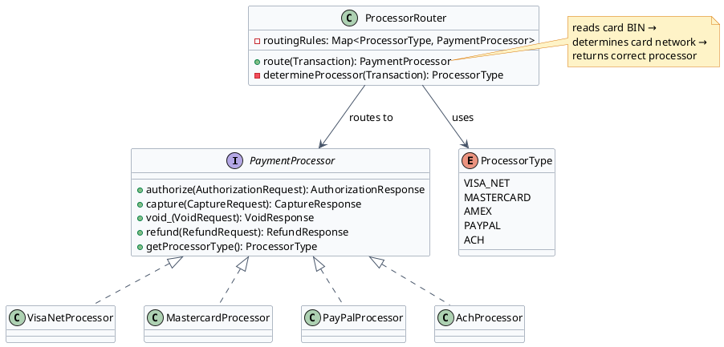
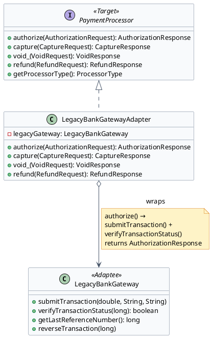
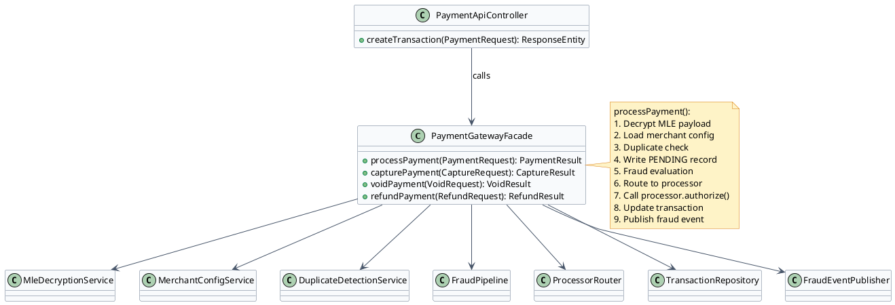

# Processor Integration — Low Level Design

A payment gateway must integrate with multiple card processors (Visa/Mastercard networks via different acquirers, PayPal, Braintree, etc.) and adapt to different API formats. Three patterns work together: Strategy for swapping processor implementations, Adapter for wrapping legacy or incompatible processor APIs, and Facade for presenting a single simple interface to the transaction engine.

---

## Problem Statement

Design the processor integration layer for a payment gateway. This layer must:

- Route each transaction to the correct card processor (Visa network for Visa cards, Mastercard for Mastercard cards, PayPal for PayPal payments, ACH processor for bank transfers)
- Adapt legacy or third-party processor APIs that are incompatible with the gateway's internal interface — without modifying the gateway's core logic
- Expose a single, simple entry point to the transaction engine that hides all subsystem complexity (MLE decryption, fraud evaluation, duplicate checking, processor routing, event publishing)

The key design challenges:
1. **Routing variety**: different card types route to different processors. Adding a new acquirer partnership must not require changes to the transaction engine.
2. **Legacy incompatibility**: some processors have 10-year-old APIs with different method names, parameter types, and response formats. The transaction engine must never know about these differences.
3. **Orchestration complexity**: a single `processPayment()` call requires 9 coordinated steps across 7 subsystems. This complexity must be hidden from the API controller.

---

## Clarifying Questions — Interview

### 1. Functional Scope
**Q:** How many processors must be supported? Can a single merchant use multiple processors for different card types?

**A:** 4-6 processors initially (VisaNet, Mastercard, Amex, PayPal, ACH, Legacy Bank). Yes — a merchant can be configured with VisaNet for Visa cards and a regional acquirer for Mastercard. The `ProcessorRouter` reads the merchant's processor configuration per card type.

### 2. Scale & Performance Budget
**Q:** How many concurrent processor calls can the system handle? What is the timeout for a processor call?

**A:** Each processor has its own bulkhead thread pool (200 threads for VisaNet, 200 for Mastercard — sized for async I/O or ~200 concurrent blocking calls at 15s average timeout). Processor timeout is **15–30 seconds** — this is the realistic range used by production payment gateways. Visa/Mastercard authorization typically responds in 1–3 seconds at the network level; a 30-second timeout catches legitimate slow responses without holding threads indefinitely. The gateway-to-merchant timeout is set slightly higher (e.g., 35 seconds) so the gateway always resolves the processor call before the merchant's HTTP connection times out — preventing the merchant from giving up and retrying while the original processor call is still in flight.

### 3. Consistency & Correctness Invariants
**Q:** What happens if the processor call succeeds but the response is lost in transit?

**A:** The PENDING record written before the call identifies this gap. Recovery process queries the processor using the `processorTransactionId` to determine if the authorization succeeded. This is why the Facade must ensure write-before-call happens before any processor call.

### 4. Extensibility & Rate of Change
**Q:** How difficult is it to add a new processor (e.g., a new regional acquirer)?

**A:** With Strategy Pattern: implement `PaymentProcessor` interface (4 methods), register in `ProcessorRouter`. Zero changes to `TransactionEngine`, `FraudEngine`, or `PaymentGatewayFacade`. A new processor is a new file + a configuration change.

### 5. Concurrency & Thread Safety
**Q:** Is the `ProcessorRouter` and `PaymentGatewayFacade` shared across threads?

**A:** Both are stateless singletons — safely shared. The `LegacyBankGatewayAdapter` stores `currentReferenceNumber` as instance state, which IS a thread-safety issue — it should be request-scoped (see Disadvantages).

### 6. Failure & Recovery
**Q:** What happens when a processor is down? Does it affect all transactions or only that processor's?

**A:** Circuit breaker per processor (stored in Redis). When VisaNet's circuit opens, only VisaNet transactions fail fast. Mastercard, PayPal, and ACH are unaffected (bulkhead isolation). The Facade catches `ProcessorUnavailableException` and returns an error response — PENDING record already written, so no silent money loss.

### 7. Observability & Debuggability
**Q:** A merchant reports their transaction was declined by the processor with an opaque error code. How do we investigate?

**A:** The `processorTransactionId` and raw `declineCode` from the processor are stored on the transaction record. The `TransactionInvoker` audit log shows which `ProcessorStrategy` handled the request, the raw response, and timing. Cross-reference with the processor's own logs using `processorTransactionId`.

### 8. Persistence & Durability
**Q:** If the `PaymentGatewayFacade.processPayment()` crashes halfway through, what's the recovery path?

**A:** The PENDING write (step 4 in the Facade) ensures a recovery record exists before any external call. If the crash happens after the processor call but before `updateResponse()`, the PENDING record exists and ops can reconcile it against the processor. The Facade's 9-step sequence is designed so every failure after step 4 is recoverable.

### 9. Fallback Processor
**Q:** If the primary processor for a card type is down (circuit open), is there a fallback?

**A:** Yes — `ProcessorRouter` supports a fallback routing rule per card type. If VisaNet's circuit is open, route to the secondary acquirer configured for that merchant. The fallback adds ~50ms overhead (different network path, possibly different fee schedule). Fallback is merchant-configurable: some merchants accept a secondary acquirer with different settlement terms; others prefer to decline during primary outage rather than settle to an unexpected acquirer. The circuit breaker state is checked before routing: `CLOSED → primary; OPEN → fallback (if configured) → decline (if no fallback)`.

### 10. Decline Code Normalization
**Q:** Each processor has different decline code schemes. How does the facade expose a consistent code to the merchant?

**A:** Each processor adapter translates its native codes to a `NormalizedDeclineCode` enum: `INSUFFICIENT_FUNDS`, `CARD_EXPIRED`, `CVV_MISMATCH`, `DO_NOT_HONOR`, `LOST_STOLEN`, `INVALID_CARD`, `GENERIC_DECLINE`. The translation lives inside the Strategy implementation — `VisaNetProcessor.authorize()` maps Visa's "51" to `INSUFFICIENT_FUNDS`, Mastercard's "N7" to `CVV_MISMATCH`. The `PaymentGatewayFacade` returns the normalized code to the merchant. The raw processor code is also stored on the transaction record for debugging and processor-specific analysis.

### 11. Partial Authorization
**Q:** Some issuers return partial approvals (e.g., authorize $80 on a $100 request for a prepaid card). How is this handled?

**A:** `AuthorizationResponse` includes an `approvedAmount` field alongside the requested `amount`. If `approvedAmount < requestedAmount`, the facade can: (a) accept the partial authorization and capture `approvedAmount` — common for prepaid/gift cards where the merchant ships what the card can cover; (b) void the partial authorization and decline — the merchant's configured preference. The `Transaction.amount` is set to `approvedAmount` on the AUTHORIZED state transition, not the original requested amount. Partial authorizations are most common with debit cards, prepaid cards, and restaurant pre-authorizations.

### 12. Network-Mandated Retry Rules
**Q:** Are there card network rules about when and how often declined transactions can be retried?

**A:** Yes — Visa and Mastercard publish strict retry rules that carry financial penalties for violations: **(1) Hard declines** (stolen card, account closed, invalid card number) — must NOT be retried. Retrying these risks `EXCESSIVE_RETRY` fees ($0.10–$0.25 per violation, thousands of them per day at scale). **(2) Soft declines** (insufficient funds "51") — may retry, minimum 1 day between attempts. **(3) "Do Not Honor" (05)** — minimum 30 days before retry. The `ProcessorRouter` stores the last decline code per stored credential and enforces minimum retry intervals before allowing a retry. Violations of network retry rules can result in increased per-transaction fees and eventually losing processing rights.

### 13. PCI DSS Scope in Processor Integration
**Q:** Does the processor integration layer fall within PCI DSS scope? What must it never do?

**A:** Yes — any component that transmits cardholder data is in PCI scope (PCI DSS Requirement 4: encrypt transmission). The processor adapter transmits the PAN to the card network, so it is in scope. Requirements: (1) All transmission uses TLS 1.2+ with certificate validation. (2) The `AuthorizationRequest` passed to `processor.authorize()` must contain the PAN only transiently — it must not be logged, cached, or stored. (3) The `processorTransactionId` returned in `AuthorizationResponse` is safe to log; it's the processor's own reference, not cardholder data. (4) With network tokenization (Visa VTS / Mastercard MDES), the actual PAN is replaced with a network token before it reaches the processor adapter — this reduces PCI scope for the adapter significantly.

---

## Section 1: Strategy Pattern — Processor Routing

:::tip[Intent]
Define a family of processor implementations (VisaNetProcessor, MastercardProcessor, PayPalProcessor, AchProcessor) and make them interchangeable. The transaction engine selects and uses the correct processor strategy without knowing its internals.
:::



:::note[Use Strategy for Processor Routing When]
- Each card processor has a different API format, authentication method, and response code scheme
- New processors (e.g., a regional acquirer) must be added without modifying existing processor logic
- You need to route different transaction types to different processors (cards to card network, ACH to bank network)
- A/B testing: route 10% of Visa transactions to a new acquirer to compare approval rates
:::

```java title="PaymentProcessor.java"
public interface PaymentProcessor {
    AuthorizationResponse authorize(AuthorizationRequest request);
    CaptureResponse capture(CaptureRequest request);
    VoidResponse void_(VoidRequest request);
    RefundResponse refund(RefundRequest request);
    ProcessorType getProcessorType();
}
```

```java title="AuthorizationRequest.java"
public class AuthorizationRequest {
    private final String transactionId;
    private final BigDecimal amount;
    private final String currency;
    private final PaymentMethod paymentMethod;
    private final BillingAddress billingAddress;
    private final String merchantId;
    private final String customerIp;
    // constructor + getters
}
```

```java title="AuthorizationResponse.java"
public class AuthorizationResponse {
    private final boolean approved;
    private final String authCode;
    private final String processorTransactionId;
    private final String declineCode;
    private final String avsResult;
    private final String cvvResult;
    // constructor + getters
}
```

```java title="VisaNetProcessor.java" collapse={1-6}
public class VisaNetProcessor implements PaymentProcessor {
    private final VisaNetClient visaNetClient;
    private final MessageFormatter formatter;

    public VisaNetProcessor(VisaNetClient visaNetClient, MessageFormatter formatter) {
        this.visaNetClient = visaNetClient;
        this.formatter = formatter;
    }

    @Override
    public AuthorizationResponse authorize(AuthorizationRequest request) {
        // Build ISO 8583 message for Visa network
        Iso8583Message message = formatter.buildAuthorizationMessage(request);
        Iso8583Response response = visaNetClient.send(message);
        return formatter.parseAuthorizationResponse(response);
    }

    @Override
    public CaptureResponse capture(CaptureRequest request) {
        Iso8583Message message = formatter.buildCaptureMessage(request);
        Iso8583Response response = visaNetClient.send(message);
        return formatter.parseCaptureResponse(response);
    }

    @Override
    public ProcessorType getProcessorType() { return ProcessorType.VISA_NET; }

    // void_ and refund implementations omitted for brevity
}
```

```java title="ProcessorRouter.java" {14,18}
public class ProcessorRouter {
    private final Map<ProcessorType, PaymentProcessor> processors;
    private final BinLookupService binLookupService;

    public ProcessorRouter(Map<ProcessorType, PaymentProcessor> processors,
                            BinLookupService binLookupService) {
        this.processors = processors;
        this.binLookupService = binLookupService;
    }

    public PaymentProcessor route(Transaction transaction) {
        ProcessorType type = determineProcessorType(transaction);
        PaymentProcessor processor = processors.get(type);
        if (processor == null) {
            throw new UnsupportedProcessorException("No processor registered for " + type);
        }
        return processor;
    }

    private ProcessorType determineProcessorType(Transaction transaction) {
        String bin = transaction.getPaymentMethod().getCardNumber().substring(0, 8);
        CardNetwork network = binLookupService.lookupNetwork(bin);

        return switch (network) {
            case VISA -> ProcessorType.VISA_NET;
            case MASTERCARD -> ProcessorType.MASTERCARD;
            case AMEX -> ProcessorType.AMEX;
            case PAYPAL -> ProcessorType.PAYPAL;
            default -> throw new UnsupportedCardNetworkException(network.name());
        };
    }
}
```

:::success[Advantages]
- **Isolated test surface**: each processor can be unit tested with a mock without touching others
- **Zero-downtime processor swap**: route 0% to old processor, 100% to new without code changes
- **Independent deployment**: `VisaNetProcessor` changes deploy without touching `MastercardProcessor`
:::

:::warn[Disadvantages]
- **Response code normalization**: each processor has unique decline codes; the router must normalize them into a common `DeclineCode` enum — ongoing maintenance as processors change their codes
- **Configuration complexity**: routing rules must cover all card BIN ranges, edge cases, and fallbacks
:::

### Why Strategy Pattern and Not Alternatives

| Alternative | Why it fails for processor routing |
|---|---|
| `if-else` by card type in `TransactionEngine` | Transaction engine knows about every processor. Adding a new processor means modifying the engine. Testing the engine requires mocking all processors. |
| Abstract base class per processor | Inheritance creates hidden dependencies. `VisaNetProcessor` and `MastercardProcessor` share no actual implementation — there's nothing to inherit. Prefer composition. |
| Service locator / registry lookup | Works but is implicit — the routing logic is hidden in a registry lookup instead of in explicit, readable routing code. Harder to trace and test. |
| **Strategy** ✓ | `ProcessorRouter` selects the correct `PaymentProcessor` at runtime. Transaction engine calls `processor.authorize(request)` — completely decoupled from which network handles it. New processor = new class + routing rule. |

:::tip[Always use Strategy Pattern when...]
- Multiple implementations share the same interface but have completely different internals
- The selection of implementation happens at runtime based on data (card BIN, merchant config)
- Adding new implementations must not require changes to the calling code
- Each implementation should be independently testable with mocks
:::

---

## Section 2: Adapter Pattern — Legacy Processor Integration

:::tip[Intent]
Some payment processors have legacy or incompatible APIs that don't match the `PaymentProcessor` interface. The Adapter wraps the legacy API and translates calls from the gateway's interface into the format the legacy system understands — without modifying either side.
:::

Problem: the gateway uses `PaymentProcessor` interface everywhere. But `LegacyBankGateway` has a completely different API — different method names, different request format, different response format:

```java title="LegacyBankGateway.java" {3}
public class LegacyBankGateway {
    private long lastReferenceNumber;

    public void submitTransaction(double totalAmount, String currencyCode, String cardData) {
        System.out.println("LegacyGateway: submitting " + currencyCode + " " + totalAmount);
        this.lastReferenceNumber = System.currentTimeMillis(); // simulated reference
    }

    public boolean verifyTransactionStatus(long referenceNumber) {
        System.out.println("LegacyGateway: checking status for ref " + referenceNumber);
        return true; // simulated approval
    }

    public long getLastReferenceNumber() {
        return lastReferenceNumber;
    }

    public void reverseTransaction(long referenceNumber) {
        System.out.println("LegacyGateway: reversing ref " + referenceNumber);
    }
}
```



:::note[Method translation in the Adapter]
Each method in `PaymentProcessor` is translated into one or more calls to the legacy API:
1. Renaming: `authorize()` → `submitTransaction()` + `verifyTransactionStatus()`
2. Type conversion: `BigDecimal amount` → `double totalAmount`
3. State tracking: `lastReferenceNumber` must be stored in the adapter between calls
4. Response mapping: `boolean` success → `AuthorizationResponse` object
:::

```java title="LegacyBankGatewayAdapter.java" {3,5}
public class LegacyBankGatewayAdapter implements PaymentProcessor {
    private final LegacyBankGateway legacyGateway;  // holds instance of adaptee
    private long currentReferenceNumber;

    public LegacyBankGatewayAdapter(LegacyBankGateway legacyGateway) {
        this.legacyGateway = legacyGateway;
    }

    @Override
    public AuthorizationResponse authorize(AuthorizationRequest request) {
        // Translate: BigDecimal → double, PaymentMethod → cardData string
        String cardData = formatCardData(request.getPaymentMethod());
        double amount = request.getAmount().doubleValue();

        legacyGateway.submitTransaction(amount, request.getCurrency(), cardData);
        currentReferenceNumber = legacyGateway.getLastReferenceNumber();

        boolean approved = legacyGateway.verifyTransactionStatus(currentReferenceNumber);

        return AuthorizationResponse.builder()
                .approved(approved)
                .processorTransactionId("LEGACY_" + currentReferenceNumber)
                .authCode(approved ? String.valueOf(currentReferenceNumber) : null)
                .declineCode(approved ? null : "LEGACY_DECLINED")
                .build();
    }

    @Override
    public VoidResponse void_(VoidRequest request) {
        long ref = Long.parseLong(request.getProcessorTransactionId().replace("LEGACY_", ""));
        legacyGateway.reverseTransaction(ref);
        return new VoidResponse(true, "LEGACY_" + ref + "_REVERSED");
    }

    @Override
    public CaptureResponse capture(CaptureRequest request) {
        // Legacy gateway uses auto-capture — capture is a no-op
        return new CaptureResponse(true, request.getTransactionId(), request.getAmount());
    }

    @Override
    public RefundResponse refund(RefundRequest request) {
        long ref = Long.parseLong(request.getProcessorTransactionId().replace("LEGACY_", ""));
        legacyGateway.reverseTransaction(ref);
        return new RefundResponse(true, "LEGACY_REFUND_" + ref);
    }

    @Override
    public ProcessorType getProcessorType() { return ProcessorType.LEGACY_BANK; }

    private String formatCardData(PaymentMethod pm) {
        return pm.getCardNumber() + "|" + pm.getExpiryMonth() + "/" + pm.getExpiryYear();
    }
}
```

Usage — the transaction engine never knows it's talking to a legacy gateway:

```java
// No changes to TransactionEngine — it uses PaymentProcessor interface
PaymentProcessor legacyProcessor = new LegacyBankGatewayAdapter(new LegacyBankGateway());
processorRouter.register(ProcessorType.LEGACY_BANK, legacyProcessor);

// ProcessorRouter selects it when a merchant is configured to use LEGACY_BANK
```

:::success[Advantages]
- **Zero changes to existing code**: `TransactionEngine` and `ProcessorRouter` are unchanged
- **Incremental migration**: run legacy and new processors in parallel; migrate merchants one at a time
- **Clean isolation**: all the ugly translation code is in one class — easy to find and update
:::

:::warn[Disadvantages]
- **State leakage risk**: `currentReferenceNumber` is instance state — adapter must be request-scoped or thread-safe
- **Partial translation**: if the legacy API doesn't support partial refunds, the adapter must simulate it or throw `UnsupportedOperationException`
:::

### Why Adapter Pattern and Not Alternatives

| Alternative | Why it fails for legacy processor integration |
|---|---|
| Modify `LegacyBankGateway` directly | Cannot — it's a third-party library or a system owned by another team. Modifying it creates a maintenance fork. |
| Add `if (isLegacy)` branches in `ProcessorRouter` | Router becomes coupled to legacy API specifics. Every legacy quirk pollutes the core routing logic. |
| Rewrite the legacy processor from scratch | Too expensive. The adapter wraps the existing battle-tested implementation. |
| **Adapter** ✓ | `LegacyBankGatewayAdapter` is the only place that knows about `LegacyBankGateway`. All translation in one class. `ProcessorRouter` uses it via `PaymentProcessor` interface — zero knowledge of legacy internals. |

:::tip[Always use Adapter Pattern when...]
- You must integrate with a third-party or legacy system whose API you cannot modify
- The incompatible interface serves the same purpose as your existing interface (same job, different method names/types)
- You want all translation logic in one place (easy to update when the legacy API changes)
- You need to make a "round peg fit in a square hole" without modifying either the peg or the hole
:::

---

## Section 3: Facade Pattern — Payment Processing API

:::tip[Intent]
Provide a single simplified interface (`PaymentGatewayFacade`) that hides the complexity of coordinating the processor router, fraud engine, MLE decryption service, transaction repository, and event publisher. The merchant-facing API controller calls one method; the facade orchestrates all subsystems.
:::

Without a Facade, the API controller would need to:
1. Decrypt the MLE-encrypted card data → calls `MleDecryptionService`
2. Look up merchant config → calls `MerchantConfigService`
3. Write PENDING transaction → calls `TransactionRepository`
4. Check for duplicates → calls `DuplicateDetectionService`
5. Run fraud evaluation → calls `FraudPipeline`
6. Route to processor → calls `ProcessorRouter`
7. Call the processor → calls `PaymentProcessor`
8. Update transaction with result → calls `TransactionRepository`
9. Publish events → calls `FraudEventPublisher`

This couples the controller to 7+ subsystems.



:::note[The Facade Pattern solves this by]
- Providing ONE entry point (`PaymentGatewayFacade`) that knows about all subsystems
- The controller just calls `facade.processPayment(request)` and gets a result
- The orchestration logic lives in the facade, not scattered across controllers
- Each subsystem (fraud engine, processor router) can still be used directly by other services that need granular access
:::

```java title="PaymentGatewayFacade.java" {8}
public class PaymentGatewayFacade {
    private final MleDecryptionService mleDecryptionService;
    private final MerchantConfigService merchantConfigService;
    private final DuplicateDetectionService duplicateDetector;
    private final FraudPipeline fraudPipeline;
    private final ProcessorRouter processorRouter;
    private final TransactionRepository transactionRepository;  // write-before-call
    private final FraudEventPublisher eventPublisher;

    // Constructor injection (Spring @Autowired or manual)
    public PaymentGatewayFacade(MleDecryptionService mle, MerchantConfigService config,
                                  DuplicateDetectionService dedup, FraudPipeline fraud,
                                  ProcessorRouter router, TransactionRepository repo,
                                  FraudEventPublisher publisher) {
        this.mleDecryptionService = mle;
        this.merchantConfigService = config;
        this.duplicateDetector = dedup;
        this.fraudPipeline = fraud;
        this.processorRouter = router;
        this.transactionRepository = repo;
        this.eventPublisher = publisher;
    }

    public PaymentResult processPayment(PaymentRequest request) {
        // Step 1: Decrypt MLE-encrypted card data
        PaymentMethod decryptedMethod = mleDecryptionService.decrypt(request.getEncryptedPayload());

        // Step 2: Load merchant config (from cache)
        MerchantConfig config = merchantConfigService.load(request.getMerchantId());

        // Step 3: Idempotency / duplicate check
        Optional<Transaction> existing = duplicateDetector.findDuplicate(request);
        if (existing.isPresent()) {
            return PaymentResult.fromExisting(existing.get());
        }

        // Step 4: Write PENDING record (write-before-call)
        Transaction transaction = transactionRepository.insertPending(request, config);

        // Step 5: Fraud evaluation
        FraudContext fraudContext = new FraudContext(transaction, config, request.getCustomerIp());
        FilterResult fraudResult = fraudPipeline.evaluate(fraudContext);

        if (fraudResult.getAction() == FraudAction.DECLINE) {
            transactionRepository.updateDeclined(transaction.getId(), fraudResult.getReason());
            return PaymentResult.declined(transaction.getId(), fraudResult.getReason());
        }

        // Step 6: Route to processor and authorize
        PaymentProcessor processor = processorRouter.route(transaction);
        AuthorizationRequest authRequest = buildAuthRequest(transaction, decryptedMethod);
        AuthorizationResponse authResponse = processor.authorize(authRequest);

        // Step 7: Update transaction record with result
        transactionRepository.updateResponse(transaction.getId(), authResponse);

        // Step 8: Publish fraud event if held
        if (fraudResult.getAction() == FraudAction.AUTH_AND_HOLD) {
            eventPublisher.publish(new FraudEvent(FraudEventType.TRANSACTION_HELD,
                    transaction.getId(), request.getMerchantId(), fraudResult.getTriggeredBy(),
                    FraudAction.AUTH_AND_HOLD, Instant.now()));
        }

        return PaymentResult.from(transaction, authResponse);
    }
}
```

```java title="PaymentApiController.java" collapse={1-4}
@RestController
public class PaymentApiController {
    private final PaymentGatewayFacade gateway;

    public PaymentApiController(PaymentGatewayFacade gateway) {
        this.gateway = gateway;
    }

    @PostMapping("/v1/transactions")
    public ResponseEntity<PaymentResult> createTransaction(@RequestBody PaymentRequest request) {
        PaymentResult result = gateway.processPayment(request);
        int status = result.isApproved() ? 201 : 402;
        return ResponseEntity.status(status).body(result);
    }
}
```

:::success[Advantages]
- **Simple controller**: the API controller has ONE dependency and ONE method call — easy to read, test, and maintain
- **Centralized orchestration**: the 9-step sequence is in one place — when a step changes, one file changes
- **Testable facade**: the facade can be tested by mocking its 7 dependencies independently
:::

:::warn[Disadvantages]
- **God object risk**: the facade can grow to handle every edge case — resist adding business logic into it; it should only orchestrate
- **Hidden complexity**: subsystems CAN still be used directly; the facade doesn't prevent bypassing it
:::

### Why Facade Pattern and Not Alternatives

| Alternative | Why it fails for payment orchestration |
|---|---|
| Put all 9 steps in the API controller | Controller handles HTTP AND payment logic. 500-line controller. Cannot reuse the logic in the recurring billing engine or test it without HTTP context. |
| Service mesh / orchestration engine | Overkill for a deterministic 9-step sequence. Adds infrastructure dependency. The sequence never changes at runtime. |
| Direct coupling between each service | `FraudEngine` calls `ProcessorRouter` which calls `TransactionRepository`. Circular dependencies, impossible to test in isolation. |
| **Facade** ✓ | Single `PaymentGatewayFacade.processPayment()`. Controller has ONE dependency. Recurring billing engine calls the same facade. Unit test the facade by mocking 7 dependencies. Subsystems stay decoupled from each other. |

:::tip[Always use Facade Pattern when...]
- A controller or client needs to coordinate 3+ subsystems to complete one operation
- The same orchestration logic is needed from multiple entry points (API controller, batch job, webhook handler)
- You want to hide subsystem complexity from clients while keeping subsystems independently usable
- You need a single, mockable dependency for testing the entire flow end-to-end
:::

Final wiring example showing how all three patterns compose:

```java
// Application startup wiring
LegacyBankGateway legacyGateway = new LegacyBankGateway();
LegacyBankGatewayAdapter legacyAdapter = new LegacyBankGatewayAdapter(legacyGateway); // Adapter

Map<ProcessorType, PaymentProcessor> processors = Map.of(           // Strategy
    ProcessorType.VISA_NET, new VisaNetProcessor(visaNetClient, formatter),
    ProcessorType.MASTERCARD, new MastercardProcessor(mcClient, formatter),
    ProcessorType.LEGACY_BANK, legacyAdapter                        // Adapter plugs into Strategy
);
ProcessorRouter router = new ProcessorRouter(processors, binLookupService);

PaymentGatewayFacade facade = new PaymentGatewayFacade(             // Facade
    mleService, merchantConfigService, duplicateDetector,
    fraudPipeline, router, transactionRepository, eventPublisher
);
```

---

[← Payment Gateway LLD](/low-level-design/payment-gateway/lld-payment-gateway/)
