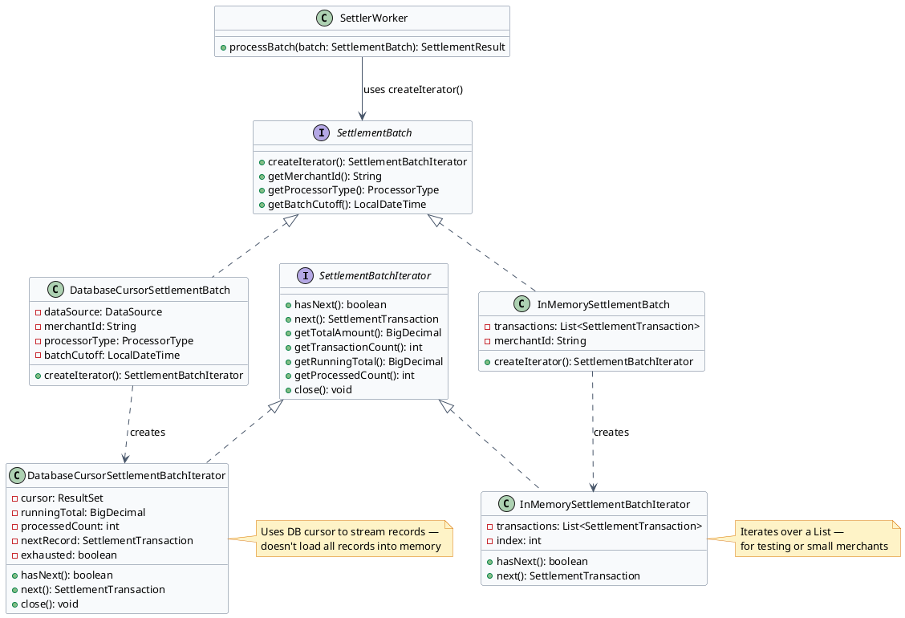
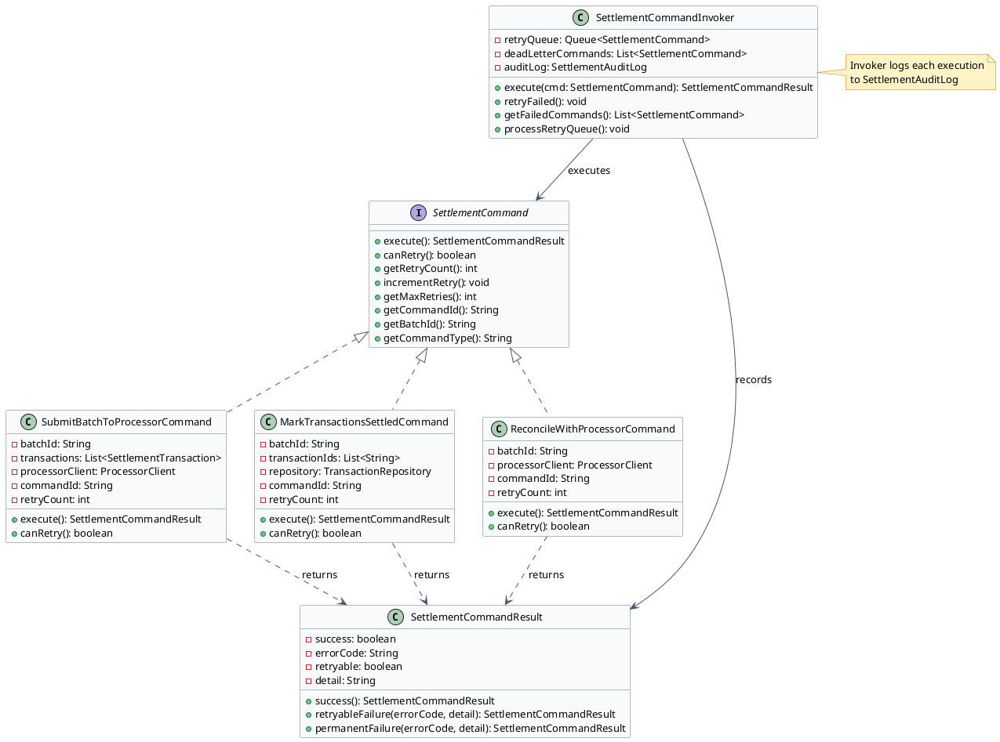

# Settlement Pipeline — Low Level Design

The settlement pipeline must process millions of transactions per day across hundreds of merchant batches. Two design patterns make this scalable and correct: Iterator for traversing settlement batches without exposing internal storage details, and Command for encapsulating retry operations so failed settlement steps can be retried with proper backoff.

---

## Problem Statement

Design the settlement pipeline for a payment gateway. The pipeline must:

- Traverse potentially hundreds of thousands of captured transactions per merchant batch without loading all records into memory
- Execute multi-step settlement operations (build batch → submit to processor → verify balance → mark settled) where each step can fail independently and must be retried without re-running completed steps
- Guarantee that a batch is never submitted to the processor twice — even if the settler crashes after submission but before recording the result

The key design challenges:
1. **Memory safety at scale**: a large merchant may have 100,000+ transactions in a single settlement batch. Loading all into a Java `List` causes OOM errors. Streaming via DB cursor is required.
2. **Granular retry**: if "submit batch to processor" succeeds but "mark transactions as settled" fails (DB outage), only the DB step should retry — not re-submit to the processor (which would double-settle).
3. **Out-of-balance detection**: if gateway totals don't match processor totals (SS=4), this must NEVER auto-retry. Manual reconciliation is required.

---

## Clarifying Questions — Interview

### 1. Functional Scope
**Q:** What steps does a settlement batch go through? Can a batch be partially settled?

**A:** Five steps: (1) query captured transactions, (2) build NACHA/ISO file, (3) submit to processor, (4) verify totals balance, (5) mark transactions as SS=2. For **ACH/NACHA**, batches are largely atomic — the ODFI can reject an entire batch. For **Visa/Mastercard card networks**, individual transactions within a batch can be declined while others succeed (e.g., a transaction whose auth code expired is rejected while the rest settle). The settler must handle partial batch success: mark SS=2 for settled transactions, SS=3 for individually rejected ones, and surface rejected transactions for merchant notification.

### 2. Scale & Performance Budget
**Q:** How many merchant batches run concurrently? How many transactions per batch?

**A:** Hundreds of merchants have cutoffs within the same hour. Each merchant's batch runs independently. Small merchants: hundreds of transactions. Large merchants: 100,000+ transactions. The settler must handle both without special-casing.

### 3. Consistency & Correctness Invariants
**Q:** What must NEVER happen during settlement?

**A:** (1) A transaction must never be submitted to the processor twice (double-settlement → double funding). (2) An SS=4 (out-of-balance) batch must never auto-retry. (3) Marking transactions as SS=2 must be idempotent — if the DB write fails and retries, re-running must not corrupt already-settled records.

### 4. Extensibility & Rate of Change
**Q:** Could new settlement step types be added (e.g., a fraud review step before submission)?

**A:** Yes — Command Pattern makes this easy. Add a `FraudReviewSettlementCommand` and insert it in the invoker's step sequence. Zero changes to existing command classes.

### 5. Concurrency & Thread Safety
**Q:** Can two settler workers process the same merchant batch simultaneously?

**A:** No — the `settle_merchant_queue` uses `SELECT FOR UPDATE SKIP LOCKED`. Only one worker can claim a given merchant job. The `batch_reference_id` provides idempotency if a claimed job needs to be handed to another worker after a crash.

### 6. Failure & Recovery
**Q:** The settler submits a batch to the processor and then crashes before marking SS=2. What happens on restart?

**A:** The `SubmitBatchToProcessorCommand` sends `batch_reference_id` to the processor. On restart, before re-submitting, the command checks if the processor already has this batch reference. If yes: skip submission, proceed to `MarkTransactionsSettledCommand`. Idempotency via reference ID.

### 7. Observability & Debuggability
**Q:** How do we know a settlement batch is stuck?

**A:** Alert on: `settle_merchant_queue` jobs with `status=CLAIMED` and `claimed_at > 30 minutes ago` (stale claim — worker crashed). Alert on: SS=4 count > 0 (out-of-balance requires immediate ops attention). `SettlementCommandInvoker` logs every command attempt with batch_id, command_type, retry_count, outcome.

### 8. Persistence & Durability
**Q:** Is settlement retry state in-memory or persisted?

**A:** Currently in-memory in `SettlementCommandInvoker` — a known limitation. Production-grade: persist retry state to a `settlement_retry_queue` table. A JVM restart after a failed command must be able to resume from the last failed step.

### 9. Batch Cutoff Timing
**Q:** When exactly does a settlement day cut off? What happens to a transaction captured 30 seconds before cutoff?

**A:** Each merchant has a configured `batch_cutoff_time` (e.g., 23:55 EST). The iterator query uses `captured_at < batchCutoff` — a transaction captured at 23:54 is in today's batch; one captured at 23:56 is in tomorrow's. The scheduler job runs every 10 minutes checking which merchants' cutoffs have passed. Edge case: a transaction captured during the 10-minute scheduler window between cutoff and the scheduler run is still included correctly because the query uses the cutoff timestamp, not "now". Missing the cutoff delays the merchant's funding by one business day — a merchant complaint driver that ops fields regularly.

### 10. Funding Timeline After Settlement
**Q:** After the gateway confirms settlement with the processor, when does the merchant receive funds?

**A:** T+1 to T+3 depending on: card network (Visa typically T+1, Amex T+2), merchant risk tier (standard merchants T+1, high-risk merchants T+3 with a 6-month rolling reserve), and whether the settlement lands on a banking holiday (weekends/holidays do not count). The gateway records a `funded_at` timestamp on the batch when the acquirer's ACH credit to the merchant's bank account is confirmed. The `DDR (Deposit Detail Report)` shows the exact deposit amount and timing. Merchants with cash flow sensitivity configure "accelerated funding" through the acquirer for an additional fee.

### 11. ACH Return Handling After Settlement
**Q:** An ACH eCheck transaction was marked SS=2 (settled). Two weeks later, the customer's bank sends an R07 return (authorization revoked). What happens?

**A:** An ACH return after settlement creates an `EXCEPTION` state (not covered by the SS state machine used for card transactions — ACH has its own return-processing pipeline). The gateway: (1) receives the R-code via the RDFI → ODFI → gateway daily return file; (2) creates a `return_event` record linked to the original `transaction_id`; (3) debits the merchant's reserve account for the returned amount; (4) surfaces the return in the `TEDR (Transaction Exception & Dispute Report)`; (5) for R07/R10 (unauthorized), immediately flags the bank account as `DO_NOT_DEBIT` — future charges to this account are blocked. The 60-day unauthorized return window means financial reserves must account for this exposure.

### 12. Multi-Currency Settlement
**Q:** If a merchant processes in EUR and USD, how are settlement batches structured?

**A:** Settlement batches are created per processor per currency per merchant. A merchant processing EUR Visa and USD Visa creates two separate batches submitted to Visa's network — one in EUR, one in USD. The settler's batch builder groups by `(merchant_id, processor_id, currency)`. FX conversion happens at the card network level (issuer currency → network settlement currency → acquirer currency) — the gateway does not perform FX conversion itself. The settlement totals in the balance check must compare in the same currency as the processor settlement file.

### 13. Chargeback Effect on Settled Batches
**Q:** A transaction was settled (SS=2) last week. Today the merchant receives a chargeback. Does the settlement record change?

**A:** No — the SS=2 record is immutable. Chargebacks are recorded as separate events in the `CRDR (Chargeback & Retrieval Detail Report)`. The gateway debits the merchant's reserve account for the chargeback amount and fee (typically $15–50). If the merchant disputes the chargeback (representment), the dispute workflow creates a new credit record on resolution. The original settled transaction always shows SS=2 — the chargeback is a separate financial event, not a state change on the original transaction.

---

## Section 1: Iterator Pattern — Settlement Batch Traversal

:::tip[Intent]
Provide a way to traverse all captured transactions in a settlement batch sequentially — handling large batches (potentially hundreds of thousands of records) — without exposing whether the underlying storage is a database cursor, an in-memory list, or a file. The settler worker never needs to know how transactions are stored.
:::



:::note[Use Iterator for Settlement Batch Traversal When]
- A large merchant's batch might contain 100,000+ transactions — loading all into memory at once causes OutOfMemoryError
- The settler worker's processing logic should be identical regardless of batch source (DB, file, in-memory)
- You want to add a new batch source (e.g., file-based batch from a legacy processor) without changing the settler
- You need to track running totals (total amount, transaction count) as you iterate for balance verification
:::

```java title="SettlementTransaction.java"
public class SettlementTransaction {
    private final String transactionId;
    private final String merchantId;
    private final BigDecimal amount;
    private final String currency;
    private final String authCode;
    private final String processorTransactionId;
    private final LocalDateTime capturedAt;
    // constructor + getters
}
```

```java title="SettlementBatchIterator.java"
public interface SettlementBatchIterator {
    boolean hasNext();
    SettlementTransaction next();
    BigDecimal getRunningTotal();
    int getProcessedCount();
    void close();  // release DB cursor / file handles
}
```

```java title="SettlementBatch.java"
public interface SettlementBatch {
    SettlementBatchIterator createIterator();
    String getMerchantId();
    ProcessorType getProcessorType();
    LocalDateTime getBatchCutoff();
}
```

```java title="DatabaseCursorSettlementBatchIterator.java" {10,14}
public class DatabaseCursorSettlementBatchIterator implements SettlementBatchIterator {
    private final ResultSet cursor;
    private BigDecimal runningTotal = BigDecimal.ZERO;
    private int processedCount = 0;
    private SettlementTransaction nextRecord = null;
    private boolean exhausted = false;

    public DatabaseCursorSettlementBatchIterator(ResultSet cursor) {
        this.cursor = cursor;
        advance(); // pre-fetch first record
    }

    @Override
    public boolean hasNext() {
        return !exhausted && nextRecord != null;
    }

    @Override
    public SettlementTransaction next() {
        if (!hasNext()) throw new NoSuchElementException("No more transactions in batch");
        SettlementTransaction current = nextRecord;
        runningTotal = runningTotal.add(current.getAmount());
        processedCount++;
        advance(); // pre-fetch next record
        return current;
    }

    private void advance() {
        try {
            if (cursor.next()) {
                nextRecord = mapRow(cursor);
            } else {
                exhausted = true;
                nextRecord = null;
            }
        } catch (SQLException e) {
            exhausted = true;
            throw new SettlementIteratorException("Cursor error: " + e.getMessage(), e);
        }
    }

    @Override
    public void close() {
        try { cursor.close(); } catch (SQLException ignored) {}
    }

    private SettlementTransaction mapRow(ResultSet rs) throws SQLException {
        return new SettlementTransaction(
            rs.getString("transaction_id"),
            rs.getString("merchant_id"),
            rs.getBigDecimal("amount"),
            rs.getString("currency"),
            rs.getString("auth_code"),
            rs.getString("processor_transaction_id"),
            rs.getTimestamp("captured_at").toLocalDateTime()
        );
    }
}
```

```java title="DatabaseCursorSettlementBatch.java" collapse={1-8}
public class DatabaseCursorSettlementBatch implements SettlementBatch {
    private final DataSource dataSource;
    private final String merchantId;
    private final ProcessorType processorType;
    private final LocalDateTime batchCutoff;

    public DatabaseCursorSettlementBatch(DataSource dataSource, String merchantId,
                                          ProcessorType processorType, LocalDateTime batchCutoff) {
        this.dataSource = dataSource;
        this.merchantId = merchantId;
        this.processorType = processorType;
        this.batchCutoff = batchCutoff;
    }

    @Override
    public SettlementBatchIterator createIterator() {
        try {
            Connection conn = dataSource.getConnection();
            PreparedStatement stmt = conn.prepareStatement(
                "SELECT transaction_id, merchant_id, amount, currency, auth_code, " +
                "processor_transaction_id, captured_at " +
                "FROM transactions " +
                "WHERE merchant_id = ? AND settlement_state = 1 " +
                "AND captured_at < ? " +
                "ORDER BY captured_at"
            );
            stmt.setString(1, merchantId);
            stmt.setTimestamp(2, Timestamp.valueOf(batchCutoff));
            stmt.setFetchSize(1000);  // stream 1000 rows at a time from DB
            ResultSet cursor = stmt.executeQuery();
            return new DatabaseCursorSettlementBatchIterator(cursor);
        } catch (SQLException e) {
            throw new BatchCreationException("Cannot open settlement cursor: " + e.getMessage(), e);
        }
    }
}
```

How the settler worker uses the iterator — note it never knows the underlying storage:

```java title="SettlerWorker.java" {7,12}
public class SettlerWorker {

    public SettlementResult processBatch(SettlementBatch batch) {
        SettlementBatchIterator iterator = batch.createIterator();
        List<SettlementTransaction> transactions = new ArrayList<>();

        try {
            while (iterator.hasNext()) {
                SettlementTransaction tx = iterator.next();
                transactions.add(tx);
            }

            BigDecimal gatewayTotal = iterator.getRunningTotal();
            int count = iterator.getProcessedCount();

            // Submit batch to processor
            ProcessorBatchResponse response = processorClient.submitBatch(
                batch.getMerchantId(), transactions, batch.getProcessorType()
            );

            // Verify balance — mismatch = SS=4, must NOT auto-retry
            if (!response.getTotal().equals(gatewayTotal)) {
                throw new OutOfBalanceException(gatewayTotal, response.getTotal());
            }

            return SettlementResult.success(count, gatewayTotal);

        } finally {
            iterator.close();  // always release DB cursor
        }
    }
}
```

:::success[Advantages]
- **Memory safe**: DB cursor streams records — 100K+ transaction batches don't cause OutOfMemoryError
- **Interchangeable sources**: `InMemorySettlementBatch` in tests, `DatabaseCursorSettlementBatch` in prod — settler code unchanged
- **Running totals**: iterator tracks amount and count during traversal — no second pass needed for balance check
:::
:::warn[Disadvantages]
- **Must call `close()`**: if the worker crashes mid-batch, the DB cursor leaks. Use try-finally or try-with-resources.
- **Forward-only**: DB cursors are forward-only; can't rewind without reopening the cursor
:::

### Why Iterator Pattern and Not Alternatives

| Alternative | Why it fails for settlement batch traversal |
|---|---|
| `List<SettlementTransaction> = repo.findAll(merchantId)` | Loads 100,000 records into heap memory. OOM error for large merchants. Blocks until all records are fetched before processing begins. |
| Pagination (`LIMIT/OFFSET`) | Each page requires a new DB query. With OFFSET, later pages get progressively slower (DB must skip N rows). Risk of missing/duplicating rows if data changes between page fetches. |
| Keyset pagination | Better than OFFSET but adds complexity and requires a stable sort key. Iterator encapsulates this complexity so the worker doesn't need to manage pagination state. |
| **Iterator** ✓ | DB cursor streams records one chunk at a time (fetch size 1,000). Worker processes as fast as records arrive. Memory usage is constant regardless of batch size. `SettlerWorker` is completely unaware of storage details. |

:::tip[Always use Iterator Pattern when...]
- A collection is too large to fit in memory (>10K records)
- The caller needs to process records one at a time without loading everything first
- Multiple traversal strategies may be needed (DB cursor for prod, in-memory list for tests)
- You want to track running aggregates (total amount, count) during traversal
:::

---

## Section 2: Command Pattern — Settlement Retry Operations

:::tip[Intent]
Encapsulate each settlement step (SubmitBatchCommand, MarkSettledCommand, ReconcileCommand) as a Command object. Failed settlement steps can be queued, retried with exponential backoff, and audited — all without changing the settler worker logic.
:::

Problem without Command: if `processorClient.submitBatch()` fails partway through, the settler has no structured way to retry just that step — it must restart the entire process, risking double-submission.



:::note[Use Command for Settlement Retry When]
- Settlement has multiple distinct steps that can fail independently (network error on processor call shouldn't force re-processing of transactions already marked settled)
- You need an audit trail of every settlement attempt: which batch, which step, when, outcome
- Retry logic (exponential backoff, max attempts, dead-letter queue) should be configurable per command type
- Operations team needs to re-run a specific failed command without rerunning the entire batch
:::

```java title="SettlementCommand.java"
public interface SettlementCommand {
    SettlementCommandResult execute();
    boolean canRetry();
    int getRetryCount();
    void incrementRetry();
    int getMaxRetries();
    String getCommandId();
    String getBatchId();
    String getCommandType();
}
```

```java title="SettlementCommandResult.java"
public class SettlementCommandResult {
    private final boolean success;
    private final String errorCode;
    private final boolean retryable;
    private final String detail;

    public static SettlementCommandResult success() {
        return new SettlementCommandResult(true, null, false, "OK");
    }
    public static SettlementCommandResult retryableFailure(String errorCode, String detail) {
        return new SettlementCommandResult(false, errorCode, true, detail);
    }
    public static SettlementCommandResult permanentFailure(String errorCode, String detail) {
        return new SettlementCommandResult(false, errorCode, false, detail);
    }
}
```

```java title="SubmitBatchToProcessorCommand.java" {6,14,21}
public class SubmitBatchToProcessorCommand implements SettlementCommand {
    private final String batchId;
    private final List<SettlementTransaction> transactions;
    private final ProcessorClient processorClient;
    private final String commandId = UUID.randomUUID().toString();
    private int retryCount = 0;
    private static final int MAX_RETRIES = 3;

    @Override
    public SettlementCommandResult execute() {
        try {
            ProcessorBatchResponse response = processorClient.submitBatch(batchId, transactions);
            if (response.isOutOfBalance()) {
                // SS=4 — PERMANENT failure, do not retry
                return SettlementCommandResult.permanentFailure(
                    "OUT_OF_BALANCE",
                    "Gateway: " + response.getGatewayTotal() + " vs Processor: " + response.getProcessorTotal()
                );
            }
            return SettlementCommandResult.success();
        } catch (ProcessorTimeoutException e) {
            return SettlementCommandResult.retryableFailure("PROCESSOR_TIMEOUT", e.getMessage());
        } catch (ProcessorUnavailableException e) {
            return SettlementCommandResult.retryableFailure("PROCESSOR_UNAVAILABLE", e.getMessage());
        }
    }

    @Override
    public boolean canRetry() { return retryCount < MAX_RETRIES; }

    @Override
    public int getMaxRetries() { return MAX_RETRIES; }

    @Override
    public void incrementRetry() { retryCount++; }

    @Override
    public String getCommandType() { return "SUBMIT_BATCH_TO_PROCESSOR"; }

    @Override
    public String getCommandId() { return commandId; }

    @Override
    public String getBatchId() { return batchId; }

    @Override
    public int getRetryCount() { return retryCount; }
}
```

```java title="MarkTransactionsSettledCommand.java" collapse={1-6}
public class MarkTransactionsSettledCommand implements SettlementCommand {
    private final String batchId;
    private final List<String> transactionIds;
    private final TransactionRepository repository;
    private final String commandId = UUID.randomUUID().toString();
    private int retryCount = 0;

    @Override
    public SettlementCommandResult execute() {
        try {
            repository.markSettled(transactionIds, batchId);  // idempotent update
            return SettlementCommandResult.success();
        } catch (DatabaseException e) {
            // DB error — retryable
            return SettlementCommandResult.retryableFailure("DB_ERROR", e.getMessage());
        }
    }

    @Override
    public boolean canRetry() { return retryCount < 5; }  // DB errors get more retries

    @Override
    public String getCommandType() { return "MARK_TRANSACTIONS_SETTLED"; }

    // Other SettlementCommand methods...
}
```

```java title="SettlementCommandInvoker.java" {12,18,24}
public class SettlementCommandInvoker {
    private final SettlementAuditLog auditLog;
    private final Queue<SettlementCommand> retryQueue = new LinkedList<>();
    private final List<SettlementCommand> deadLetterCommands = new ArrayList<>();

    public SettlementCommandResult execute(SettlementCommand command) {
        SettlementCommandResult result = command.execute();

        auditLog.record(command.getBatchId(), command.getCommandId(),
                        command.getCommandType(), command.getRetryCount(), result);

        if (!result.isSuccess() && result.isRetryable() && command.canRetry()) {
            command.incrementRetry();
            retryQueue.add(command);  // schedule for retry
        } else if (!result.isSuccess()) {
            deadLetterCommands.add(command);  // permanent failure or max retries exceeded
            alertOperations(command, result);
        }

        return result;
    }

    public void processRetryQueue() {
        while (!retryQueue.isEmpty()) {
            SettlementCommand command = retryQueue.poll();
            long backoffMs = (long) Math.pow(2, command.getRetryCount()) * 1000L; // exponential backoff
            try { Thread.sleep(backoffMs); } catch (InterruptedException ignored) {}
            execute(command);
        }
    }

    public List<SettlementCommand> getDeadLetterCommands() {
        return Collections.unmodifiableList(deadLetterCommands);
    }
}
```

:::success[Advantages]
- **Granular retry**: only the failed step retries — if `MarkTransactionsSettledCommand` fails, `SubmitBatchToProcessorCommand` doesn't re-run (prevents double-submission)
- **Audit trail**: every command attempt logged with outcome and retry count
- **Dead letter queue**: permanently failed commands preserved for ops investigation, not silently dropped
:::
:::danger
Never retry a command that returned `OUT_OF_BALANCE`. The SS=4 state requires manual reconciliation — automated retry would create duplicate processor submissions and potentially double-fund transactions.
:::
:::warn[Disadvantages]
- **Command proliferation**: one class per settlement step
- **Statefulness**: `retryCount` is in-memory — if the settler JVM restarts mid-retry, the counter resets. For production, persist retry state in DB.
:::

### Why Command Pattern and Not Alternatives

| Alternative | Why it fails for settlement retry |
|---|---|
| Catch exception, retry inline in `SettlerWorker` | Retry logic mixed with orchestration logic. Cannot retry a specific step without re-running earlier steps. No audit trail of which step failed how many times. |
| Simple retry wrapper (`@Retry` annotation) | Retries the entire `processBatch()` call — including re-submitting to the processor, risking double-settlement. |
| Saga pattern | Correct for distributed systems with multiple services. Overkill for a single-service settlement pipeline with 3-4 in-process steps. Command Pattern is sufficient. |
| **Command** ✓ | Each step is an object. `SubmitBatchToProcessorCommand` retries only processor submission. `MarkTransactionsSettledCommand` retries only the DB write. SS=4 detected in `execute()` returns `permanentFailure` — invoker never retries it. |

:::tip[Always use Command Pattern when...]
- A multi-step operation needs step-level retry without re-running earlier steps
- Each step needs an audit trail (which batch, which step, how many retries, what outcome)
- Some failures are permanent (SS=4) and others are transient (timeout) — distinguishable at the command level
- You need compensation (undo) for already-completed steps when a later step permanently fails
:::

---

[← Payment Gateway LLD](/low-level-design/payment-gateway/lld-payment-gateway/)
