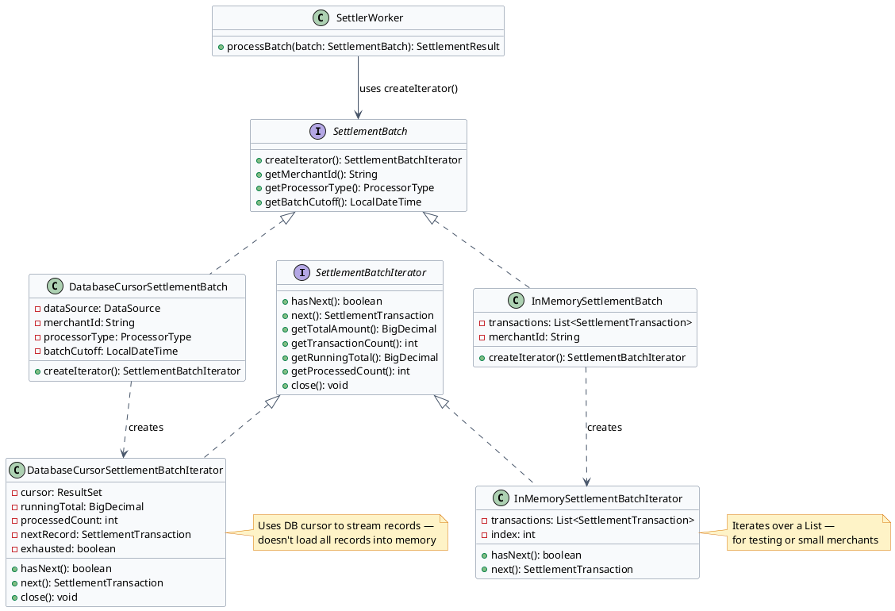
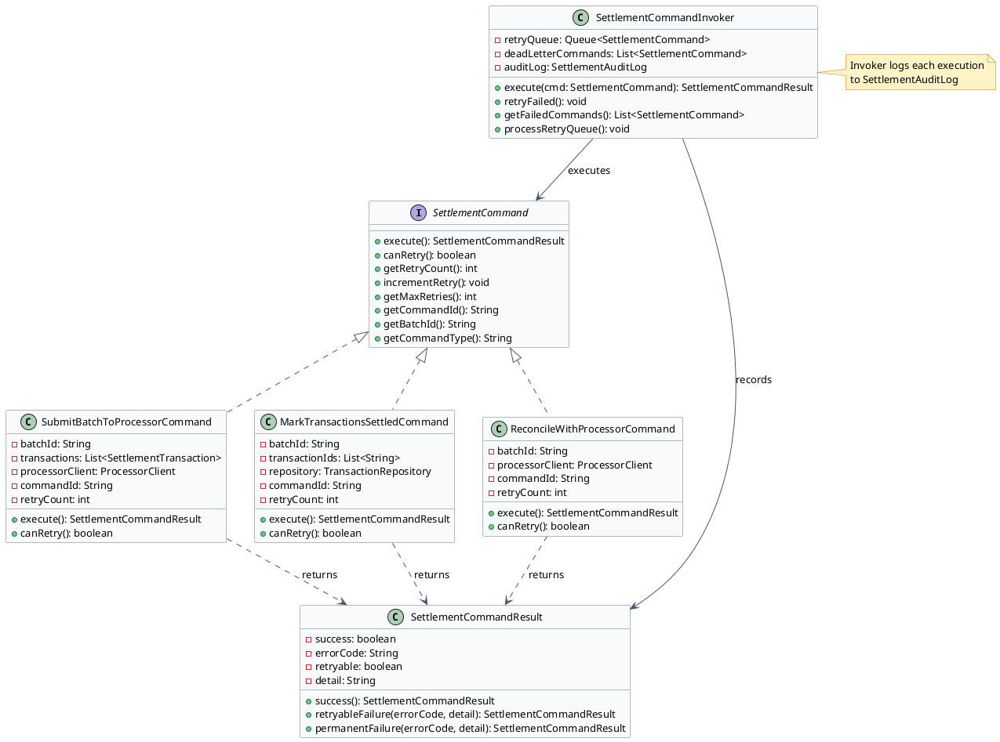

# Settlement Pipeline — Low Level Design

The settlement pipeline must process millions of transactions per day across hundreds of merchant batches. Two design patterns make this scalable and correct: Iterator for traversing settlement batches without exposing internal storage details, and Command for encapsulating retry operations so failed settlement steps can be retried with proper backoff.

---

## Section 1: Iterator Pattern — Settlement Batch Traversal

:::tip[Intent]
Provide a way to traverse all captured transactions in a settlement batch sequentially — handling large batches (potentially hundreds of thousands of records) — without exposing whether the underlying storage is a database cursor, an in-memory list, or a file. The settler worker never needs to know how transactions are stored.
:::



:::note[Use Iterator for Settlement Batch Traversal When]
- A large merchant's batch might contain 100,000+ transactions — loading all into memory at once causes OutOfMemoryError
- The settler worker's processing logic should be identical regardless of batch source (DB, file, in-memory)
- You want to add a new batch source (e.g., file-based batch from a legacy processor) without changing the settler
- You need to track running totals (total amount, transaction count) as you iterate for balance verification
:::

```java
// SettlementTransaction.java
public class SettlementTransaction {
    private final String transactionId;
    private final String merchantId;
    private final BigDecimal amount;
    private final String currency;
    private final String authCode;
    private final String processorTransactionId;
    private final LocalDateTime capturedAt;
    // constructor + getters
}
```

```java
// SettlementBatchIterator.java
public interface SettlementBatchIterator {
    boolean hasNext();
    SettlementTransaction next();
    BigDecimal getRunningTotal();
    int getProcessedCount();
    void close();  // release DB cursor / file handles
}
```

```java
// SettlementBatch.java
public interface SettlementBatch {
    SettlementBatchIterator createIterator();
    String getMerchantId();
    ProcessorType getProcessorType();
    LocalDateTime getBatchCutoff();
}
```

```java {10,14}
// DatabaseCursorSettlementBatchIterator.java
public class DatabaseCursorSettlementBatchIterator implements SettlementBatchIterator {
    private final ResultSet cursor;
    private BigDecimal runningTotal = BigDecimal.ZERO;
    private int processedCount = 0;
    private SettlementTransaction nextRecord = null;
    private boolean exhausted = false;

    public DatabaseCursorSettlementBatchIterator(ResultSet cursor) {
        this.cursor = cursor;
        advance(); // pre-fetch first record
    }

    @Override
    public boolean hasNext() {
        return !exhausted && nextRecord != null;
    }

    @Override
    public SettlementTransaction next() {
        if (!hasNext()) throw new NoSuchElementException("No more transactions in batch");
        SettlementTransaction current = nextRecord;
        runningTotal = runningTotal.add(current.getAmount());
        processedCount++;
        advance(); // pre-fetch next record
        return current;
    }

    private void advance() {
        try {
            if (cursor.next()) {
                nextRecord = mapRow(cursor);
            } else {
                exhausted = true;
                nextRecord = null;
            }
        } catch (SQLException e) {
            exhausted = true;
            throw new SettlementIteratorException("Cursor error: " + e.getMessage(), e);
        }
    }

    @Override
    public void close() {
        try { cursor.close(); } catch (SQLException ignored) {}
    }

    private SettlementTransaction mapRow(ResultSet rs) throws SQLException {
        return new SettlementTransaction(
            rs.getString("transaction_id"),
            rs.getString("merchant_id"),
            rs.getBigDecimal("amount"),
            rs.getString("currency"),
            rs.getString("auth_code"),
            rs.getString("processor_transaction_id"),
            rs.getTimestamp("captured_at").toLocalDateTime()
        );
    }
}
```

```java collapse={1-8}
// DatabaseCursorSettlementBatch.java
public class DatabaseCursorSettlementBatch implements SettlementBatch {
    private final DataSource dataSource;
    private final String merchantId;
    private final ProcessorType processorType;
    private final LocalDateTime batchCutoff;

    public DatabaseCursorSettlementBatch(DataSource dataSource, String merchantId,
                                          ProcessorType processorType, LocalDateTime batchCutoff) {
        this.dataSource = dataSource;
        this.merchantId = merchantId;
        this.processorType = processorType;
        this.batchCutoff = batchCutoff;
    }

    @Override
    public SettlementBatchIterator createIterator() {
        try {
            Connection conn = dataSource.getConnection();
            PreparedStatement stmt = conn.prepareStatement(
                "SELECT transaction_id, merchant_id, amount, currency, auth_code, " +
                "processor_transaction_id, captured_at " +
                "FROM transactions " +
                "WHERE merchant_id = ? AND settlement_state = 1 " +
                "AND captured_at < ? " +
                "ORDER BY captured_at"
            );
            stmt.setString(1, merchantId);
            stmt.setTimestamp(2, Timestamp.valueOf(batchCutoff));
            stmt.setFetchSize(1000);  // stream 1000 rows at a time from DB
            ResultSet cursor = stmt.executeQuery();
            return new DatabaseCursorSettlementBatchIterator(cursor);
        } catch (SQLException e) {
            throw new BatchCreationException("Cannot open settlement cursor: " + e.getMessage(), e);
        }
    }
}
```

How the settler worker uses the iterator — note it never knows the underlying storage:

```java {7,12}
// SettlerWorker.java — core iteration logic
public class SettlerWorker {

    public SettlementResult processBatch(SettlementBatch batch) {
        SettlementBatchIterator iterator = batch.createIterator();
        List<SettlementTransaction> transactions = new ArrayList<>();

        try {
            while (iterator.hasNext()) {
                SettlementTransaction tx = iterator.next();
                transactions.add(tx);
            }

            BigDecimal gatewayTotal = iterator.getRunningTotal();
            int count = iterator.getProcessedCount();

            // Submit batch to processor
            ProcessorBatchResponse response = processorClient.submitBatch(
                batch.getMerchantId(), transactions, batch.getProcessorType()
            );

            // Verify balance — mismatch = SS=4, must NOT auto-retry
            if (!response.getTotal().equals(gatewayTotal)) {
                throw new OutOfBalanceException(gatewayTotal, response.getTotal());
            }

            return SettlementResult.success(count, gatewayTotal);

        } finally {
            iterator.close();  // always release DB cursor
        }
    }
}
```

:::success[Advantages]
- **Memory safe**: DB cursor streams records — 100K+ transaction batches don't cause OutOfMemoryError
- **Interchangeable sources**: `InMemorySettlementBatch` in tests, `DatabaseCursorSettlementBatch` in prod — settler code unchanged
- **Running totals**: iterator tracks amount and count during traversal — no second pass needed for balance check
:::
:::caution[Disadvantages]
- **Must call `close()`**: if the worker crashes mid-batch, the DB cursor leaks. Use try-finally or try-with-resources.
- **Forward-only**: DB cursors are forward-only; can't rewind without reopening the cursor
:::

---

## Section 2: Command Pattern — Settlement Retry Operations

:::tip[Intent]
Encapsulate each settlement step (SubmitBatchCommand, MarkSettledCommand, ReconcileCommand) as a Command object. Failed settlement steps can be queued, retried with exponential backoff, and audited — all without changing the settler worker logic.
:::

Problem without Command: if `processorClient.submitBatch()` fails partway through, the settler has no structured way to retry just that step — it must restart the entire process, risking double-submission.



:::note[Use Command for Settlement Retry When]
- Settlement has multiple distinct steps that can fail independently (network error on processor call shouldn't force re-processing of transactions already marked settled)
- You need an audit trail of every settlement attempt: which batch, which step, when, outcome
- Retry logic (exponential backoff, max attempts, dead-letter queue) should be configurable per command type
- Operations team needs to re-run a specific failed command without rerunning the entire batch
:::

```java
// SettlementCommand.java
public interface SettlementCommand {
    SettlementCommandResult execute();
    boolean canRetry();
    int getRetryCount();
    void incrementRetry();
    int getMaxRetries();
    String getCommandId();
    String getBatchId();
    String getCommandType();
}
```

```java
// SettlementCommandResult.java
public class SettlementCommandResult {
    private final boolean success;
    private final String errorCode;
    private final boolean retryable;
    private final String detail;

    public static SettlementCommandResult success() {
        return new SettlementCommandResult(true, null, false, "OK");
    }
    public static SettlementCommandResult retryableFailure(String errorCode, String detail) {
        return new SettlementCommandResult(false, errorCode, true, detail);
    }
    public static SettlementCommandResult permanentFailure(String errorCode, String detail) {
        return new SettlementCommandResult(false, errorCode, false, detail);
    }
}
```

```java {6,14,21}
// SubmitBatchToProcessorCommand.java
public class SubmitBatchToProcessorCommand implements SettlementCommand {
    private final String batchId;
    private final List<SettlementTransaction> transactions;
    private final ProcessorClient processorClient;
    private final String commandId = UUID.randomUUID().toString();
    private int retryCount = 0;
    private static final int MAX_RETRIES = 3;

    @Override
    public SettlementCommandResult execute() {
        try {
            ProcessorBatchResponse response = processorClient.submitBatch(batchId, transactions);
            if (response.isOutOfBalance()) {
                // SS=4 — PERMANENT failure, do not retry
                return SettlementCommandResult.permanentFailure(
                    "OUT_OF_BALANCE",
                    "Gateway: " + response.getGatewayTotal() + " vs Processor: " + response.getProcessorTotal()
                );
            }
            return SettlementCommandResult.success();
        } catch (ProcessorTimeoutException e) {
            return SettlementCommandResult.retryableFailure("PROCESSOR_TIMEOUT", e.getMessage());
        } catch (ProcessorUnavailableException e) {
            return SettlementCommandResult.retryableFailure("PROCESSOR_UNAVAILABLE", e.getMessage());
        }
    }

    @Override
    public boolean canRetry() { return retryCount < MAX_RETRIES; }

    @Override
    public int getMaxRetries() { return MAX_RETRIES; }

    @Override
    public void incrementRetry() { retryCount++; }

    @Override
    public String getCommandType() { return "SUBMIT_BATCH_TO_PROCESSOR"; }

    @Override
    public String getCommandId() { return commandId; }

    @Override
    public String getBatchId() { return batchId; }

    @Override
    public int getRetryCount() { return retryCount; }
}
```

```java collapse={1-6}
// MarkTransactionsSettledCommand.java
public class MarkTransactionsSettledCommand implements SettlementCommand {
    private final String batchId;
    private final List<String> transactionIds;
    private final TransactionRepository repository;
    private final String commandId = UUID.randomUUID().toString();
    private int retryCount = 0;

    @Override
    public SettlementCommandResult execute() {
        try {
            repository.markSettled(transactionIds, batchId);  // idempotent update
            return SettlementCommandResult.success();
        } catch (DatabaseException e) {
            // DB error — retryable
            return SettlementCommandResult.retryableFailure("DB_ERROR", e.getMessage());
        }
    }

    @Override
    public boolean canRetry() { return retryCount < 5; }  // DB errors get more retries

    @Override
    public String getCommandType() { return "MARK_TRANSACTIONS_SETTLED"; }

    // Other SettlementCommand methods...
}
```

```java {12,18,24}
// SettlementCommandInvoker.java
public class SettlementCommandInvoker {
    private final SettlementAuditLog auditLog;
    private final Queue<SettlementCommand> retryQueue = new LinkedList<>();
    private final List<SettlementCommand> deadLetterCommands = new ArrayList<>();

    public SettlementCommandResult execute(SettlementCommand command) {
        SettlementCommandResult result = command.execute();

        auditLog.record(command.getBatchId(), command.getCommandId(),
                        command.getCommandType(), command.getRetryCount(), result);

        if (!result.isSuccess() && result.isRetryable() && command.canRetry()) {
            command.incrementRetry();
            retryQueue.add(command);  // schedule for retry
        } else if (!result.isSuccess()) {
            deadLetterCommands.add(command);  // permanent failure or max retries exceeded
            alertOperations(command, result);
        }

        return result;
    }

    public void processRetryQueue() {
        while (!retryQueue.isEmpty()) {
            SettlementCommand command = retryQueue.poll();
            long backoffMs = (long) Math.pow(2, command.getRetryCount()) * 1000L; // exponential backoff
            try { Thread.sleep(backoffMs); } catch (InterruptedException ignored) {}
            execute(command);
        }
    }

    public List<SettlementCommand> getDeadLetterCommands() {
        return Collections.unmodifiableList(deadLetterCommands);
    }
}
```

:::success[Advantages]
- **Granular retry**: only the failed step retries — if `MarkTransactionsSettledCommand` fails, `SubmitBatchToProcessorCommand` doesn't re-run (prevents double-submission)
- **Audit trail**: every command attempt logged with outcome and retry count
- **Dead letter queue**: permanently failed commands preserved for ops investigation, not silently dropped
:::
:::danger
Never retry a command that returned `OUT_OF_BALANCE`. The SS=4 state requires manual reconciliation — automated retry would create duplicate processor submissions and potentially double-fund transactions.
:::
:::caution[Disadvantages]
- **Command proliferation**: one class per settlement step
- **Statefulness**: `retryCount` is in-memory — if the settler JVM restarts mid-retry, the counter resets. For production, persist retry state in DB.
:::

---

[← Payment Gateway LLD](/learnings/payment-gateway/lld/)
