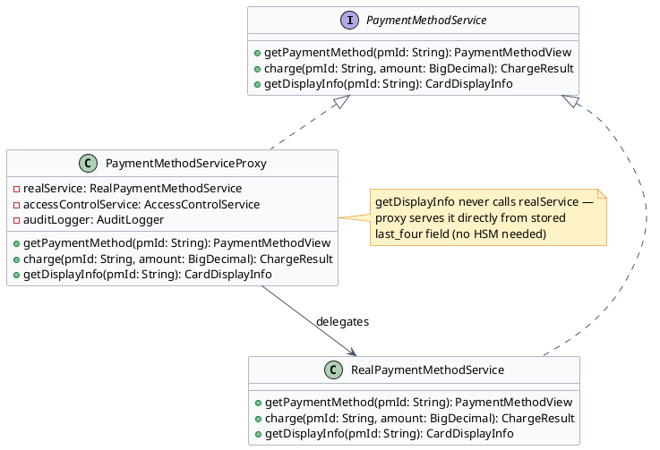
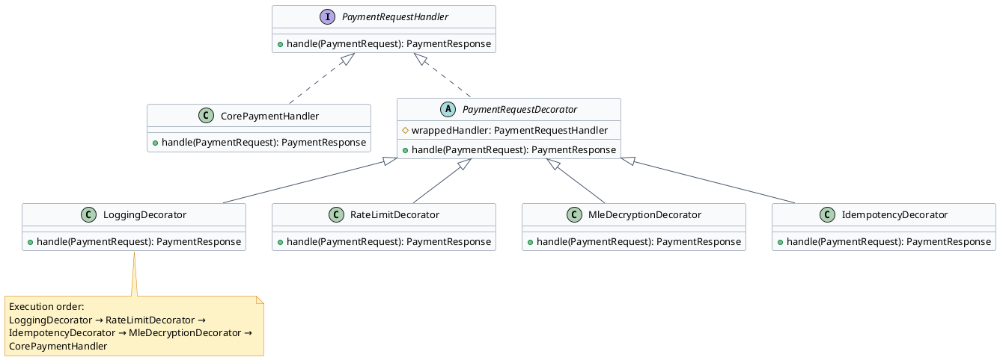

# Stored Credentials & API Layer — Low Level Design

This document covers three patterns that apply to different layers of the stored credentials system: Proxy controls and defers access to encrypted payment profiles, Singleton ensures the HSM client is a single shared instance, and Decorator adds cross-cutting concerns (logging, rate limiting, encryption) to the payment API without modifying its core logic.

---

## Problem Statement

Design the stored credentials and API layer for a payment gateway. The system must:

- Store encrypted payment profiles (customer cards) and control who can decrypt them — display operations should never trigger HSM decryption
- Ensure the HSM client is a single shared instance across the JVM — the HSM has limited connections and expensive initialization
- Add cross-cutting concerns (logging, rate limiting, idempotency, MLE decryption) to the payment API in a composable, independently-testable way

All three design challenges below are driven by **PCI DSS Level 1** compliance requirements — the regulatory framework that mandates HSM use, encrypted storage, access control, memory zeroing, and audit logging for any entity that stores cardholder data at scale. Without PCI DSS, these constraints would read as arbitrary. With it, they are non-negotiable.

The key design challenges:
1. **Minimal decryption surface**: decrypting a stored PAN triggers an HSM operation and exposes card data in memory. The system must decrypt only when actually needed (charging), never for display operations.
2. **HSM connection scarcity**: HSM devices support ~10-100 concurrent sessions. Multiple instances each with their own connection pools would exhaust this limit.
3. **Cross-cutting concern composition**: the payment API needs logging, rate limiting, idempotency, and MLE decryption — all independently configurable per endpoint, none mixed into the core processing logic.

---

## Clarifying Questions — Interview

### 1. Functional Scope
**Q:** What operations does the stored credentials system support? When is decryption actually needed?

**A:** Four operations: `getDisplayInfo()` (last four digits for UI — never needs decryption), `getPaymentMethod()` (full view including encrypted data — decrypted only if caller has PAYMENT_METHOD_READ permission), `charge()` (decrypts PAN, submits to processor, zeros memory), `updatePaymentMethod()` (re-encrypts with new PAN). Decryption happens only in `charge()` — all other operations work with masked or encrypted data.

### 2. Scale & Performance Budget
**Q:** How many `getDisplayInfo()` calls happen per second vs `charge()` calls?

**A:** Display calls are ~10× more frequent than charge calls (every page load that shows saved cards triggers display). Display must be <5ms (Redis/DB cache, no HSM). Charge can take up to 200ms including HSM decryption and processor call. The Proxy's optimization of bypassing HSM for display is a significant throughput win.

### 3. Consistency & Correctness Invariants
**Q:** What must NEVER happen with stored card data?

**A:** (1) The decrypted PAN must never be written to a log file, database field (other than `encrypted_pan`), or HTTP response. (2) The decrypted PAN must be zeroed from memory immediately after use (`Arrays.fill(plainPan, (byte) 0)`). (3) Every decryption event must be audit logged — who, which profile, when. PCI DSS requires this.

### 4. Extensibility & Rate of Change
**Q:** Can new decorators be added to the API pipeline without changing existing code?

**A:** Yes — the Decorator pattern explicitly supports this. A new `FraudPreScreenDecorator` can be inserted between `IdempotencyDecorator` and `MleDecryptionDecorator` in `HandlerFactory` with zero changes to existing decorators. Order matters and is documented in `HandlerFactory`.

### 5. Concurrency & Thread Safety
**Q:** Is the HSM client thread-safe? Can two threads call `decrypt()` simultaneously?

**A:** Yes — the `HsmConnectionPool` manages concurrent sessions. Each `decrypt()` call borrows a session, uses it, and returns it. Sessions are not shared between threads. Bill Pugh Singleton initialization is thread-safe via JVM class-loading.

### 6. Failure & Recovery
**Q:** What happens if the HSM is unavailable during a charge?

**A:** The `charge()` call in `RealPaymentMethodService` catches `HsmUnavailableException` and returns a `ChargeResult.failed("HSM_UNAVAILABLE")`. The transaction remains in PENDING state and can be retried. The Proxy propagates this failure to the caller — no silent data corruption.

### 7. Observability & Debuggability
**Q:** PCI compliance audit: show all decryption events for payment profile `pm_xyz` in the last 30 days.

**A:** The Proxy's `AuditLogger` writes every `PAYMENT_METHOD_ACCESSED` and `PAYMENT_METHOD_CHARGE_INITIATED` event to `audit_log` with: `entity_id=pm_xyz`, `actor=service-name`, `timestamp`, `operation`. Queryable: `SELECT * FROM audit_log WHERE entity_id='pm_xyz' AND event_type LIKE 'PAYMENT_METHOD_%' AND created_at > NOW() - INTERVAL 30 DAYS`.

### 8. Persistence & Durability
**Q:** Where are encryption keys stored? What happens if the HSM loses its keys?

**A:** Master keys are stored in the HSM hardware only — never in software. HSM clusters in two datacenters with key synchronization. DEKs (Data Encryption Keys) are stored in the DB as wrapped blobs (encrypted by a wrapping key in the HSM). Key recovery requires M-of-N operator key shares.

### 9. PCI DSS Compliance Requirements
**Q:** What PCI DSS level applies, and which specific requirements directly shape this design?

**A:** PCI DSS Level 1 (>6M transactions/year). Four requirements directly shape the stored credentials design: **(1) Req 3.3** — PAN must be encrypted at rest using strong cryptography (AES-256 with HSM-managed keys satisfies this). **(2) Req 3.2** — CVV must never be stored. The data model has no CVV field; it is used transiently during authorization and never persisted. **(3) Req 7** — restrict access to cardholder data by business need. The Proxy pattern enforces this: the reporting service never gets a decrypted PAN — it uses `getDisplayInfo()` which the proxy serves without calling the HSM. **(4) Req 10.3** — log all access to cardholder data with timestamps, user identity, and outcome. The `AuditLogger` in the proxy satisfies this for every decryption event.

### 10. DEK Rotation
**Q:** How often are Data Encryption Keys (DEKs) rotated? What does rotation require operationally?

**A:** DEKs are rotated annually per PCI DSS guidance (Req 3.6.4). Rotation process: (1) Generate new DEK inside the HSM. (2) Background job reads each `payment_method` record in batches of 1,000/minute. (3) For each: unwrap old DEK via HSM, decrypt `encrypted_pan`, re-encrypt with new DEK, update `encrypted_pan` and `key_handle` in DB atomically. (4) Once all records migrated, retire the old DEK. The `key_handle` column is essential — it tells the decryption service which key version encrypted each record, allowing old and new DEKs to coexist during the migration window. Total rotation for 10M stored cards at 1,000/minute takes ~7 days.

### 11. Network Token vs. Encrypted PAN
**Q:** Should new payment methods be stored as encrypted PANs or provisioned as Visa/Mastercard network tokens?

**A:** Network tokens are preferred for all recurring billing use cases. A Visa Token Service (VTS) or Mastercard MDES token: (a) is automatically updated when the customer's card is reissued — no subscription failure; (b) carries a per-transaction cryptogram (TAVV) that issuers trust more highly → 2–5% approval rate lift; (c) reduces PCI scope — the network token is not the PAN, so even if the `payment_methods` table is exfiltrated, the tokens are less dangerous than raw PANs. Encrypted PAN storage remains as a fallback for card types not yet supported by token services (some regional banks, commercial cards). The `payment_methods` table has both `encrypted_pan` and `network_token_reference` columns — whichever is non-null is used for charging.

### 12. Account Updater
**Q:** When a customer's card expires and is replaced with a new card number, how do stored credentials stay current?

**A:** Two mechanisms: **(1) Network tokens (preferred)** — VTS/MDES automatically updates the token-to-PAN mapping when the issuer reissues the card. The stored credential (network token reference) continues working without any action. **(2) Account Updater service (fallback for encrypted PAN storage)** — ANET/Visa runs a batch service: weekly, submit truncated card numbers (BIN + last 4) for all stored profiles to the card network. Network returns: new PAN (card reissued), new expiry (extension), or closed account. For updated cards: decrypt old PAN, re-encrypt new PAN via HSM, update record. Account Updater costs ~$0.02 per checked card but prevents involuntary subscription churn from card reissuances.

### 13. Multi-Tenant Isolation
**Q:** In a multi-merchant gateway, how is stored credential data isolated between merchants?

**A:** Isolation operates at three levels: **(1) Data**: every `customer` and `payment_method` record has `merchant_id` as a foreign key and NOT NULL constraint. Every query is scoped by `merchant_id`. A DB-level row-security policy (PostgreSQL RLS) can enforce this at the storage engine level — no application-layer bug can leak cross-merchant data. **(2) Access control**: `AccessControlService.checkPermission()` validates that the requesting service's merchant context matches the `payment_method.merchant_id`. **(3) Key isolation** (optional for highest-security merchants): a dedicated DEK per merchant rather than a shared DEK. This way, even a DEK compromise only exposes one merchant's cards, not all merchants'. Typically only implemented for enterprise merchants with contractual isolation requirements.

### 14. Proxy Bug Fix Note
:::note
The `getDisplayInfo()` implementation in `PaymentMethodServiceProxy` references `profileRepository` which is not injected via the constructor shown. In production code, this dependency must be added to the constructor: `public PaymentMethodServiceProxy(RealPaymentMethodService realService, AccessControlService accessControl, AuditLogger auditLogger, ProfileRepository profileRepository)`. Always inject dependencies explicitly — hidden dependencies discovered at runtime are a common source of `NullPointerException` in payment services.
:::

---

## Section 1: Proxy Pattern — Encrypted Payment Profile

:::tip[Intent]
Control access to an encrypted payment profile. The proxy adds security checks, audit logging, and lazy decryption — the encrypted PAN is only decrypted when actually needed for a charge, not every time the profile is loaded.
:::

The problem: without a proxy, every call to `getPaymentMethod()` loads the full encrypted blob and decrypts it — even when the caller only needs the card's last-four digits for display. This unnecessarily exercises the HSM and risks exposing decrypted PAN data.



:::note[Use Proxy for Encrypted Payment Profile When]
- You want to control who can decrypt card data (only billing engine, not reporting service)
- Display operations (show last-four on UI) should never trigger HSM decryption — proxy serves from masked fields
- All decryption events must be audited (who accessed, when, which profile, from which service)
- You want lazy decryption — defer HSM call until a charge is actually attempted
:::

```java title="PaymentMethodView.java"
public class PaymentMethodView {
    private final String pmId;
    private final String cardType;
    private final String lastFour;
    private final int expiryMonth;
    private final int expiryYear;
    private final DecryptedPan decryptedPan;  // null until decrypted

    public boolean isPanDecrypted() { return decryptedPan != null; }
    // constructor + getters
}
```

```java title="CardDisplayInfo.java"
public class CardDisplayInfo {
    private final String maskedNumber;   // e.g., "**** **** **** 4242"
    private final String cardType;
    private final String expiryDisplay;  // e.g., "12/27"
    // constructor + getters
}
```

```java title="PaymentMethodServiceProxy.java" {10,16,22}
public class PaymentMethodServiceProxy implements PaymentMethodService {
    private final RealPaymentMethodService realService;
    private final AccessControlService accessControl;
    private final AuditLogger auditLogger;

    public PaymentMethodServiceProxy(RealPaymentMethodService realService,
                                      AccessControlService accessControl,
                                      AuditLogger auditLogger) {
        this.realService = realService;
        this.accessControl = accessControl;
        this.auditLogger = auditLogger;
    }

    @Override
    public PaymentMethodView getPaymentMethod(String pmId) {
        accessControl.checkPermission("PAYMENT_METHOD_READ", pmId);
        auditLogger.log("PAYMENT_METHOD_ACCESSED", pmId, getCurrentServiceIdentity());
        return realService.getPaymentMethod(pmId);
    }

    @Override
    public ChargeResult charge(String pmId, BigDecimal amount) {
        accessControl.checkPermission("PAYMENT_METHOD_CHARGE", pmId);
        auditLogger.log("PAYMENT_METHOD_CHARGE_INITIATED", pmId, getCurrentServiceIdentity(),
                        Map.of("amount", amount.toString()));
        ChargeResult result = realService.charge(pmId, amount);
        auditLogger.log("PAYMENT_METHOD_CHARGE_COMPLETED", pmId, getCurrentServiceIdentity(),
                        Map.of("success", result.isSuccess(), "authCode", result.getAuthCode()));
        return result;
    }

    @Override
    public CardDisplayInfo getDisplayInfo(String pmId) {
        // PROXY HANDLES DIRECTLY — no HSM call needed for display
        // Load only the masked fields from DB (last_four, card_type, expiry)
        StoredProfile profile = profileRepository.loadDisplayOnly(pmId);
        return new CardDisplayInfo(
            "**** **** **** " + profile.getLastFour(),
            profile.getCardType(),
            profile.getExpiryMonth() + "/" + profile.getExpiryYear()
        );
        // Note: realService.getPaymentMethod() is NOT called here
    }

    private String getCurrentServiceIdentity() {
        return SecurityContext.getCurrentServicePrincipal().getName();
    }
}
```

:::success[Advantages]
- **Separation of concerns**: security checks and audit logging in the proxy — `RealPaymentMethodService` stays clean
- **Performance**: `getDisplayInfo()` never calls the HSM — saves ~5ms latency for every card display
- **Audit trail**: every decryption event logged with caller identity — required for PCI DSS compliance
:::

:::warn[Disadvantages]
- **Extra layer**: proxy adds one indirection; bugs in proxy (wrong permission check, missing audit) are security-critical
- **Test complexity**: must test both proxy behavior and real service behavior independently
:::

### Why Proxy Pattern and Not Alternatives

| Alternative | Why it fails for encrypted payment profiles |
|---|---|
| Put access control in `RealPaymentMethodService` | Service is now responsible for both business logic AND security — violates SRP. Security code is harder to audit when mixed with decryption logic. |
| AOP / `@PreAuthorize` annotations | Works for simple role checks but cannot implement the "display never decrypts" optimization. AOP intercepts at the method level — can't change return value behavior based on caller intent. |
| Manually add permission checks at each call site | Every caller must remember to check. A new call site that forgets = a security hole. |
| **Proxy** ✓ | Security and audit in one class. `getDisplayInfo()` short-circuits — proxy handles it directly without calling the real service. All HSM-touching operations audited centrally. Real service stays clean. |

:::tip[Always use Proxy Pattern when...]
- You need to add security/access control without modifying the real object
- Some operations can be served without delegating to the real object (display vs decrypt)
- All access to a resource must be audited centrally (PCI, HIPAA, financial compliance)
- Lazy initialization: create or connect to the expensive resource only when first truly needed
:::

---

## Section 2: Singleton Pattern — HSM Client

:::tip[Intent]
The HSM (Hardware Security Module) client maintains an authenticated session and connection pool to the physical HSM device. Creating multiple instances would exhaust the HSM's connection limit and multiply authentication overhead. Singleton ensures exactly one HSM client instance exists per JVM.
:::

```d2
HsmClient: {
  shape: class
  - instance: HsmClient
  - connectionPool: HsmConnectionPool
  - sessionKey: byte[]
  - HsmClient(): void
  + getInstance(): HsmClient
  + encrypt(plaintext: byte[]): byte[]
  + decrypt(ciphertext: byte[]): byte[]
  + sign(data: byte[]): byte[]
}

DecryptionService -> HsmClient: uses
EncryptionService -> HsmClient: uses
SecretKeyService -> HsmClient: uses
```

Why Singleton for HSM:
- HSM devices have a limited number of concurrent sessions (typically 10–100)
- Each session initialization requires a PIN entry or key ceremony — expensive operation
- Connection pooling must be centralized — multiple instances would each create their own pools
- Thread-safe: HSM operations are atomic — concurrent threads can share the single instance safely

:::note[Use Singleton for HSM Client When]
- The underlying resource (HSM device) has a limited connection quota
- Connection initialization is expensive (authentication, key ceremony)
- Multiple services in the same JVM (encryption service, decryption service, key management) need access to the same HSM
- You want to centralize connection health monitoring and automatic reconnection
:::

Use Bill Pugh Singleton (best practice for lazy initialization without synchronized overhead):

```java title="HsmClient.java" {6}
public class HsmClient {
    private final HsmConnectionPool connectionPool;
    private final HsmAuthConfig authConfig;

    private HsmClient() {
        // Private constructor — expensive initialization happens here
        this.authConfig = HsmAuthConfig.fromEnvironment();
        this.connectionPool = HsmConnectionPool.builder()
                .host(authConfig.getHost())
                .port(authConfig.getPort())
                .partitionLabel(authConfig.getPartitionLabel())
                .pinProvider(authConfig.getPinProvider())
                .maxConnections(authConfig.getMaxConnections())
                .build();
        connectionPool.initialize();
        validateConnection();
    }

    // Bill Pugh Singleton — lazy initialization, thread-safe without synchronization
    private static class HsmClientHolder {
        private static final HsmClient INSTANCE = new HsmClient();
    }

    public static HsmClient getInstance() {
        return HsmClientHolder.INSTANCE;
    }

    public byte[] decrypt(byte[] encryptedData, String keyHandle) {
        HsmSession session = connectionPool.borrowSession();
        try {
            return session.decrypt(encryptedData, keyHandle);
        } finally {
            connectionPool.returnSession(session);
        }
    }

    public byte[] encrypt(byte[] plaintext, String keyHandle) {
        HsmSession session = connectionPool.borrowSession();
        try {
            return session.encrypt(plaintext, keyHandle);
        } finally {
            connectionPool.returnSession(session);
        }
    }

    private void validateConnection() {
        HsmSession testSession = connectionPool.borrowSession();
        try {
            testSession.performSelfTest();  // HSM push test
        } finally {
            connectionPool.returnSession(testSession);
        }
    }
}
```

Usage across multiple services in the same JVM:

```java title="DecryptionService.java" collapse={1-4}
public class DecryptionService {
    private final HsmClient hsmClient = HsmClient.getInstance();  // same instance everywhere

    public PaymentMethod decryptStoredCard(String pmId, byte[] encryptedPan) {
        String keyHandle = keyRegistry.getKeyHandle(pmId);
        byte[] plainPan = hsmClient.decrypt(encryptedPan, keyHandle);
        // plainPan exists in memory only for this method's duration
        PaymentMethod method = buildPaymentMethod(pmId, plainPan);
        Arrays.fill(plainPan, (byte) 0);  // zero out in memory immediately after use
        return method;
    }
}
```

:::success[Advantages]
- **Resource efficiency**: one connection pool shared across all services — no over-provisioning HSM connections
- **Thread-safe by design**: Bill Pugh pattern uses JVM class-loading guarantees — no explicit synchronization needed
- **Centralized monitoring**: one instance → one health check, one reconnection logic, one metrics endpoint
:::

:::warn[Disadvantages]
- **Testing difficulty**: `HsmClient.getInstance()` is hard to mock. Use dependency injection: accept `HsmClient` as a constructor parameter in services that need it, and inject a test double.
- **JVM restart required to reconfigure**: HSM host/port/credentials read at initialization time — changing them requires restart
:::

### Why Singleton Pattern and Not Alternatives

| Alternative | Why it fails for HSM client |
|---|---|
| New `HsmClient` instance per service | Each instance creates its own connection pool. 5 services = 5 pools = potentially 250 HSM connections (far exceeding the HSM's limit of 10-100). |
| Spring `@Bean` (prototype scope) | A new bean per injection point — same problem as above. Must use `@Bean` with singleton scope (which is Spring's default). |
| Static methods on `HsmClient` | Static methods are untestable (can't mock). Session management becomes global mutable state. |
| **Singleton** ✓ | One connection pool shared across all services in the JVM. Bill Pugh gives lazy init without synchronization overhead. Services accept `HsmClient` via constructor for testability. |

:::tip[Always use Singleton Pattern when...]
- The resource has a hard connection/session limit (HSM, database connection pool, thread pool)
- Initialization is expensive (authentication, network handshake) and must happen exactly once
- Multiple callers in the same JVM need the same shared resource
- Use Bill Pugh (static inner class) for lazy initialization — prefer it over double-checked locking
:::

---

## Section 3: Decorator Pattern — Payment API Request Pipeline

:::tip[Intent]
Attach cross-cutting behaviors (logging, rate limiting, MLE encryption validation, idempotency checking) to the payment API handler dynamically. Each behavior is implemented as a Decorator that wraps the next handler in the chain — allowing behaviors to be composed without modifying the core transaction processing logic.
:::

Without Decorator, the `PaymentApiHandler` would contain:
- Logging code
- Rate limit checking code
- MLE decryption code
- Idempotency key checking code
- Core transaction logic

That's 5 concerns in one class — violates Single Responsibility Principle and makes it hard to test each concern in isolation.



:::note[Use Decorator for Payment API Pipeline When]
- Each cross-cutting concern (logging, rate limiting, encryption) should be independently testable
- You want to apply different decorator stacks for different API endpoints (e.g., webhook endpoints don't need MLE decryption)
- A new concern (e.g., fraud pre-screen at API layer) can be added by writing a new decorator and inserting it in the chain — zero changes to existing handlers
:::

```java title="PaymentRequestHandler.java"
public interface PaymentRequestHandler {
    PaymentResponse handle(PaymentRequest request);
}
```

```java title="PaymentRequestDecorator.java"
public abstract class PaymentRequestDecorator implements PaymentRequestHandler {
    protected final PaymentRequestHandler wrappedHandler;

    public PaymentRequestDecorator(PaymentRequestHandler wrappedHandler) {
        this.wrappedHandler = wrappedHandler;
    }
}
```

```java title="LoggingDecorator.java" collapse={1-4}
public class LoggingDecorator extends PaymentRequestDecorator {
    private final StructuredLogger logger;

    public LoggingDecorator(PaymentRequestHandler wrapped, StructuredLogger logger) {
        super(wrapped);
        this.logger = logger;
    }

    @Override
    public PaymentResponse handle(PaymentRequest request) {
        long startMs = System.currentTimeMillis();
        logger.info("payment_request_received", Map.of(
            "merchantId", request.getMerchantId(),
            "requestId", request.getRequestId(),
            "type", request.getType()
            // NOTE: never log card data, CVV, transaction key
        ));

        PaymentResponse response = wrappedHandler.handle(request);

        logger.info("payment_request_completed", Map.of(
            "requestId", request.getRequestId(),
            "success", response.isSuccess(),
            "latencyMs", System.currentTimeMillis() - startMs
        ));
        return response;
    }
}
```

```java title="RateLimitDecorator.java" {8,13}
public class RateLimitDecorator extends PaymentRequestDecorator {
    private final RateLimiterService rateLimiter;

    @Override
    public PaymentResponse handle(PaymentRequest request) {
        RateLimitResult limit = rateLimiter.checkLimit(request.getMerchantId());
        if (limit.isExceeded()) {
            return PaymentResponse.rateLimitExceeded(
                limit.getRetryAfterSeconds(),
                "Merchant " + request.getMerchantId() + " rate limit exceeded"
            );
        }
        return wrappedHandler.handle(request);
    }
}
```

```java title="IdempotencyDecorator.java" {7,14}
public class IdempotencyDecorator extends PaymentRequestDecorator {
    private final IdempotencyStore idempotencyStore;

    @Override
    public PaymentResponse handle(PaymentRequest request) {
        String key = request.getIdempotencyKey();
        if (key != null) {
            Optional<PaymentResponse> cached = idempotencyStore.get(request.getMerchantId(), key);
            if (cached.isPresent()) {
                return cached.get();  // return cached response — no duplicate processing
            }
        }

        PaymentResponse response = wrappedHandler.handle(request);

        if (key != null) {
            idempotencyStore.store(request.getMerchantId(), key, response, Duration.ofHours(24));
        }
        return response;
    }
}
```

```java title="HandlerFactory.java" {5,6,7,8}
public class HandlerFactory {
    public static PaymentRequestHandler buildChain(PaymentGatewayFacade facade,
                                                    StructuredLogger logger,
                                                    RateLimiterService rateLimiter,
                                                    IdempotencyStore idempotency,
                                                    MleDecryptionService mle) {
        // Build from inside out — last decorator is the outermost (first to execute)
        PaymentRequestHandler core       = new CorePaymentHandler(facade);
        PaymentRequestHandler withMle    = new MleDecryptionDecorator(core, mle);
        PaymentRequestHandler withIdem   = new IdempotencyDecorator(withMle, idempotency);
        PaymentRequestHandler withRate   = new RateLimitDecorator(withIdem, rateLimiter);
        PaymentRequestHandler withLog    = new LoggingDecorator(withRate, logger);
        return withLog;
        // Execution order: LoggingDecorator → RateLimitDecorator → IdempotencyDecorator → MleDecryptionDecorator → CorePaymentHandler
    }
}
```

:::success[Advantages]
- **Single responsibility**: each decorator handles exactly one concern — easy to test in isolation
- **Composable**: webhook endpoints can skip `MleDecryptionDecorator`; internal service calls can skip `RateLimitDecorator`
- **Open for extension**: add `FraudPreScreenDecorator` without touching existing decorators
:::

:::warn[Disadvantages]
- **Debugging complexity**: a failure deep in the chain shows a stack trace through all decorators — can be confusing
- **Order matters**: logging before rate limiting means you log even rate-limited requests; decide consciously
:::

### Why Decorator Pattern and Not Alternatives

| Alternative | Why it fails for API request pipeline |
|---|---|
| All concerns in one `PaymentApiHandler` class | 5 concerns × complex logic = 500-line class. Cannot test logging without also running rate limiting. Adding a new concern requires modifying the existing handler. |
| Filter chain (Servlet filters) | Works for HTTP-level concerns (authentication, logging) but not for application-level concerns (idempotency, MLE decryption) that need access to parsed domain objects. |
| AOP (`@Around` annotations) | Powerful but implicit — the execution order of multiple aspects is not obvious from reading the code. Decorator makes the chain explicit in `HandlerFactory`. |
| **Decorator** ✓ | Each concern is a self-contained class with one responsibility. `HandlerFactory` makes the chain order explicit and readable. Webhook endpoints skip `MleDecryptionDecorator` by building a different chain. Each decorator is unit-testable with a mock `wrappedHandler`. |

:::tip[Always use Decorator Pattern when...]
- You need to add behaviors to an object dynamically at runtime
- The same base object needs different combinations of behaviors in different contexts (API vs webhook vs internal)
- Each behavior must be independently testable
- Behaviors must be composable: logging + rate limiting + idempotency, in a controlled order
:::

---

[← Payment Gateway LLD](/low-level-design/payment-gateway/lld-payment-gateway/)
