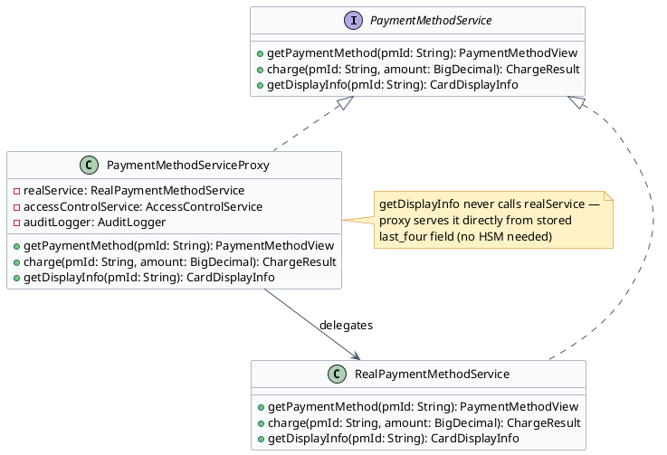
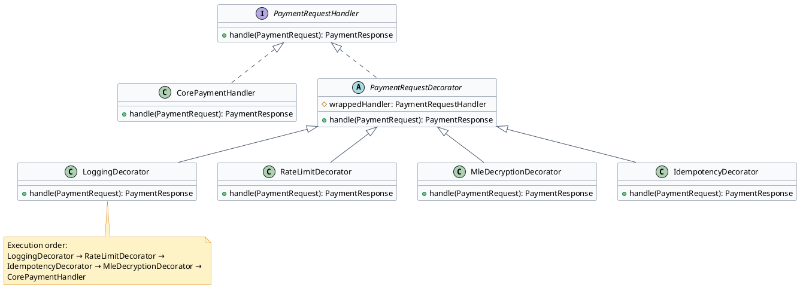

# Stored Credentials & API Layer — Low Level Design

This document covers three patterns that apply to different layers of the stored credentials system: Proxy controls and defers access to encrypted payment profiles, Singleton ensures the HSM client is a single shared instance, and Decorator adds cross-cutting concerns (logging, rate limiting, encryption) to the payment API without modifying its core logic.

---

## Section 1: Proxy Pattern — Encrypted Payment Profile

:::tip[Intent]
Control access to an encrypted payment profile. The proxy adds security checks, audit logging, and lazy decryption — the encrypted PAN is only decrypted when actually needed for a charge, not every time the profile is loaded.
:::

The problem: without a proxy, every call to `getPaymentMethod()` loads the full encrypted blob and decrypts it — even when the caller only needs the card's last-four digits for display. This unnecessarily exercises the HSM and risks exposing decrypted PAN data.



:::note[Use Proxy for Encrypted Payment Profile When]
- You want to control who can decrypt card data (only billing engine, not reporting service)
- Display operations (show last-four on UI) should never trigger HSM decryption — proxy serves from masked fields
- All decryption events must be audited (who accessed, when, which profile, from which service)
- You want lazy decryption — defer HSM call until a charge is actually attempted
:::

```java
// PaymentMethodView.java
public class PaymentMethodView {
    private final String pmId;
    private final String cardType;
    private final String lastFour;
    private final int expiryMonth;
    private final int expiryYear;
    private final DecryptedPan decryptedPan;  // null until decrypted

    public boolean isPanDecrypted() { return decryptedPan != null; }
    // constructor + getters
}
```

```java
// CardDisplayInfo.java
public class CardDisplayInfo {
    private final String maskedNumber;   // e.g., "**** **** **** 4242"
    private final String cardType;
    private final String expiryDisplay;  // e.g., "12/27"
    // constructor + getters
}
```

```java {10,16,22}
// PaymentMethodServiceProxy.java
public class PaymentMethodServiceProxy implements PaymentMethodService {
    private final RealPaymentMethodService realService;
    private final AccessControlService accessControl;
    private final AuditLogger auditLogger;

    public PaymentMethodServiceProxy(RealPaymentMethodService realService,
                                      AccessControlService accessControl,
                                      AuditLogger auditLogger) {
        this.realService = realService;
        this.accessControl = accessControl;
        this.auditLogger = auditLogger;
    }

    @Override
    public PaymentMethodView getPaymentMethod(String pmId) {
        accessControl.checkPermission("PAYMENT_METHOD_READ", pmId);
        auditLogger.log("PAYMENT_METHOD_ACCESSED", pmId, getCurrentServiceIdentity());
        return realService.getPaymentMethod(pmId);
    }

    @Override
    public ChargeResult charge(String pmId, BigDecimal amount) {
        accessControl.checkPermission("PAYMENT_METHOD_CHARGE", pmId);
        auditLogger.log("PAYMENT_METHOD_CHARGE_INITIATED", pmId, getCurrentServiceIdentity(),
                        Map.of("amount", amount.toString()));
        ChargeResult result = realService.charge(pmId, amount);
        auditLogger.log("PAYMENT_METHOD_CHARGE_COMPLETED", pmId, getCurrentServiceIdentity(),
                        Map.of("success", result.isSuccess(), "authCode", result.getAuthCode()));
        return result;
    }

    @Override
    public CardDisplayInfo getDisplayInfo(String pmId) {
        // PROXY HANDLES DIRECTLY — no HSM call needed for display
        // Load only the masked fields from DB (last_four, card_type, expiry)
        StoredProfile profile = profileRepository.loadDisplayOnly(pmId);
        return new CardDisplayInfo(
            "**** **** **** " + profile.getLastFour(),
            profile.getCardType(),
            profile.getExpiryMonth() + "/" + profile.getExpiryYear()
        );
        // Note: realService.getPaymentMethod() is NOT called here
    }

    private String getCurrentServiceIdentity() {
        return SecurityContext.getCurrentServicePrincipal().getName();
    }
}
```

:::success[Advantages]
- **Separation of concerns**: security checks and audit logging in the proxy — `RealPaymentMethodService` stays clean
- **Performance**: `getDisplayInfo()` never calls the HSM — saves ~5ms latency for every card display
- **Audit trail**: every decryption event logged with caller identity — required for PCI DSS compliance
:::

:::caution[Disadvantages]
- **Extra layer**: proxy adds one indirection; bugs in proxy (wrong permission check, missing audit) are security-critical
- **Test complexity**: must test both proxy behavior and real service behavior independently
:::

---

## Section 2: Singleton Pattern — HSM Client

:::tip[Intent]
The HSM (Hardware Security Module) client maintains an authenticated session and connection pool to the physical HSM device. Creating multiple instances would exhaust the HSM's connection limit and multiply authentication overhead. Singleton ensures exactly one HSM client instance exists per JVM.
:::

```d2
HsmClient: {
  shape: class
  - instance: HsmClient
  - connectionPool: HsmConnectionPool
  - sessionKey: byte[]
  - HsmClient(): void
  + getInstance(): HsmClient
  + encrypt(plaintext: byte[]): byte[]
  + decrypt(ciphertext: byte[]): byte[]
  + sign(data: byte[]): byte[]
}

DecryptionService -> HsmClient: uses
EncryptionService -> HsmClient: uses
SecretKeyService -> HsmClient: uses
```

Why Singleton for HSM:
- HSM devices have a limited number of concurrent sessions (typically 10–100)
- Each session initialization requires a PIN entry or key ceremony — expensive operation
- Connection pooling must be centralized — multiple instances would each create their own pools
- Thread-safe: HSM operations are atomic — concurrent threads can share the single instance safely

:::note[Use Singleton for HSM Client When]
- The underlying resource (HSM device) has a limited connection quota
- Connection initialization is expensive (authentication, key ceremony)
- Multiple services in the same JVM (encryption service, decryption service, key management) need access to the same HSM
- You want to centralize connection health monitoring and automatic reconnection
:::

Use Bill Pugh Singleton (best practice for lazy initialization without synchronized overhead):

```java {6}
// HsmClient.java
public class HsmClient {
    private final HsmConnectionPool connectionPool;
    private final HsmAuthConfig authConfig;

    private HsmClient() {
        // Private constructor — expensive initialization happens here
        this.authConfig = HsmAuthConfig.fromEnvironment();
        this.connectionPool = HsmConnectionPool.builder()
                .host(authConfig.getHost())
                .port(authConfig.getPort())
                .partitionLabel(authConfig.getPartitionLabel())
                .pinProvider(authConfig.getPinProvider())
                .maxConnections(authConfig.getMaxConnections())
                .build();
        connectionPool.initialize();
        validateConnection();
    }

    // Bill Pugh Singleton — lazy initialization, thread-safe without synchronization
    private static class HsmClientHolder {
        private static final HsmClient INSTANCE = new HsmClient();
    }

    public static HsmClient getInstance() {
        return HsmClientHolder.INSTANCE;
    }

    public byte[] decrypt(byte[] encryptedData, String keyHandle) {
        HsmSession session = connectionPool.borrowSession();
        try {
            return session.decrypt(encryptedData, keyHandle);
        } finally {
            connectionPool.returnSession(session);
        }
    }

    public byte[] encrypt(byte[] plaintext, String keyHandle) {
        HsmSession session = connectionPool.borrowSession();
        try {
            return session.encrypt(plaintext, keyHandle);
        } finally {
            connectionPool.returnSession(session);
        }
    }

    private void validateConnection() {
        HsmSession testSession = connectionPool.borrowSession();
        try {
            testSession.performSelfTest();  // HSM push test
        } finally {
            connectionPool.returnSession(testSession);
        }
    }
}
```

Usage across multiple services in the same JVM:

```java collapse={1-4}
// DecryptionService.java
public class DecryptionService {
    private final HsmClient hsmClient = HsmClient.getInstance();  // same instance everywhere

    public PaymentMethod decryptStoredCard(String pmId, byte[] encryptedPan) {
        String keyHandle = keyRegistry.getKeyHandle(pmId);
        byte[] plainPan = hsmClient.decrypt(encryptedPan, keyHandle);
        // plainPan exists in memory only for this method's duration
        PaymentMethod method = buildPaymentMethod(pmId, plainPan);
        Arrays.fill(plainPan, (byte) 0);  // zero out in memory immediately after use
        return method;
    }
}
```

:::success[Advantages]
- **Resource efficiency**: one connection pool shared across all services — no over-provisioning HSM connections
- **Thread-safe by design**: Bill Pugh pattern uses JVM class-loading guarantees — no explicit synchronization needed
- **Centralized monitoring**: one instance → one health check, one reconnection logic, one metrics endpoint
:::

:::caution[Disadvantages]
- **Testing difficulty**: `HsmClient.getInstance()` is hard to mock. Use dependency injection: accept `HsmClient` as a constructor parameter in services that need it, and inject a test double.
- **JVM restart required to reconfigure**: HSM host/port/credentials read at initialization time — changing them requires restart
:::

---

## Section 3: Decorator Pattern — Payment API Request Pipeline

:::tip[Intent]
Attach cross-cutting behaviors (logging, rate limiting, MLE encryption validation, idempotency checking) to the payment API handler dynamically. Each behavior is implemented as a Decorator that wraps the next handler in the chain — allowing behaviors to be composed without modifying the core transaction processing logic.
:::

Without Decorator, the `PaymentApiHandler` would contain:
- Logging code
- Rate limit checking code
- MLE decryption code
- Idempotency key checking code
- Core transaction logic

That's 5 concerns in one class — violates Single Responsibility Principle and makes it hard to test each concern in isolation.



:::note[Use Decorator for Payment API Pipeline When]
- Each cross-cutting concern (logging, rate limiting, encryption) should be independently testable
- You want to apply different decorator stacks for different API endpoints (e.g., webhook endpoints don't need MLE decryption)
- A new concern (e.g., fraud pre-screen at API layer) can be added by writing a new decorator and inserting it in the chain — zero changes to existing handlers
:::

```java
// PaymentRequestHandler.java
public interface PaymentRequestHandler {
    PaymentResponse handle(PaymentRequest request);
}
```

```java
// PaymentRequestDecorator.java
public abstract class PaymentRequestDecorator implements PaymentRequestHandler {
    protected final PaymentRequestHandler wrappedHandler;

    public PaymentRequestDecorator(PaymentRequestHandler wrappedHandler) {
        this.wrappedHandler = wrappedHandler;
    }
}
```

```java collapse={1-4}
// LoggingDecorator.java
public class LoggingDecorator extends PaymentRequestDecorator {
    private final StructuredLogger logger;

    public LoggingDecorator(PaymentRequestHandler wrapped, StructuredLogger logger) {
        super(wrapped);
        this.logger = logger;
    }

    @Override
    public PaymentResponse handle(PaymentRequest request) {
        long startMs = System.currentTimeMillis();
        logger.info("payment_request_received", Map.of(
            "merchantId", request.getMerchantId(),
            "requestId", request.getRequestId(),
            "type", request.getType()
            // NOTE: never log card data, CVV, transaction key
        ));

        PaymentResponse response = wrappedHandler.handle(request);

        logger.info("payment_request_completed", Map.of(
            "requestId", request.getRequestId(),
            "success", response.isSuccess(),
            "latencyMs", System.currentTimeMillis() - startMs
        ));
        return response;
    }
}
```

```java {8,13}
// RateLimitDecorator.java
public class RateLimitDecorator extends PaymentRequestDecorator {
    private final RateLimiterService rateLimiter;

    @Override
    public PaymentResponse handle(PaymentRequest request) {
        RateLimitResult limit = rateLimiter.checkLimit(request.getMerchantId());
        if (limit.isExceeded()) {
            return PaymentResponse.rateLimitExceeded(
                limit.getRetryAfterSeconds(),
                "Merchant " + request.getMerchantId() + " rate limit exceeded"
            );
        }
        return wrappedHandler.handle(request);
    }
}
```

```java {7,14}
// IdempotencyDecorator.java
public class IdempotencyDecorator extends PaymentRequestDecorator {
    private final IdempotencyStore idempotencyStore;

    @Override
    public PaymentResponse handle(PaymentRequest request) {
        String key = request.getIdempotencyKey();
        if (key != null) {
            Optional<PaymentResponse> cached = idempotencyStore.get(request.getMerchantId(), key);
            if (cached.isPresent()) {
                return cached.get();  // return cached response — no duplicate processing
            }
        }

        PaymentResponse response = wrappedHandler.handle(request);

        if (key != null) {
            idempotencyStore.store(request.getMerchantId(), key, response, Duration.ofHours(24));
        }
        return response;
    }
}
```

```java {5,6,7,8}
// HandlerFactory.java — builds the full decorator chain
public class HandlerFactory {
    public static PaymentRequestHandler buildChain(PaymentGatewayFacade facade,
                                                    StructuredLogger logger,
                                                    RateLimiterService rateLimiter,
                                                    IdempotencyStore idempotency,
                                                    MleDecryptionService mle) {
        // Build from inside out — last decorator is the outermost (first to execute)
        PaymentRequestHandler core       = new CorePaymentHandler(facade);
        PaymentRequestHandler withMle    = new MleDecryptionDecorator(core, mle);
        PaymentRequestHandler withIdem   = new IdempotencyDecorator(withMle, idempotency);
        PaymentRequestHandler withRate   = new RateLimitDecorator(withIdem, rateLimiter);
        PaymentRequestHandler withLog    = new LoggingDecorator(withRate, logger);
        return withLog;
        // Execution order: LoggingDecorator → RateLimitDecorator → IdempotencyDecorator → MleDecryptionDecorator → CorePaymentHandler
    }
}
```

:::success[Advantages]
- **Single responsibility**: each decorator handles exactly one concern — easy to test in isolation
- **Composable**: webhook endpoints can skip `MleDecryptionDecorator`; internal service calls can skip `RateLimitDecorator`
- **Open for extension**: add `FraudPreScreenDecorator` without touching existing decorators
:::

:::caution[Disadvantages]
- **Debugging complexity**: a failure deep in the chain shows a stack trace through all decorators — can be confusing
- **Order matters**: logging before rate limiting means you log even rate-limited requests; decide consciously
:::

---

[← Payment Gateway LLD](/learnings/payment-gateway/lld/)
